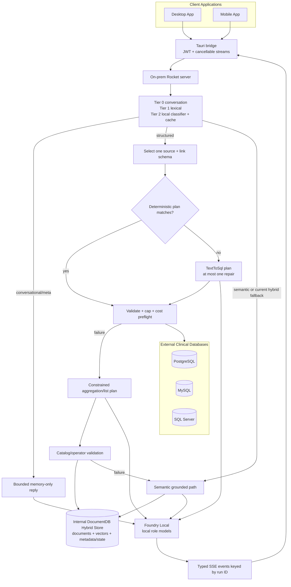

<!-- markdownlint-disable MD013 -->

# Agentic Patterns

> **Authoritative guide (2026-09-04).** This guide describes the bounded agentic orchestration implemented by the on-prem server and clients, and the **Planned** target patterns specified in [`plans/new/`](../new/00-README.md). “Agent” means a task-specific, server-controlled path around local models and validated data operations. It does **not** mean a cloud-hosted agent or an unrestricted model/tool loop.

## Architectural stance

The system is deliberately **deterministic-first, bounded, and fail-open to grounded retrieval**. Models classify or propose typed plans; server code selects tools, validates plans, executes them, limits retries, and decides fallbacks. The model does not narrate its way into arbitrary tool access.

The target architecture sharpens this without loosening it. Agents become **hospital service lines** (Ask + 13 lines, with Trends and Handover as modes) whose data scope is a per-source `SchemaBinding` of a fixed concept ontology, not hardcoded table names. Routing is **deterministic-first**: a model-free `QuerySpec` parse (Tier 1.5) *is* the routing decision when it succeeds, so the Tier 2 classifier is the exception. The IR is the single typed plan that deterministic parsing, the model planner, DocumentDB aggregation, follow-up mutation, and provenance all share; a wrong plan is rejected by the binder before any SQL exists. One `StructuredExecutor` ladder replaces the per-endpoint fallback chains and emits the path it actually took as a `provenance` event. Conversation continuity is a typed `ConversationFocus` updated by code, not a model; when a required slot cannot be filled the assistant asks **one** clarifying question rather than guessing. Every model call stays local; every plan stays validated by Rust.

The **Desktop App** and **Mobile App** expose Auto and dedicated agent experiences through a shared Tauri bridge. Client-generated run IDs isolate streams; the Rocket server remains the authority for authentication, source access, query validation, persistence, and local model execution.

## Pattern status matrix

The diagram above shows the **current** graph. Planned rows below reference the plan in [`plans/new/`](../new/00-README.md) that specifies them; see [Routing, agents, and structured query](routing-agents-and-structured-query.md) for the target ladder diagram.

| Pattern | Status | Current implementation and boundary |
| --- | --- | --- |
| Tiered intent routing | **Implemented** | Conversation/meta rules → lexical classifier → local model classifier only when needed; failures fall open to semantic retrieval. |
| Tier-2 route cache | **Implemented** | Normalized-question bounded LRU caches only model decisions and is cleared when the runtime catalog changes. |
| Task-aware model routing | **Implemented** | `AgentKind` maps each task to alias, thinking, temperature, tool intent, device preference, and token cap; persisted role overrides apply at request time. Planned rename to `ModelRole`, separated from product `AgentKind` ([plan 05](../new/05-hospital-agents-server.md)). |
| Deterministic-first planning | **Implemented** | SQL templates and a simple DocumentDB count plan run before model planning; a miss is preferred to guessing. Templates are hardcoded to dev-seed names. |
| Deterministic-first routing (Tier 1.5) | **Planned** — [plan 02](../new/02-intent-router-v3.md) | A successful `QuerySpec` parse is itself the routing decision (`Structured{SourceSql}`, `deterministic: true`), skipping the Tier 2 model; backend chosen from binding coverage, not string shape. |
| `QuerySpec` IR planning | **Planned** — [plan 03](../new/03-schema-driven-deterministic-sql.md) | Grammar R1–R16 → typed IR → bind against `SchemaBinding` roles → per-dialect compile. The model planner fills the same IR (`plan_spec`) before raw SQL is ever attempted; `bind` rejects wrong plans before any database is touched. |
| Service-line scoping | **Planned** — [plans 01, 05](../new/01-service-line-ontology-and-schema-binding.md) | Fixed concept ontology (13 lines + Ask) bound per source at catalog time; scope = `binding.tables_for(line)` ∪ shared concepts enforced at linker, aggregation catalog, retrieval filter, and identity. Read allow-list, not a security boundary. |
| Planner fallback | **Implemented** | Local SQL or DocumentDB planners are invoked only when deterministic handling misses. SQL gets at most one repair under one deadline. |
| Constrained classification plan | **Implemented** | Tier 2 returns a validated `RouteToolOutput`-shaped JSON result; unknown combinations fall open to semantic. |
| Clarify pattern | **Planned** — [plan 02 §5](../new/02-intent-router-v3.md), [plan 06 §4](../new/06-conversation-memory-and-suggestions.md) | When the question is confidently structured but a required slot is unbound and focus cannot fill it, ask one templated question (no model); the next short reply fills the slot and re-routes. Never two clarifies in a row. |
| Constrained DocumentDB aggregation/list plans | **Implemented** | Planner outputs deserialize into typed specs; catalog allowlists, operator checks, caps, and server-built pipelines gate execution. Planned: `Catalog::scoped` and deterministic `spec_from_query_spec` ([plan 04 §3](../new/04-structured-execution-and-fallbacks.md)). |
| Constrained NL2SQL | **Implemented** | The local model emits plain SQL because constrained ONNX grammar is unreliable; AST validation, linked-table allowlists, limits, cost preflight, read-only execution, timeout, and one repair provide the constraint boundary. |
| Constrained clinical extractor | **Implemented, opt-in** | Eligible rows can be annotated through an `extract_clinical` schema; failures do not fail ingestion. It is not PHI redaction and code quality is not fully validated. |
| Constrained answer verifier | **Implemented, opt-in** | `verify_claims` returns per-claim support against retrieved passages after streaming; malformed/unavailable checks become skipped. |
| Planning tools separated from narration | **Implemented** | Planning produces typed intent/specification/provenance. Narration runs with tools disabled and only receives executed rows or grounded passages. |
| Auto agent | **Implemented** | Uses shared tiered routing to resolve a task role, then a fixed dispatcher. It is not an autonomous general agent. Planned successor: **Ask** ([plan 05](../new/05-hospital-agents-server.md)). |
| Dedicated agents | **Implemented** | Health Query, Trends, Patient Lookup, and Summarize select explicit, bounded paths with narrow deterministic opportunities and documented fallback. Planned successors: service-line agents with Trends/Handover modes and binding-generated personas. |
| Capability route | **Planned** — [plan 05 §5](../new/05-hospital-agents-server.md) | Tier 0 answers “what can you do / what data do you have” from the binding (concept list + example questions) per agent, without a model. |
| Structured backend selection | **Implemented** | Configuration selects live-source SQL first for structured chat; server code owns the fallback chain. Planned: selection from binding coverage ([plan 02 §3.5](../new/02-intent-router-v3.md)). |
| Single `StructuredExecutor` ladder | **Planned** — [plan 04](../new/04-structured-execution-and-fallbacks.md) | Link → deterministic SQL → model SQL → validate → guarded execute → exact rows; bounded failure → scoped DocumentDB aggregation/list → filtered semantic RAG, with per-rung deadlines. Called identically by `/chat` and every `/agents/<kind>`. Empty `List`/`Grouped` results are hits, not fallbacks. |
| Provenance event | **Planned** — [plan 04 §6](../new/04-structured-execution-and-fallbacks.md) | PHI-free SSE `provenance` `{ path: [rung: Hit|Miss(reason)|Skipped], backend, service_line, scope, source_id, elapsed_ms }` emitted before the first token and persisted with the message; the client no longer infers the path from which events arrived. |
| Schema linking | **Implemented** | Local BGE-M3 ranks active cards, promotes explicit table/alias mentions, chooses one source, and adds outgoing one-hop FK targets. Planned: scope filter before ranking. |
| Guarded SQL execution | **Implemented** | One SELECT, linked tables only, dangerous constructs blocked, outer cap, cost preflight, connector row cap and timeout. Unchanged by the plans. |
| Agent conversation persistence | **Implemented** | User/assistant turns and citations or structured provenance are stored in user-owned DocumentDB conversations partitioned by `agent_kind`. |
| Agent use of rolling-summary memory | **Partial** | Agent requests load a recent ten-turn history, use it for semantic rewrite and structured follow-up rewrite, and trigger compaction after success; they do not currently load the persisted rolling summary. |
| Focus-based anaphora resolution | **Planned** — [plan 06](../new/06-conversation-memory-and-suggestions.md) | Typed `ConversationFocus` (patient, place, time range, last `QuerySpec`, last result, pending clarify) updated by code after each turn; pronouns, “same period”, and bare ellipsis (“and by gender?”, “only ICU”, “as a percentage”) resolve without a model by substitution or spec mutation. Today: identifier-only `resolve_followup_question`. |
| Answerable suggestions | **Planned** — [plan 06 §5](../new/06-conversation-memory-and-suggestions.md) | ≤ 4 follow-ups per turn generated from mutated `QuerySpec`s that already pass `bind`, so a click never produces a clarify or a miss; emitted as SSE `suggestions` and persisted. Model-generated suggestions are explicitly excluded. |
| Run-scoped streaming and cancellation | **Implemented, partial end-to-end** | Runs are keyed by client UUID, queued per conversation, independently cancellable at the bridge transport, and concurrent across conversations. Cancellation is not proven through every already-running server stage. |
| Bounded autonomy | **Implemented** | Fixed route graph, typed planners, allowlists, one SQL repair, limits/timeouts, admission control, and grounded fallbacks replace open-ended iteration. The plans add clarify and provenance without adding a tool loop. |
| General iterative multi-agent/tool loop | **Not planned** | `AgentKind::MultiHop` and model configuration exist, but no loop repeatedly chooses arbitrary tools, observes results, and replans. None of the plans introduce one. |
| Hybrid cohort executor | **Planned** — [plan 04 §5](../new/04-structured-execution-and-fallbacks.md) | Today Hybrid is classified but falls back to ordinary semantic RAG. Planned: cohort `QuerySpec` forced to `List` → row keys (cap 200) → explicit `RetrievalFilter` on vector and `$text` stages → grounded synthesis with cohort summary and citations. |

## 1. Tiered intent routing

The subsections below describe the **current** router v2. Router v3 (focus resolution, Tier 1.5 deterministic parse, binding-driven backend selection, Clarify) is specified in [plan 02](../new/02-intent-router-v3.md) and summarised in [Routing, agents, and structured query](routing-agents-and-structured-query.md#target-design-router-v3).

`router/mod.rs` uses the cheapest sufficient decision mechanism and always has a safe semantic fallback.

### Tier 0: conversational and conversation-meta gates

Anchored rules identify greetings, thanks, identity/capability questions, and off-topic requests. These bypass all record retrieval and receive a short local response. A separate negative guard recognizes questions about the conversation itself; when `/chat` has history, those are answered only from working memory.

### Tier 1: lexical intent

`aggregation/intent.rs` recognizes lookup, narrative, aggregation, trend, enumeration, and multi-hop shapes. Clear aggregation/trend/enumeration requests become structured routes. Lookup, narrative, and multi-hop labels currently execute semantically unless a narrower deterministic SQL opportunity is recognized later.

A structured shape with narrative language is treated as a possible hybrid and escalates to Tier 2 when model routing is enabled.

### Tier 2: local classification and cache

Ambiguous questions use the local `Classify` role and a strict route/intent output shape. The implementation currently requests validated JSON content rather than forcing the nominal tool call because the local ONNX grammar compiler rejects this schema on affected variants. The output is still deserialized, mapped to closed enums, and rejected to semantic on unknown or inconsistent labels.

Only Tier-2 decisions enter the normalized-question bounded LRU. Tier 0/1 are already cheap. Replacing the aggregation catalog clears this cache because schema changes can alter whether a question is structurally answerable.

**Current Auto nuance:** `/chat` routes with knowledge of loaded working memory. The `/agents/auto` endpoint currently invokes the router with `has_history=false` before loading its recent history, so conversation-meta routing is not equivalent there.

## 2. Task-aware model routing with `AgentKind`

`foundry/router.rs` defines the role contract independently of model loading. `AppState::spec_for` applies a persisted role override over configuration defaults before each routed call.

| `AgentKind` | Task in the current orchestration | Tool/planning posture |
| --- | --- | --- |
| `Chat` | Conversational or grounded semantic generation | Tools off |
| `PatientLookup` | Narrow patient overview SQL, otherwise semantic retrieval | Declares planning capability, but current dispatch is deterministic SQL or semantic |
| `HealthQuery` | Counts/grouped analytics; deterministic SQL before DocumentDB aggregation | Typed aggregation planning where fallback is needed |
| `Trends` | Temporal analytics | Typed aggregation planning; thinking enabled by default spec |
| `Summarize` | Narrow recent-record SQL, otherwise semantic summary | Tools off for narration |
| `QueryRewrite` | Standalone rewrite, expansion, and memory compaction | Tools off; low temperature |
| `Classify` | Tier-2 route decision | Closed route/intent output |
| `Extract` | Optional ingestion-time clinical annotation | Constrained entity/code output |
| `Verify` | Optional post-stream claim/evidence check | Constrained claim verdict output |
| `TextToSql` | Dialect-aware source SQL proposal | Plain SQL output, then mandatory server validation |
| `MultiHop` | Reserved role definition | **No general iterative executor** |

Current defaults consolidate these roles on local `qwen3-8b` GPU variants to reduce model swaps. Device resolution, busy guards, residency, and overrides are described in [Foundry Local roles](foundry-local-role.md) and [Models, accelerators, and lifecycle](models-accelerators-and-lifecycle.md).

## 3. Deterministic-first, planner-fallback

Determinism is not merely an optimization; it limits autonomy where a narrow interpretation can be proven.

### Live-source SQL

For one linked source, `nl2sql/routes.rs` attempts deterministic templates before obtaining a planning model. The compiler handles a conservative inventory of exact counts, listings, grouped counts, trends, patient overviews, identifier follow-ups, and selected healthcare joins. It fully consumes bounded frames and returns `None` on ambiguity.

A deterministic statement still passes through the same SQL safety layer as model output. If compilation, validation, cost checks, or execution miss, the general structured path can use the local `TextToSql` planner. Initial planning and at most one repair share one deadline; there is no retry loop.

The full matcher order, dialect restrictions, schema requirements, and fixtures are maintained in [Deterministic query handling reference](deterministic-sql-matcher.md).

### Ingested DocumentDB

`answer.rs` has a direct unfiltered patient-count plan. Other aggregate/trend/list requests use a local planner to create a typed `RunAggregation` or list specification. The server—not the model—then validates names and operators and builds the actual DocumentDB pipeline.

This is distinct from semantic RAG: structured execution returns exact rows from the selected backend, while semantic retrieval returns a bounded evidence sample.

## 4. Constrained planning tools, not arbitrary narration

The code exposes tool-shaped schemas for five planning/checking jobs:

| Planning/checking job | Output contract | Server enforcement |
| --- | --- | --- |
| Route classification | `RouteToolOutput` with closed route/intent labels | Enum mapping, inconsistent structural labels demoted to semantic, fail-open behavior |
| DocumentDB aggregation | `RunAggregation` | Active runtime catalog, collection/field allowlists, blocked operators, synonym resolution, top-N clamp, server-built pipeline and auth prefix |
| DocumentDB listing | Typed list spec | Catalog validation, bounded pagination/columns/sort, server-built pipeline |
| Clinical extraction | Conditions/medications/labs arrays | Typed parse, code-system stamping, eligibility threshold, per-row timeout/fail-open behavior |
| Answer verification | Claim, support flag, passage indexes | Evidence cap, index range checks, dedupe, unsupported demotion, timeout/fail-open report |

Actual runtime strategy varies by local-model grammar support. Classification, aggregation, and listing currently request JSON content matching the schema rather than force tool grammar; extraction and verification prefer forced tool calls and can fall back when grammar compilation fails. This distinction matters: **the safety boundary is mandatory deserialization and server validation, not trust in constrained decoding alone**.

NL2SQL is intentionally different. The model emits one plain SQL statement because supported local ONNX variants cannot reliably compile the proposed SQL tool grammar. The server then supplies the hard boundary: AST parsing, a single read-only query, linked-table allowlist, blocked functions/locks, row-limit rewrite, cost preflight, connector cap, timeout, and least-privilege execution.

After execution, narration is separate:

- structured rows are passed to a narrow data-narration prompt;
- semantic answers receive numbered passages;
- narration specs explicitly set `tools=false`;
- deterministic SQL results can use deterministic summaries with no second model call;
- models never receive authority to invent another query while narrating.

## 5. Auto versus dedicated agents

| Surface | Dispatch behavior | Important limitation |
| --- | --- | --- |
| Auto | Tiered router resolves conversational, structured, semantic, or hybrid, then maps to a fixed role/path | Not an autonomous agent; agent endpoint currently routes without conversation-history awareness |
| Health Query | Attempts deterministic live SQL for eligible questions; otherwise constrained DocumentDB aggregation | Model fallback here is aggregation planning, not the full live-source SQL planner used by structured `/chat` |
| Trends | Same deterministic-first pattern with trend-specific aggregation planning and chart rows | Depends on linked schema or ingested catalog quality |
| Patient Lookup | Attempts only recognized deterministic patient-overview SQL, then semantic retrieval | No broad patient tool loop or unrestricted source querying |
| Summarize | Attempts only recognized deterministic recent-record SQL, then semantic retrieval | General summaries are retrieval-grounded, not full-table scans |

The server emits actual routed kind and path-specific provenance. Structured agents return spec, rows, and pipeline; semantic agents return citations. The client renders this data rather than inferring agent activity from prose.

## 6. Structured backend selection and fallback chain

Backend choice is policy in server code, not a model-selected arbitrary tool.

For structured `/chat` requests when text-to-SQL is enabled:

1. **Live source, deterministic SQL** against one linked PostgreSQL, MySQL, or SQL Server database.
2. **Live source, local SQL planner** with validation, execution, and at most one repair.
3. **Internal DocumentDB aggregation/listing** over active ingested records.
4. **Semantic hybrid retrieval** with grounded local generation.

If text-to-SQL is disabled, structured handling starts at DocumentDB. Dedicated Health Query and Trends currently attempt deterministic live SQL, then use DocumentDB planning; they do not invoke the general TextToSql fallback. Patient Lookup and Summarize use only their narrow deterministic SQL shapes before semantic retrieval.

Successful live-source results retain source ID, SQL, columns, rows, and deterministic answer provenance. DocumentDB structured results retain validated specification, rows, and generated pipeline. See [Routing, agents, and structured query](routing-agents-and-structured-query.md) and [RAG Patterns](rag-patterns.md).

## 7. Schema linking and guarded execution

The source schema catalog is generated and embedded locally, versioned independently from ingested records, and published with a last-known-good active pointer. Linking:

1. embeds the question with BGE-M3;
2. ranks active table cards by cosine similarity;
3. promotes explicit physical-table or curated business-alias mentions;
4. chooses the source owning the best card—never a cross-source SQL join;
5. selects bounded seed cards; and
6. adds their outgoing one-hop foreign-key targets.

Incoming edges and recursive expansion are not automatic. Tier-2 entity hints are retained but are not currently consumed by the linker.

SQL validation and execution then enforce:

- exactly one `SELECT`/query statement;
- only linked relations, with query-defined CTEs allowed;
- no locks, DDL/DML, dynamic execution, file operations, sleep/wait, or other blocked signatures;
- bounded outer `LIMIT`/`TOP` plus a second connector result cap;
- optional cost estimation before execution—over-limit estimates reject, while estimator errors currently fail open to still-bounded execution;
- read-only connector behavior and database/Tokio timeouts.

DocumentDB plans similarly validate catalog collections/fields and reject dangerous filter operators before server code creates a pipeline with mandatory authorization/active-data constraints.

## 8. Conversations, persistence, and memory

Chat and agent transcripts share `chat_conversations` and `chat_messages`. Agent conversations carry `agent_kind`, and every conversation is scoped to the authenticated user. Assistant messages can persist citations, structured result JSON, or live-SQL provenance.

The general `/chat` path uses `memory.rs`: rolling summary plus bounded verbatim tail, conversation-aware rewrite, memory-only conversation-meta answers, and detached compare-and-swap compaction.

The dedicated agent path currently:

- verifies conversation ownership;
- loads up to ten recent raw turns before persisting the new user turn;
- wraps those turns in `WorkingMemory` without loading the persisted summary;
- uses recent memory for semantic rewrite and for rewriting structured follow-ups before DocumentDB planning;
- persists successful assistant output and then triggers the shared compaction job.

Thus agent persistence and recent-history continuity are **implemented**, while long-conversation summary consumption by `/agents` is **partial**. Structured agent code computes a standalone rewrite for follow-up planning/narration, but the aggregation planner currently receives the original question; only narration receives the rewritten string. This is another current follow-up limitation, not a promised behavior.

## 9. Streaming, queues, cancellation, and concurrency

The client runtime is run-scoped rather than component-scoped:

- each chat or agent submission receives a client-generated UUID `run_id`;
- Tauri bridge events wrap payloads as `{run_id, data}`;
- one application-lifetime listener registry routes events into separate chat and agent Zustand run registries;
- token batches are keyed by run ID and flushed on animation frames, preventing interleaving;
- normal prompts queue behind active work for the same conversation;
- “Send now” can launch concurrently in that conversation, with the explicit tradeoff that unfinished output is absent from server-loaded history;
- different conversations can run concurrently;
- cancellation aborts the corresponding bridge HTTP/SSE future; logout aborts all registered bridge runs;
- failed or stopped runs retain partial output and support retry; successful runs refresh persisted messages before optimistic state is removed.

The server independently bounds generations, retrievals, and ingestions with timed semaphores. Bridge cancellation is real at the transport/run-registry layer, but cancellation tokens are not proven to propagate through every in-flight blocking embedding/reranking call, source query, pre-stream retrieval stage, or local model operation.

## 10. Bounded autonomy and safety properties

The current agentic design is bounded by construction:

1. **Closed route graph:** only known route classes and agent kinds are accepted.
2. **Server-selected capabilities:** dispatch code chooses whether SQL, aggregation, retrieval, or narration runs.
3. **Deterministic-first behavior:** known exact shapes avoid model planning.
4. **Typed planning:** model output becomes a data structure or one SQL statement, not executable narration.
5. **Validation after generation:** schemas, catalogs, ASTs, operators, tables, row caps, and timeouts are enforced outside the model.
6. **Bounded repair:** NL2SQL has at most one repair under the same deadline.
7. **Grounded narration:** tools are disabled for narration; answers see only rows or numbered evidence.
8. **Explicit fallbacks:** structured failures degrade to a safer available grounded path instead of expanding autonomy.
9. **Admission and model busy guards:** expensive local work and model lifecycle changes are bounded.
10. **On-prem execution:** routing, planning, embedding, reranking, extraction, verification, and generation do not call cloud models.

These controls reduce tool misuse but do not turn model output into a clinical authority. Extracted codes are hints rather than terminology-validated facts, verifier quality is not fully validated, and source/database deployment still requires least-privilege accounts and transport hardening.

## Decision table

| Situation | Selected agentic pattern | Why | Fallback or refusal |
| --- | --- | --- | --- |
| Greeting, thanks, identity, off-topic | Tier-0 conversational path | Avoids unnecessary data access | Short local reply |
| Question about prior `/chat` turns | Conversation-meta path | Transcript is the relevant source, not clinical records | Memory-only answer; absent history routes normally |
| Clear count, ranking, trend, listing | Tier-1 structured route | Exact execution is more appropriate than semantic top-k | Live SQL → DocumentDB structured → semantic |
| Ambiguous or mixed request | Tier-2 local classifier | Uses model judgment only when lexical rules are insufficient | Cached decision or semantic fail-open |
| Known exact database question | Deterministic SQL/template | Fast, auditable, and conservative | Planner only after a miss |
| General exact live-source question | TextToSql planner under guard | Covers shapes beyond templates while preserving read-only controls | One repair, then DocumentDB structured path |
| Aggregate over ingested active data | Typed aggregation planner | Produces chart-ready exact rows from allowed fields | Semantic RAG on planning/execution failure |
| Enumerate ingested rows | Typed list planner | Keeps pagination and columns bounded | Semantic RAG on failure |
| Patient overview in dedicated agent | Narrow deterministic source query | Avoids broad model-generated lookup | Semantic retrieval |
| Recent-record summary in dedicated agent | Narrow deterministic ordered query | Preserves source order and row bounds | Semantic retrieval |
| Narrative clinical question | Semantic RAG + grounded narration | Needs evidence synthesis rather than exact aggregation | Score-gated refusal |
| Optional ingestion annotation | Extract role | Adds local retrieval hints without controlling original text | Store row unannotated on failure |
| Optional answer review | Verify role | Adds claim-level evidence status after response | Skipped report; answer remains |
| Multiple active conversations | Run registry + per-conversation queue | Isolates streams while allowing useful concurrency | Admission can reject saturation with `429` |
| Cohort selection plus narrative synthesis | Hybrid route | Intended to combine exact cohort and semantic evidence | **Currently semantic fallback; cohort executor Planned ([plan 04 §5](../new/04-structured-execution-and-fallbacks.md))** |
| Confidently structured question with an unfillable slot | Clarify (Planned, [plan 02 §5](../new/02-intent-router-v3.md)) | One templated question beats a guessed subject | Second consecutive clarify is forbidden; falls to semantic |
| Follow-up with pronoun or ellipsis | Focus resolution / spec mutation (Planned, [plan 06](../new/06-conversation-memory-and-suggestions.md)) | Reference is a data problem, not a language-model problem | Model `QueryRewrite` after routing when substitution is insufficient |
| Open-ended multi-hop request | `MultiHop` role only | Role exists for future task routing | **No iterative loop; current dispatch remains semantic/fixed** |

## Code map

| Concern | Primary code |
| --- | --- |
| Tiered routing, route cache, backend labels | `onprem-rag-server/src/router/mod.rs`, `router/conversational.rs` |
| Lexical intent taxonomy | `onprem-rag-server/src/aggregation/intent.rs` |
| `AgentKind` and `ModelSpec` | `onprem-rag-server/src/foundry/router.rs`, `state.rs` |
| Tool schemas and plan parsing | `onprem-rag-server/src/foundry/mod.rs` |
| Shared structured planning and narration | `onprem-rag-server/src/answer.rs` |
| DocumentDB aggregation/list validation and execution | `onprem-rag-server/src/aggregation/` |
| Source catalog, schema linking, SQL generation/repair | `onprem-rag-server/src/nl2sql/catalog.rs`, `linker.rs`, `generate.rs`, `routes.rs` |
| SQL AST guard and connector execution | `onprem-rag-server/src/nl2sql/validate.rs`, `execute.rs` |
| Auto chat dispatch and fallback chain | `onprem-rag-server/src/rag/routes.rs` |
| Dedicated agent dispatch and SSE | `onprem-rag-server/src/agents/routes.rs` |
| Conversation memory/compaction | `onprem-rag-server/src/memory.rs`, `routes/conversations.rs` |
| Extraction and verification | `onprem-rag-server/src/ingest/extract.rs`, `verify.rs` |
| Admission and local model lifecycle | `onprem-rag-server/src/admission.rs`, `foundry/mod.rs` |
| Client run registries and queues | `onprem-rag-app/src/stores/chat.ts`, `stores/agents.ts`, `lib/conversationRuntime.ts` |
| Global run-ID event fan-out | `onprem-rag-app/src/lib/bridgeEvents.ts`, `src-tauri/src/commands.rs` |

## Explicit non-claims

- There is no general iterative ReAct-style or multi-agent tool loop, and none of the plans in `plans/new/` introduce one.
- `AgentKind::MultiHop` is configuration surface, not an implemented autonomous executor.
- The model does not choose arbitrary databases, commands, or tools.
- A nominal tool schema does not imply every local model uses native constrained tool grammar; mandatory server parsing and validation are the real boundary.
- Full cohort-conditioned semantic retrieval is not implemented.
- Service-line agents, the `QuerySpec` IR, router v3, the `StructuredExecutor`, `ConversationFocus`, clarify, suggestions, and the `provenance` event are **Planned**; nothing in `plans/new/` is proof of implementation.
- Dedicated agents do not yet consume persisted rolling summaries, despite sharing conversation persistence and triggering compaction.
- Cancellation is not yet proven end to end through all server-side work.
- No cloud-hosted agents or cloud model fallbacks are part of the architecture, today or in the plans.

## Related authoritative guides

- [Architecture and data model](architecture-and-data-model.md)
- [DocumentDB architecture](documentdb-architecture.md)
- [Routing, agents, and structured query](routing-agents-and-structured-query.md)
- [Deterministic query handling reference](deterministic-sql-matcher.md)
- [RAG Patterns](rag-patterns.md)
- [Retrieval, chat memory, and concurrency](retrieval-chat-memory-and-concurrency.md)
- [Foundry Local roles](foundry-local-role.md)
- [Models, accelerators, and lifecycle](models-accelerators-and-lifecycle.md)
- [Ingestion, schema catalog, and Data Explorer](ingestion-schema-catalog-and-explorer.md)
- [Security, authentication, and audit](security-auth-and-audit.md)
- [Operations, performance, and observability](operations-performance-and-observability.md)
- [Hospital agents and their data map](hospital-agents-and-data-map.md) (Planned roster and data boundary)
- [plans/new/ implementation plans](../new/00-README.md) (Planned patterns referenced above)
