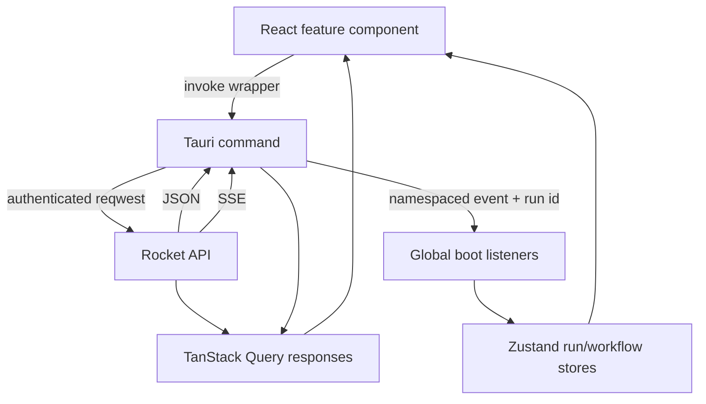

# Application and feature architecture

> **Authoritative current-state guide (2026-09-02).** This document describes the shipped React/Tauri product surface and labels partial or planned features explicitly. System boundaries and persistence are covered in [Architecture and data model](architecture-and-data-model.md); ingestion and browsing are covered in [Ingestion, schema catalog, and Data Explorer](ingestion-schema-catalog-and-explorer.md).

## Client boundary

The application is a Tauri v2 client with a React 19/Vite/TypeScript webview and a Rust bridge.

**React never sends HTTP requests to the server and never holds the JWT.** All server calls go through `invoke` wrappers in `src/lib/bridge.ts`. The Rust bridge in `src-tauri/src/commands.rs` reads its managed server URL and JWT, performs `reqwest` calls, and relays SSE through the Tauri event bus. React may display a mirror of the configured URL for UX, but it does not own transport or bearer credentials.

## Shell, navigation, and responsive behavior

### Implemented

`App.tsx` bootstraps the persisted bridge URL, probes health, and asks the bridge to validate its stored token. The gate renders Connect, Login, or `AppShell`.

Navigation is an in-memory stack in `stores/ui.ts`, not URL routing. `app/routes.tsx` lazy-loads feature modules. The shell uses:

- a bottom bar and “More” sheet on phones;
- an icon rail at medium widths;
- a full sidebar on large screens;
- route filtering through the role matrix in `lib/permissions.ts`.

A global `ErrorBoundary` prevents render failures from becoming a blank screen. Dark design tokens and responsive primitives live under `styles/` and `components/`.

### Android status — partial

The Tauri Android project exists under `src-tauri/gen/android`. Internet permission and LAN cleartext/network-security configuration are present. The client is designed for a server URL such as `http://<host-lan-ip>:8000`; device `localhost` is not the server host.

An Android build/run and end-to-end device validation are still outstanding. The navigation stack has `back()`, but no verified OS hardware-back binding is shipped. Android must therefore be described as initialized and configured, **not production-validated**.

## State architecture

| State kind | Owner | Examples |
| --- | --- | --- |
| Server-derived/cacheable | TanStack Query | sources, users, ingest history, records, messages, model status, audit rows |
| Session presentation | `stores/session.ts` | authenticated user, connectivity, displayed server URL |
| Navigation/UI | `stores/ui.ts` | nav stack, drawers, preview role, toasts |
| Long-running ingestion | `stores/ingestion.ts` | wizard step, schema selection, progress snapshot |
| Concurrent chat runs | `stores/chat.ts` | run registry, conversation queues, drafts, partial answers |
| Concurrent agent runs | `stores/agents.ts` | run registry, kind partitions, structured results, queues, drafts |
| Agent registry (Planned) | `stores/agentRegistry.ts` | roster from `GET /agents`, usable/tier lookups |
| Model downloads | `stores/models.ts` | progress keyed by model variant |
| Logs | `stores/stream.ts` | bounded server-log buffer and frame batching helpers |

PHI-bearing drafts and active runs are session-memory only; they are not persisted to browser storage.

## Event architecture

`src/lib/bridgeEvents.ts` is the single, application-lifetime listener registry. Components do not establish per-request listeners.

- Chat and agent events carry a client-generated `run_id`.
- Token events are batched per run on animation frames, so concurrent streams cannot mix.
- Model events carry `variant_id` so downloads survive navigation without cross-wiring cards.
- Ingestion progress updates the global workflow store and survives route changes.
- The log relay feeds a bounded activity console.

`src/lib/conversationRuntime.ts` owns request lifetimes rather than chat components. It creates conversations, launches work, invalidates authoritative message queries, advances queues, retries, and invokes bridge cancellation.

### Concurrent conversation behavior — implemented

- Independent conversations and chat/agent features can run concurrently.
- Normal sends queue behind active work in the same conversation.
- “Send now” bypasses that queue, with the documented tradeoff that unfinished output is not yet in server history.
- Navigation and conversation switching do not stop streams.
- Destructive rename/delete controls are disabled only for conversations with active work.
- Failed or stopped runs retain partial output and can be retried.

This supersedes the Stage 6/7 single-global-run and “lock the whole UI” design.

## Feature surface

### Connect and Login — implemented

The Connect screen sets and probes the bridge-owned server URL. Login sends credentials through the bridge; the returned user profile reaches React, but the JWT remains in Rust. Stored tokens are validated through `/auth/me`. Session-expired responses centrally clear the React Query cache to avoid leaving transcript data for the next user.

### Dashboard — implemented

The Dashboard shows operational totals and service/model status through the summary endpoint. Values are current snapshots rather than an analytics warehouse. `pending_alerts` is present for surface compatibility but there is no alert engine.

### Connections — implemented

Admins can create, edit, test, and delete PostgreSQL, MySQL, and SQL Server sources. Other roles can view available sources. Connection “connected” means the latest test succeeded; the stateless server does not keep a permanent source socket open.

The connection screen also exposes the admin schema-metadata modal: current active version/hash/health, recent refresh history, manual refresh, business aliases, and undeclared relationship overrides.

**Not implemented:** MongoDB as an operational source. DocumentDB is the application store, not a generic MongoDB source connector.

### Ingest wizard — implemented, resume UI partial

The six-step wizard covers source selection, schema loading, advisory analysis, table/column selection, progress, and completion. Its Zustand state survives navigation. PII candidates are highlighted; users explicitly choose exclusions.

The server supports resuming failed/partial jobs from durable checkpoints. The current React flow displays jobs and progress but does not expose the full server resume operation as a dedicated recovery control.

### Data Explorer — implemented

The explorer derives connection/table/vector totals from ingestion history, browses active rows with search and pagination, opens row details, and shows a table inspector with source metadata, sampled field profile, and recent connection-level jobs. Admins can clear a table, source, or all indexed data and re-ingest a table.

Desktop uses a table/tree layout; mobile uses drawers and row cards. The explorer reads only the active ingestion generation.

### AI Chat — implemented through the unified Agents surface

`/chat` currently resolves to the Agents feature; the `Auto` tab embeds the Chat experience. It provides user-scoped conversations, server-owned history, citations, markdown, retrieval settings, structured SQL result tables, optional verification badges, queues, cancellation, and retries.

The server may answer conversationally, through DocumentDB aggregation, through guarded live-source SQL, or through semantic RAG. The UI renders the returned provenance appropriate to the path.

The older separate Chat navigation item is superseded: the primary navigation exposes AI Agents, whose Auto tab is the general chat entry point.

### AI Agents — implemented, with deliberate fixed paths

**Current (legacy kinds).** Selectable tabs are Auto, Health Query, Trends, Patient Lookup, and Summarize, hardcoded in `src/features/agents/index.tsx` (`KIND_TABS`, `KIND_BLURBS`). Agent conversations are partitioned by selected kind and by JWT user, and switching tab resets the active conversation. Auto delegates to general chat behavior; explicit kinds use typed server routes. Structured paths return typed specification/rows/pipeline data and render charts. Semantic paths return citations. Activity labels are derived from actual event phases rather than pretending there is a general autonomous tool loop.

**Partial:** the system is a constrained dispatcher, not an open-ended agentic tool-loop. Structured follow-up planning is more limited than semantic history-aware rewriting.

#### Hospital Agents — registry-driven roster

**Status: Planned — see [plans/new/07-app-restructure.md](../new/07-app-restructure.md) (client) and [plans/new/05-hospital-agents-server.md](../new/05-hospital-agents-server.md) (server).** The navigation label becomes "Hospital Agents"; `/chat` keeps mapping to this feature.

- **Roster from `GET /agents`.** Tabs are rendered from a new `useAgentRegistry` store, never from string literals in `src/`: **Ask** first, then Tier 1 service lines (Patient Chart, Front Desk, Ward Board, Pharmacy, Diagnostics); Tier 2/3 lines collapse into a "More" menu; lines with no bound tables in any connected source are greyed there with the tooltip "No bound tables in connected sources". The registry loads once after login, refreshes when an admin rebuilds a binding, and falls back to `[ask]` against an older server.
- **Mode toggle.** A segmented `Ask | Trends | Handover` control per tab (hidden where the agent's `modes` lacks one); the mode is sent with each prompt and badged on the assistant bubble.
- **Scope panel** (xl+ context panel): agent blurb, "Data this agent can see" as table chips grouped by source, and `example_questions` chips (also centred in an empty conversation).
- **Department badge.** Ask answers show the `routed.service_line` label and an "Open in {Line}" link that switches tab and carries the conversation (`PATCH /conversations/<id>` with `agent_kind`; the focus travels with it).
- **Provenance strip** (`ProvenanceStrip`, shared with chat): compact rung list `Link ✓ → Deterministic SQL ✓ → Validate ✓ → Execute ✓ · 212 ms`; misses show their PHI-free reason; expands to SQL + explanation, spec + pipeline, or the retrieval filter.
- **Suggestion chips** (`SuggestionChips`): ≤ 4 pre-bound follow-ups under the last assistant message; clicking submits the text as a normal turn plus `suggestion_spec`; `switch` suggestions change tab and carry the conversation.
- **Clarify block:** the clarifying question with option buttons; free-text replies also work.
- **Focus chip:** "using: patient · period" derived from `focus_used`, plus a lightning icon when `deterministic` is true.
- **Conversation continuity (plan 07 §5):** switching tabs never discards the composer draft (drafts keyed by conversation or `__new__:<kind>`); re-entering a tab restores its last open conversation; a conversation can move between agents with its focus and history; suggestion clicks are persisted as ordinary user turns; clarify options are buttons.
- **Legacy kinds:** conversations with `agent_kind ∈ {health_query, trends, patient_lookup, summarize, chat}` list under Ask with a legacy badge; the server maps them to Ask plus a mode for one release.

Bridge and TypeScript contracts change accordingly (`AgentKind` becomes a server-validated string; `AgentInfo`, `Suggestion`, `Provenance`, extended `StoredMessage`/`SqlResult`; new `agent://provenance|suggestions|clarify` and `chat://*` equivalents).

### Models — implemented

The Models screen is driven by the server’s role manifest, not a hard-coded family catalog. Foundry-managed roles expose variant download/load/unload/delete/default operations. fastembed embedding and reranking roles are read-only because they are not Foundry models.

Download progress is keyed by variant and stored globally, so it survives navigation. It is intentionally not persisted across process restarts because the bridge-side download also ends with the process.

### Settings — implemented

System Setup reports hardware, execution providers, active model, Foundry readiness, DocumentDB, embeddings, reranker, loaded/cached models, and the live activity console.

Foundry Local is in process. Therefore there are no start/stop/restart controls and no Foundry endpoint URL. “Re-register execution providers” is the valid administrative recovery action. DocumentDB lifecycle is also not controlled by the app; the UI provides health and operator guidance.

**Planned — Data Binding section (admin); see [plans/new/07-app-restructure.md §4](../new/07-app-restructure.md).** Per source: a coverage table (13 service lines × usable / bound tables / missing concepts), "Rebuild binding", and a history diff; a table list with detected concept and confidence, inline concept override (or *ignore*), per-column role override, and service-line add/remove, saved through the extended catalog-overrides endpoint and refreshing the agent registry; an orphans banner for tables owned by no service line.

### Profile and Admin — implemented

All users can edit their display name and change their password. Admins can list, create, edit, delete, and reset users across the four roles: admin, doctor, nurse, analyst. Server-side guards prevent self-deletion and removal/demotion of the last admin.

Token-version revocation is now implemented for logout/forced logout, superseding the earlier plan assumption that password or administrative actions could only wait for JWT expiry.

### Audit Log — implemented

Admins can filter and page audit entries by user, action, and date. The audit trail covers authentication and relevant user/source/ingestion/catalog mutations. It is an administrative/security log, not yet a comprehensive PHI-access ledger for every viewed row or generated query.

### Analytics — planned stub

The route intentionally renders an honest stub. Structured aggregation exists through Agents, but saved dashboards, cohort analytics, and ingestion/retrieval-quality visualizations are not implemented.

### Outbreak Alerts — planned stub

The route intentionally renders an honest stub. There is no scheduler, rule engine, anomaly detector, notification pipeline, or alert persistence.

## Role access

The server remains authoritative. Current client navigation broadly groups access as:

| Access | Features |
| --- | --- |
| Admin only | Connections mutations, Ingest, Admin, Audit, model/source/catalog mutations |
| Admin, doctor, analyst | Agents, Analytics, Alerts |
| All authenticated roles | Dashboard, Data Explorer, general chat behavior, Models read view, Settings read view, Profile |

Exact operation-level permissions are enforced by route guards; visibility in the shell is not a security boundary.

## Feature status matrix

| Area | Status | Important limitation |
| --- | --- | --- |
| Connect/login/session | Implemented | Production still requires strong deployment secrets and network controls |
| Dashboard | Implemented | Snapshot summary, not analytics |
| Connections | Implemented | PG/MySQL/MSSQL only |
| Ingestion | Implemented | Server resume exists; dedicated resume UX is incomplete |
| Data Explorer | Implemented | Row view is reconstructed from chunk records; search is regex over active text |
| Chat/Auto | Implemented | Unified under Agents route; hybrid cohort executor remains partial |
| Explicit agents | Implemented | Constrained structured/semantic dispatcher, not arbitrary tool-loop |
| Hospital Agents roster, modes, scope panel, provenance strip, suggestions, clarify, focus chip | Planned | Requires [plans/new/05](../new/05-hospital-agents-server.md)–[07](../new/07-app-restructure.md) |
| Data Binding settings (admin) | Planned | Requires [plans/new/01](../new/01-service-line-ontology-and-schema-binding.md) and [07](../new/07-app-restructure.md) |
| Models/Settings | Implemented | In-process Foundry; no service lifecycle controls |
| Profile/Admin | Implemented | Four-role model |
| Audit | Implemented | Not a complete per-record access audit |
| Analytics | Planned stub | No dashboard backend |
| Alerts | Planned stub | No alert backend |
| Android | Partial | Project/config present; device build/run and hardware back unverified |

## Superseded design notes

- The original 4-tab scaffold has been replaced by the responsive multi-feature shell.
- React Context/manual effects have largely given way to Zustand for client workflows and TanStack Query for server state.
- Per-component stream listeners have been replaced by one global boot listener registry.
- Single pending chat/agent state has been replaced by per-run registries and per-conversation queues.
- The old assumption that both URL and JWT were volatile has been superseded by bridge-side plugin-store persistence; the JWT still never enters React.
- The reference app’s external Foundry/Docker controls were rejected because they do not match this architecture.
- The reference’s MongoDB source and ingestion agent were not adopted.
- Analytics and Alerts are intentionally honest stubs, not “almost complete” screens.

## Source plans consolidated

- `../old/UI redo plan.md`
- `../old/08-data-explorer-implementation.md`
- `../old/09-chat-implementation.md`
- `../old/10-agents-implementation.md`
- `../old/11-models-settings-implementation.md`
- `../old/13-profile-admin-implementation.md`
- `../old/14-audit-log-implementation.md`
- `../old/15-stage-11-polish-android.md`
- `../old/23-model-download-persistence.md`
- `../old/25-concurrent-chat-orchestration.md`
- `../old/docs/app-feature-surface-and-requirements.md`
