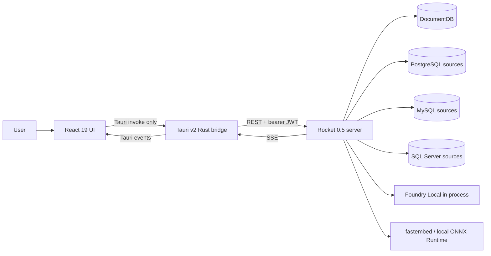
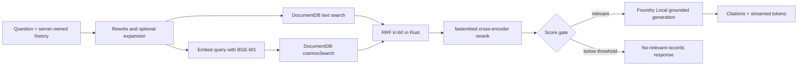

# Architecture and data model

> **Authoritative current-state guide (2026-09-02).** This document describes the implementation in `onprem-rag-server/` and `onprem-rag-app/`. Status labels distinguish shipped behavior from incomplete or planned work. For feature-level behavior, see [Application and feature architecture](application-and-feature-architecture.md). For ingestion details, see [Ingestion, schema catalog, and Data Explorer](ingestion-schema-catalog-and-explorer.md).

## System boundary and privacy invariant

This is an on-premises RAG system for health records. Operational data comes from PostgreSQL, MySQL, or SQL Server, is processed on the server host, and is stored in local DocumentDB. **There are no cloud model calls.** Chat, routing, extraction, verification, embeddings, and reranking all run locally.

The security boundary is deliberate:

- React renders the interface and invokes Tauri commands. It does not call the Rocket server directly and never receives or stores the JWT.
- The Tauri Rust bridge owns the server base URL and JWT in managed state, persists them through `tauri-plugin-store`, adds bearer authentication, and relays server SSE as Tauri events.
- The Rocket server owns authorization, source credentials, database access, ingestion, retrieval, model execution, and persistence.
- Saved source passwords are encrypted at rest with AES-256-GCM. The encryption key and JWT secret are separate production requirements.

## Runtime components

### React application — implemented

`onprem-rag-app/src/` is a React 19, TypeScript, Vite, Tailwind, Zustand, and TanStack Query application. TanStack Query holds server-derived data. Zustand holds session presentation, navigation, ingestion workflow, model download progress, drafts, queues, and active streaming runs.

The application uses an in-memory route registry and navigation stack rather than browser routing. Feature modules are lazy loaded. Responsive compositions cover phone, tablet/rail, and desktop/sidebar layouts.

### Tauri bridge — implemented

`onprem-rag-app/src-tauri/src/state.rs` holds the `reqwest::Client`, base URL, JWT, log-stream flag, and cancellable run registry. `commands.rs` mirrors server wire types and exposes commands to React. Streaming commands translate SSE to namespaced events such as `chat://*`, `agent://*`, `ingest://*`, `model://*`, and `logs://*`.

A response field must be mirrored in both `commands.rs` and `src/lib/bridge.ts`; otherwise serde can silently discard it at the bridge boundary.

### Rocket server — implemented

`onprem-rag-server/src/main.rs` initializes configuration, DocumentDB, indexes, auth seed data, recovery, local model services, warmup, retention, and schema polling. `AppState` holds cheap database/model handles, model-routing overrides, the aggregation catalog, route cache, admission controls, ingestion notifications, and warmup state.

The process is async Tokio and serves multiple clients. Expensive generations, retrievals, and ingestions are bounded by process-local admission controls. `/health` is liveness-oriented; `/ready` checks operational readiness, including required indexes and capacity.

### Foundry Local — implemented, chat/tool generation only

`foundry-local-sdk` is embedded **in process**. There is no separate Foundry HTTP service to start, stop, or restart, and no fixed Foundry port. The model-management UI therefore exposes load, unload, download, delete, role defaults, and execution-provider registration—not fake service lifecycle controls.

Foundry Local is used for chat generation and model-driven structured tasks such as routing, SQL/tool planning, optional clinical extraction, and optional verification. It is **not** the embedding engine.

### fastembed — implemented

`embed/` uses local fastembed **BGE-M3**, 1024 dimensions, with the same prefix-free encoder for documents and queries. `retrieval/rerank.rs` uses `bge-reranker-v2-m3`. These synchronous model APIs run behind blocking-task boundaries and guarded model instances.

This supersedes early plan text that named a Foundry embedding client or `qwen3-embedding-0.6b`. Switching embedding models requires a full re-embedding; vectors from different models must not be mixed.

### DocumentDB — implemented

The store is the local DocumentDB engine exposed through the MongoDB wire protocol and backed by PostgreSQL/pgvector. The Rust `mongodb` 3.x driver accesses it. The records collection has:

- a `cosmosSearch` IVF cosine index on `contentVector`;
- a legacy `$text` index on `text`;
- compound indexes supporting source/table/active-generation reads.

The exact `cosmosSearch` and `$text` syntax was verified against the local container. DocumentDB does not provide the native rank-fusion operator assumed by some MongoDB products, so rank fusion remains in Rust.

## Major server paths

| Concern | Primary modules | Current behavior |
| --- | --- | --- |
| Auth and authorization | `auth/`, `crypto.rs` | Argon2id passwords, HS256 JWTs, token-version revocation, four roles, admin guards, login throttling, audit writes |
| Sources | `connectors/` | PostgreSQL/MySQL through `sqlx`; SQL Server through `tiberius`; encrypted saved credentials |
| Ingestion | `ingest/`, `embed/` | Paged, checkpointed, generation-aware local embedding and DocumentDB writes |
| Semantic RAG | `rag/`, `retrieval/` | rewrite/expansion, vector + text retrieval, RRF, rerank, score gate, grounded generation |
| Structured answers | `router/`, `aggregation/`, `nl2sql/` | tiered routing to DocumentDB aggregation or validated read-only source SQL where appropriate |
| Agents | `agents/`, `foundry/router.rs` | auto or explicit agent routing; structured rows/charts or semantic citations |
| Chat memory | `routes/conversations.rs`, `memory.rs` | per-user conversations, persisted messages, bounded working memory and compaction |
| Operations | `telemetry.rs`, `routes/metrics.rs`, `logstream.rs` | local tracing, summary metrics, and live log relay without logging prompts/record text |

## Request and answer paths

### Semantic RAG — implemented

The router can bypass retrieval for conversational or conversation-meta turns. Structured questions can use an exact DocumentDB aggregation or the live-source NL-to-SQL path. Structured failures intentionally fall back to semantic retrieval rather than fail the whole request. The hybrid cohort executor remains partial: its route currently falls back to semantic handling.

### Live source SQL — implemented with safeguards

The schema linker selects one connected source; a chat query does not federate SQL across databases. Generated SQL is dialect-aware and must pass AST validation, table allowlists, row limits, plan-cost checks where supported, a read-only connector execution path, and timeouts. Results and SQL provenance can be persisted with the assistant message.

## Authoritative DocumentDB model

Schemas are intentionally schemaless at the database level; the fields below are stable conceptual contracts, not exhaustive inventories.

| Collection | Identity and important fields | Ownership and role |
| --- | --- | --- |
| `users` | string UUIDv7 `_id`; username, email, name, role, Argon2 hash, token version, timestamps | Authentication and RBAC |
| `sources` | UUIDv7 `_id`; engine/host/database/user; encrypted password; test status | Saved PG/MySQL/MSSQL connections; no password in public responses |
| `records` | composite `_id`; `source_id`, `table`, `row_pk`, `chunk_index`, `fields`, `text`, `contentVector`, `ingest_generation`, `active`, optional `extracted` | Chunk-grained retrieval store; only active generation is read |
| `indexed_tables` | `{source_id}:{table}`; active generation, refresh state, row/vector counts, timestamps | Per-table last-known-good pointer and explorer/ingest summary |
| `jobs` | UUIDv7 `_id`; saved request, status/counters/log, checkpoint table/offset/generation | Durable ingestion progress and resume metadata |
| `schema_catalog` | source/table/version card, columns, FK edges, samples/profiles, text and local vector | Source-specific NL-to-SQL schema metadata |
| `schema_catalog_state` | source `_id`; active version, structural hash, health and refresh timestamps | Atomic last-known-good catalog pointer |
| `schema_catalog_history` | UUIDv7 `_id`; trigger/outcome/hash/error/timestamps | Bounded operational refresh history |
| `schema_metadata_overrides` | source `_id`; aliases and undeclared relationships | Admin-curated metadata surviving catalog refreshes |
| `chat_conversations` | ObjectId `_id`; `user_id`, title, optional `agent_kind`, timestamps, memory fields | User-scoped chat and agent partitions |
| `chat_messages` | ObjectId `_id`; conversation/user, role/content, citations, structured or SQL result, optional verification | Authoritative transcript |
| `settings` | named settings documents | Persisted per-role model-routing overrides |
| `audit_log` | ObjectId `_id`; actor, action, resource, details, timestamp | Append-only security/administrative trail |

### Planned collections and fields

**Status: Planned — see [plans/new/01-service-line-ontology-and-schema-binding.md](../new/01-service-line-ontology-and-schema-binding.md), [plans/new/04-structured-execution-and-fallbacks.md](../new/04-structured-execution-and-fallbacks.md), and [plans/new/06-conversation-memory-and-suggestions.md](../new/06-conversation-memory-and-suggestions.md).**

| Collection | Identity and important fields | Ownership and role |
| --- | --- | --- |
| `schema_bindings` | source `_id`; `catalog_version`, `dialect`, `tables[]` (`table`, `concept`, `confidence`, `service_lines`, `columns[]` with `role`/`enum_values`/`pii`, `patient_path`, `overridden`), `coverage`, `built_at` | Per-source binding of the fixed service-line ontology to the physical schema; rebuilt on catalog refresh and overrides save |
| `schema_binding_history` | versioned copies of `schema_bindings`; last 5 kept per source | Admin diff view of concept/role changes |
| `schema_metadata_overrides` (extended) | adds `table_concepts`, `column_roles`, `service_lines` arrays | Admin binding overrides alongside existing aliases/relationships |

Planned field additions to existing collections:

- `chat_conversations.focus` — `ConversationFocus` (patient/provider/place entities, `concept`, `service_line`, `time_range`, `last_spec`, `last_result` digest, `pending_clarify`, `turn`, `updated_at`), written by the executor after each turn without a model call.
- `chat_messages` — `provenance` (PHI-free rung path, backend, service line, scope, source, timings), `spec` (the `QuerySpec` behind a structured answer), `suggestions` (≤ 4 pre-bound follow-ups), `focus_used` (which focus slots were substituted), `clarify` (`slot`, `options` when the assistant asked a clarifying question), and `mode` (`ask` | `trends` | `handover`).

### Identifier distinction

Most application-created top-level IDs use UUIDv7 for time locality. Chat conversations/messages and audit rows use MongoDB ObjectIds. Record IDs include source, table, row key, chunk, and ingestion generation so staged and active generations can coexist safely.

**Planned:** `chat_conversations.agent_kind` stores the service-line slug (`ask`, `maternity`, `ward_board`, …) instead of the current mechanism names (`health_query`, `trends`, `patient_lookup`, `summarize`, `chat`); legacy values are read through a one-release mapping to Ask plus a mode (see [plans/new/05-hospital-agents-server.md §1](../new/05-hospital-agents-server.md)).

## Generation semantics

There are two independent versioned data families:

1. **Ingest generations** protect searchable record refreshes. New chunks are written inactive, the table cutover marks the new generation active transactionally, and old inactive records are cleaned afterward. Retrieval, aggregation catalogs, and Data Explorer filter on `active: true`.
2. **Schema catalog generations** protect source metadata refreshes. New cards are fully introspected, profiled, embedded, and inserted before `schema_catalog_state.active_version` moves. Readers resolve only that active version.

A generation in one family does not imply the same version in the other.

## Authentication and role model

Implemented roles are `admin`, `doctor`, `nurse`, and `analyst`. Server guards are authoritative; client route filtering is UX only. Conversations are scoped by JWT subject, and ownership mismatch returns 404 to avoid disclosing existence. Logout and forced logout increment token versions, superseding the older assumption that issued JWTs necessarily remain valid until expiry.

The development seed is `admin` / `password`, but production startup rejects default or weak security configuration. It must not be treated as a deployable credential.

## Streaming and concurrency

The server sends SSE; the bridge consumes it and emits typed Tauri events. Token payloads are JSON encoded so leading whitespace survives SSE parsing. React registers listeners once at application boot in `bridgeEvents.ts`.

Chat and agent state is a **per-run registry keyed by `run_id`**, with per-conversation queues and drafts. Different conversations can stream concurrently. A conversation normally serializes prompts, while “Send now” may bypass its queue. The Tauri bridge owns cancellation handles per run. This supersedes the original single-in-flight-run design.

Ingestion is detached from the initiating request. A process-local broadcast wakes connected progress streams, while the `jobs` document remains the durable reconnect/recovery snapshot.

## Status summary

### Implemented

- On-prem-only model and data flow.
- React → Tauri bridge → Rocket separation with JWT outside the web layer.
- PostgreSQL, MySQL, and SQL Server connectors.
- BGE-M3 embeddings, hybrid DocumentDB retrieval, RRF, reranking, grounding gate, citations.
- Tiered routing, DocumentDB aggregation, guarded live-source SQL, agents, persisted chat memory.
- Generation-aware paged/resumable ingestion and versioned source schema catalogs.
- Auth/RBAC, source credential encryption, token revocation, audit log, metrics, readiness, and admission limits.

### Partial or operationally unverified

- Hybrid cohort execution routes semantically rather than running the planned structured-then-semantic executor.
- Optional extractor/verifier code is implemented but disabled by default and has not been fully quality-validated against live configured models.
- Capacity targets and full failure/soak matrix are not yet established on named production hardware.
- Some list APIs remain unbounded and dashboard aggregation is not yet materialized.

### Planned

- Calibrated retrieval thresholds and broader metadata filters.
- Index tuning from corpus-scale benchmarks.
- Full production recovery, backup/restore, and capacity certification.
- Analytics dashboards and outbreak-alert backend.
- Service-line ontology and per-source schema binding, router v3, `QuerySpec`-driven SQL, `StructuredExecutor`, conversation focus, and registry-driven agents — see [plans/new/00-README.md](../new/00-README.md).

## Superseded design notes

- **Foundry embeddings:** superseded by fastembed BGE-M3; Foundry Local has no suitable embedding catalog entry.
- **External Foundry service controls:** superseded by the in-process native SDK lifecycle.
- **Delete-before-reingest:** superseded by staged generations and last-known-good cutover.
- **Whole-table ingestion:** superseded by bounded page reads, though paging currently uses `OFFSET`, not keyset cursors.
- **Single pending chat/agent run:** superseded by run registries, per-conversation queues, and cancellation.
- **Client-held history as authority:** superseded by server-owned persisted history and working-memory assembly.
- **MongoDB source connector from the reference UI:** not implemented and not part of the current connector contract.

## Source plans consolidated

- `../old/00-master-plan.md`
- `../old/02-verification-and-decode-findings.md`
- `../old/07-ingest-wizard-implementation.md`
- `../old/09-chat-implementation.md`
- `../old/10-agents-implementation.md`
- `../old/26-schema-metadata-catalog.md`
- `../old/docs/architecture-overview.md`
