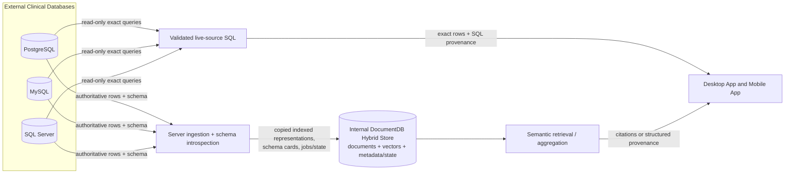
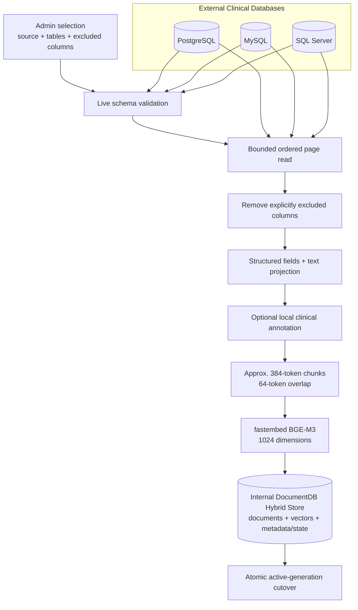
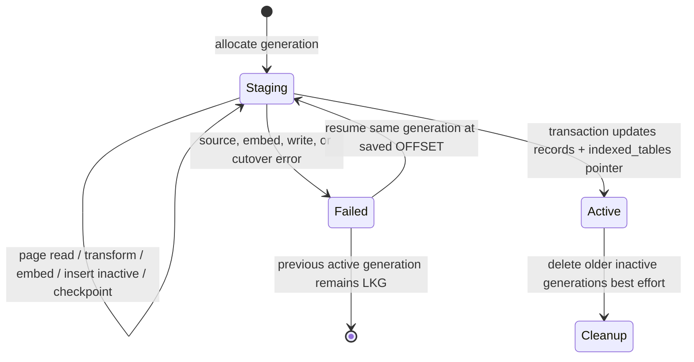
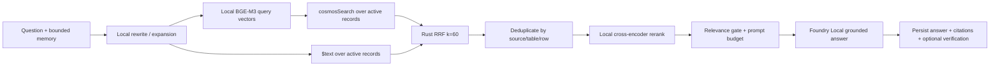
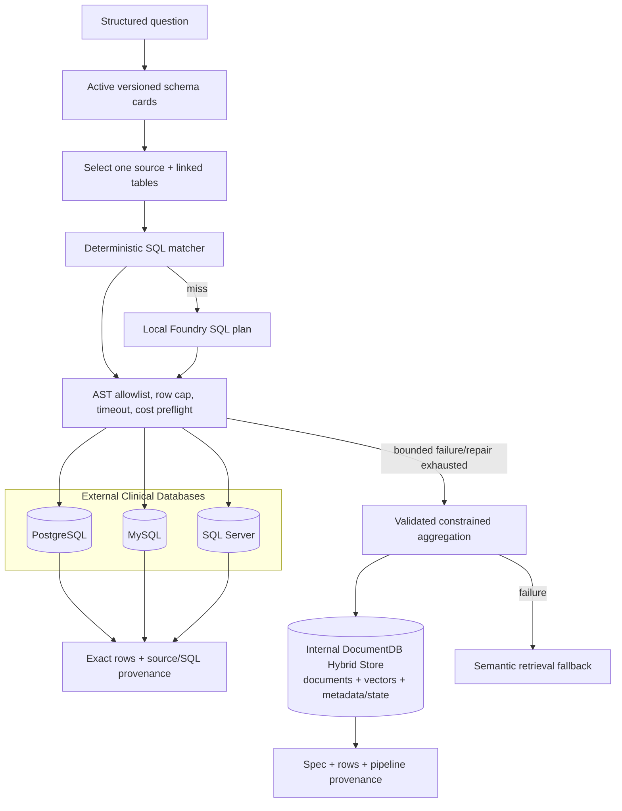

# Data Architecture

> **Authoritative current-state guide (2026-09-02).** Current code is authoritative. Status terminology follows the [documentation authority policy](README.md). This guide distinguishes external clinical systems of record from copied internal representations and documents the implemented, partial, and planned data lifecycle.

## Data architecture principles

1. **PHI remains on premises.** Source reads, projections, embeddings, vectors, prompts, transcripts, and outputs remain within the on-prem deployment.
2. **Clinical sources remain authoritative.** PostgreSQL, MySQL, and SQL Server own operational source rows. The Internal DocumentDB Hybrid Store owns copied searchable representations and application state; it is not a replacement clinical system of record.
3. **Copies retain provenance.** Every indexed chunk carries source, table, row, chunk, and generation identity. Answers retain the evidence form used to produce them.
4. **Publication is generation-based.** New record and schema-catalog data is fully staged before readers move to it. A failed refresh preserves the last-known-good (LKG) pointer.
5. **Model/vector compatibility is an invariant.** Current record and schema vectors are BGE-M3, 1024 dimensions, prefix-free. Changing model or dimensions requires rebuilding affected vectors and indexes; unlike vectors must not be mixed.
6. **No hidden cloud data plane exists.** Foundry Local and fastembed are local processors, not external data stores or cloud services.

## Data domains

| Domain | System of record / owner | Current data |
| --- | --- | --- |
| Operational source data | External PostgreSQL, MySQL, or SQL Server managed by the clinical source owner | Authoritative rows and live schema; queried read-only by connectors |
| Source registrations | Internal DocumentDB Hybrid Store / server | Source kind, host, port, database, username, encrypted password, test status and timestamps |
| Schema metadata | External schema is truth; versioned internal catalog is a planning copy | Tables, columns, types, PK/FK edges, bounded samples/profiles, local card text/vector, structural hash, health/history, admin overrides |
| Indexed chunks and vectors | Server ingestion pipeline in Internal DocumentDB Hybrid Store | Filtered row fields, projected/chunked text, BGE-M3 vectors, optional annotations, provenance, generation and active flag |
| Identity and security | Internal DocumentDB Hybrid Store / auth subsystem | Users, password hashes, roles, token versions, audit records, encrypted source credentials |
| Chat and memory | Internal DocumentDB Hybrid Store / conversation subsystem | Conversations, messages, citations, structured/SQL results, verification reports, rolling summaries and summary cursor |
| Jobs | Internal DocumentDB Hybrid Store / ingestion subsystem | Saved ingest request, checkpoint, progress counters, bounded log, status and timestamps |
| Telemetry | Rocket process memory and trace stream; audit is separately persisted | Bounded metrics samples, recent log replay, request summaries without intended prompt/record text; durable best-effort security audit |
| Model settings/state | Settings collection plus process-local managers | Persisted role overrides; loaded/resident model state, caches, warmup and EP state are process-local |

## Systems of record and ownership

### External clinical databases

The three supported source engines hold authoritative operational records. The server introspects schema, counts and pages selected tables, and executes already validated read-only SQL. It does not federate one query across multiple source databases, maintain a permanent application-owned source pool, or write clinical changes back to the sources.

Source mutations after ingestion do not immediately change indexed copies. Semantic retrieval sees the last successfully published ingest generation; live structured SQL sees source state at query execution time. The two paths can therefore legitimately differ until reingestion.

### Internal DocumentDB Hybrid Store

DocumentDB is the application persistence and search plane. It stores copied source representations plus application-owned metadata/state. The server accesses it with the `mongodb` 3.x driver over the MongoDB wire protocol. It uses a `cosmosSearch` IVF cosine index for vectors and a legacy `$text` index for lexical search; Rust performs RRF and reranking.

See [DocumentDB Architecture](documentdb-architecture.md) for the store-specific guide.

### Local inference processors

Foundry Local and fastembed transform data transiently in process. They do not become systems of record. Foundry Local produces local text/tool-planning outputs; fastembed produces vectors/rerank scores. See [Foundry Local Role](foundry-local-role.md) and [Models, accelerators, and lifecycle](models-accelerators-and-lifecycle.md).

## Ingress and transformation lineage

Implemented lineage:

1. An admin chooses a saved source, ordered tables, optional per-table excluded columns, and an optional row limit.
2. The server decrypts the source credential and validates requested tables against live introspection before launching work.
3. A durable `jobs` document records the request and is updated with table, OFFSET, generation, counters, bounded log, and terminal status.
4. Connectors read rows in bounded ordered pages. A declared primary key is preferred for ordering; paging is currently OFFSET-based.
5. Excluded fields are removed before both storage and text projection. Audit timestamps and opaque IDs may remain in `fields` while being omitted from text as retrieval noise.
6. Optional patient-reference enrichment and optional local clinical annotation occur before chunk persistence. Annotation does **not** redact the source text.
7. Text is chunked with whitespace/word approximation, then embedded locally in batches.
8. Each chunk is inserted as inactive data in a new generation.
9. When one table finishes, a DocumentDB transaction switches active records and the `indexed_tables` pointer together. Cleanup of older inactive data follows best-effort.

## Source-table → row → chunk identity

The identity chain is explicit:

| Level | Identifier | Meaning |
| --- | --- | --- |
| Source | `source_id` | UUIDv7 string minted when a source registration is created |
| Table | `(source_id, table)`; `indexed_tables._id = "{source_id}:{table}"` | A table is scoped to one source registration |
| Row | `(source_id, table, row_pk)` | `row_pk` comes from connector row identity: preferred source natural/primary ID, with connector positional fallback where necessary |
| Chunk | `(source_id, table, row_pk, chunk_index, ingest_generation)` | One text segment and vector from one copied row in one generation |
| Stored record `_id` | `"{source_id}:{table}:{row_pk}:{chunk_index}:{generation}"` | Allows old active and new staged generations to coexist |

Every chunk clones the row's structured `fields` and optional extraction annotation. This enables row-grained Data Explorer reconstruction from the first chunk and permits citations to expose source/table/row/chunk coordinates without a separate raw-row collection.

**Limitation:** fallback row identity and OFFSET paging are less stable under concurrent source mutation than a declared immutable primary key plus keyset pagination. Token/chunk sizes are approximated by whitespace, not the exact embedding tokenizer.

## External rows versus copied indexed representations

| Property | External clinical source | Internal indexed copy |
| --- | --- | --- |
| Authority | Clinical system of record | Derived/searchable application representation |
| Shape | Original relational rows and schema | Schemaless chunk documents with cloned fields, text, vector, metadata |
| Freshness | Live at query time | Last successfully published ingest generation |
| Mutability | Controlled by source system | Replaced/removed only through ingestion and administrative lifecycle |
| Query use | Schema introspection and validated read-only structured SQL | Semantic vector/text retrieval, constrained aggregation, Data Explorer |
| Completeness | Full source data available to its owner | Only selected tables/rows and non-excluded columns; text projection omits configured noise fields |
| Semantics | Exact relational operations | Approximate semantic retrieval unless a constrained aggregation is used |

The internal copy must never be described as the canonical patient record. Conversely, live SQL result rows are not automatically copied into `records`; their result/provenance may be persisted with the assistant message when the conversation is persisted.

## Ingest generation, staging, cutover, and LKG

Each table refresh gets a UUIDv7 `ingest_generation`.

The cutover transaction:

1. marks previously active records for the source/table inactive;
2. marks staged records in the completed generation active; and
3. upserts `indexed_tables.active_generation`, status, counts, and timestamps.

Readers representing current indexed data filter `active: true`. A failed staged refresh cannot partially replace the LKG. Resuming replays the checkpoint page safely by first deleting inactive chunks in the same generation for the fetched row keys. Boot recovery marks interrupted jobs failed and resets transient table refresh status while retaining active and staged data.

**Partial operational guarantee:** transactions implement the intended atomic cutover, but complete failure-injection and production-scale recovery evidence is not yet committed. Old inactive generations are cleaned eagerly after cutover rather than retained for a grace period.

## Schema catalog versioning

The source schema catalog is separate from ingest generations and from the row-derived Data Explorer profile.

For each source refresh, the server:

1. introspects all tables and relationships;
2. obtains bounded sample rows and approximate column profiles;
3. builds table cards containing source/table identity, columns/types/nullability, PK/FK flags, FK edges, samples, profiles, card text, and estimated row count;
4. embeds every card text locally with BGE-M3;
5. inserts all cards under a new UUIDv7 `catalog_version`;
6. updates `schema_catalog_state.active_version` only after the generation is complete; and
7. deletes previous versions best-effort after publication.

A structural SHA-256 fingerprint includes tables, columns/types/flags, and FK edges, but excludes row counts and profiles so routine data changes do not constitute schema drift. Poll, source creation/test, completed ingestion, manual refresh, and lazy initialization can trigger refresh. Failed refreshes update health/history but preserve the prior active version.

Admin aliases and undeclared relationships live in `schema_metadata_overrides`, independent of generations, so curation survives refreshes. Source configuration changes invalidate cards, state, history, overrides, and the process-local graph cache.

The schema catalog has its own vector index (`cardVector`) at the configured embedding dimensions. An ingest generation and catalog version are independent and must not be compared as if they were one timeline.

## Schema binding lineage

**Status: Planned — see [plans/new/01-service-line-ontology-and-schema-binding.md](../new/01-service-line-ontology-and-schema-binding.md).**

A `SchemaBinding` is a derived artifact layered on the schema catalog: it maps each active `TableCard` to an `EntityConcept` (and thereby to the `ServiceLine`s that own the concept) and each column to a `ColumnRole`, with confidences, bounded `enum_values`, a PII flag, and the shortest FK path to the Patient-bound table.

- **Version tie.** `schema_bindings.catalog_version` equals the `schema_catalog_state.active_version` it was built from. A binding is never read against a different catalog version.
- **Rebuild triggers.** Every successful catalog refresh and every save of `schema_metadata_overrides` rebuilds the binding (non-fatal on failure; the previous binding stays loaded). Overridden tables carry `overridden: true`.
- **History.** `schema_binding_history` keeps the last 5 versions per source for the admin diff view; older versions are dropped.
- **Inputs.** Active cards, `MetadataOverrides` (aliases, relationships, and the extended `table_concepts` / `column_roles` / `service_lines`), the ingest PII analysis when present, and cached BGE-M3 vectors of the fixed concept descriptors. No PII column is ever placed in `enum_values`.
- **Ownership rule.** A binding is a read allow-list that scopes linking, aggregation, retrieval, and personas per service line. It is **not** a security boundary; authorization remains RBAC in `auth/`.

The ingested `records` collection is joined to a binding only by `(source_id, table)` name match at aggregation-catalog build time; records themselves carry no binding version.

## Provenance of answers

**Status: Planned — see [plans/new/04-structured-execution-and-fallbacks.md §6](../new/04-structured-execution-and-fallbacks.md).**

Every assistant message produced by the `StructuredExecutor` persists a PHI-free `provenance` object recording the path actually taken (ordered rungs — link, deterministic SQL, model SQL, validate, execute, aggregation, list, retrieval, clarify — each hit/miss/skipped with a reason), the backend, service line, scope, source, and per-rung timings. Alongside it:

| Answer path | Persisted evidence |
| --- | --- |
| Live-source SQL | executed SQL text, the `QuerySpec` that produced it (when deterministic), compiler explanation, columns, rows |
| Scoped DocumentDB aggregation | validated `RunAggregation`/`RunList` spec, rows, executed pipeline |
| Filtered semantic RAG | the `RetrievalFilter` applied (tables, sources, row keys or patient key, whether explicit or inferred and whether it was relaxed) plus citations |
| Hybrid | cohort SQL/spec **and** the retrieval filter derived from it, plus citations |

Provenance reasons must be schema-level ("bind error: no EventTime on Bill"), never row values.

## Internal DocumentDB collection inventory

These are the named collections in the current code. Fields are conceptual contracts; DocumentDB remains schemaless at the storage layer.

| Collection | Identity / key fields | Owner and lifecycle |
| --- | --- | --- |
| `users` | UUIDv7 string `_id`; username, email, role, Argon2 hash, `token_version`, timestamps | Auth subsystem; admin/user mutations; unique email index |
| `sources` | UUIDv7 string `_id`; kind/host/port/database/username, `password_enc`, status, timestamps | Connector administration; source deletion cascades indexed and schema metadata |
| `records` | Composite string `_id`; `source_id`, `table`, `row_pk`, `chunk_index`, `ingest_generation`, `active`, `fields`, `text`, `contentVector`, optional `extracted` | Ingestion-owned copied chunks; searched/read only as active current data |
| `indexed_tables` | `"{source_id}:{table}"`; counts, status, `refresh_status`, `active_generation`, timestamps | Ingestion publication pointer and Data Explorer summary |
| `jobs` | UUIDv7 string `_id`; source/request, checkpoint, counters, bounded log, status/timestamps | Durable ingestion progress, reconnect, boot recovery, and resume |
| `schema_catalog` | Source/table/version card; `card_text`, `cardVector`, columns, FK edges, profiles/samples, hash/time | Versioned NL-to-SQL planning copy |
| `schema_catalog_state` | Source ID `_id`; `active_version`, hash, health/status, checks/errors | Atomic LKG catalog pointer and health |
| `schema_catalog_history` | UUIDv7 entry `_id`; source, trigger/outcome/hash/error/timestamps | Bounded operational catalog refresh history |
| `schema_metadata_overrides` | Source ID `_id`; aliases and undeclared relationships | Admin-curated metadata independent of versions |
| `schema_bindings` (Planned) | Source ID `_id`; `catalog_version`, table/column bindings, coverage, `built_at` | Derived ontology binding; rebuilt on refresh and overrides save |
| `schema_binding_history` (Planned) | Versioned binding copies; last 5 per source | Admin diff view |
| `chat_conversations` | ObjectId `_id`; `user_id`, title, optional `agent_kind`, summary, `summary_upto`, timestamps | User-scoped transcript partition and rolling memory state; **Planned:** `focus` (`ConversationFocus`) |
| `chat_messages` | ObjectId `_id`; conversation/user, role/content, citations or structured/SQL result JSON, optional verification, timestamps | Authoritative persisted transcript/evidence; **Planned:** `provenance`, `spec`, `suggestions`, `focus_used`, `clarify`, `mode` |
| `settings` | Named documents, currently including `app_settings` | Persisted model-role routing overrides |
| `audit_log` | ObjectId `_id`; actor, action, resource, optional details, timestamp | Best-effort security/admin event trail |

There is no separate raw-row collection, vector database, telemetry database, alert collection, or analytics warehouse in the current implementation.

## Vector and model invariants

| Invariant | Current implementation |
| --- | --- |
| Embedding model | fastembed `bge-m3` |
| Dimensions | 1024 by default and in the verified index |
| Prefix policy | Same prefix-free encoder for documents and queries |
| Record vector field | `records.contentVector` |
| Schema vector field | `schema_catalog.cardVector` |
| Similarity/index | `cosmosSearch`, cosine (`COS`), `vector-ivf`, fixed `numLists=100` |
| Lexical index | `$text` over `records.text` |
| Reranker | fastembed `bge-reranker-v2-m3`; logits converted with sigmoid |
| Fusion | RRF in Rust with $k=60$ because vector/text scores are not comparable |

Configuration can expose model/dimension values, but changing them is not an online mixed-vector migration. All affected record and catalog vectors must be regenerated and indexes recreated/validated. Corpus-specific score-gate calibration and dynamic index sizing remain planned.

## Query data paths

### Semantic retrieval

Each returned `Passage` includes record `_id`, `source_id`, table, `row_pk`, chunk index, text, fields, score type, vector/text ranks, fused score, and optional rerank score. Only selected chunks, not reconstructed complete parent rows, enter the grounding prompt. General source/table/patient/date metadata filters and cohort-key injection are not implemented. **Planned:** a `RetrievalFilter` (tables, source IDs, cohort row keys, patient key) applied to both search sides — see [plans/new/04-structured-execution-and-fallbacks.md §4](../new/04-structured-execution-and-fallbacks.md).

### Structured query

Live-source SQL uses current operational data and exactly one selected source. Deterministic templates precede local model planning. The validator permits one read-only query over linked allow-listed tables, inserts/clamps outer row bounds, rejects dangerous syntax/functions, and applies connector/runtime limits. DocumentDB aggregation operates only over active copied records and cannot claim live-source freshness.

The full hybrid cohort path—exact cohort selection followed by metadata-filtered semantic retrieval—is **Partial**; hybrid classification currently falls back to ordinary semantic retrieval.

## Provenance, citations, and verification

| Answer path | Persisted/displayed provenance |
| --- | --- |
| Semantic RAG | Ordered cited `Passage` records with source/table/row/chunk identity, text/fields, and ranking scores; optional `verify_json` on the same assistant message |
| Live-source SQL | `source_id`, executed SQL, columns, exact rows, and deterministic answer summary in `sql_result_json` |
| DocumentDB structured agent | Validated aggregation spec, result rows, and pipeline in `structured_json` |
| Conversational or conversation-meta | No record citations; answer derives from local generation or server-owned conversation memory |

Citations are the selected chunk evidence used in the prompt; they do not imply a full row reconstruction or clinical correctness certification. Verification runs after streaming, combines deterministic citation-range checks with an optional local verifier, and is disabled by default. Extracted terminology codes are hints, not terminology-service-validated facts. The audit log does not currently record every viewed row, citation, or PHI access.

## Consistency model

The system deliberately combines different consistency scopes:

- **External source reads:** connector/query-specific point-in-time behavior determined by the source database and isolation level; there is no distributed snapshot across sources.
- **Indexed records:** per-source-table LKG consistency. A transaction moves record activity and `indexed_tables.active_generation` together; readers filter `active: true`.
- **Schema catalog:** per-source LKG pointer. Complete cards are inserted before `active_version` changes; linkers resolve the active version.
- **Source versus index:** eventually consistent by explicit reingestion; live SQL may observe newer data than semantic retrieval.
- **Jobs:** durable snapshots plus process-local notifications. Reconnect rereads the snapshot; writes are progress snapshots, not an immutable event log.
- **Conversations:** user/assistant messages are separate writes. The user turn is persisted before generation and the assistant turn only after successful completion; a mid-stream failure can therefore leave a user message without a persisted assistant reply.
- **Memory compaction:** asynchronous write-behind with compare-and-swap on `summary_upto`; the bounded verbatim tail remains authoritative transcript data.
- **Audit:** best-effort and not transactional with the primary mutation, so it is not a complete ledger.
- **Metrics/logs/caches:** process-local and reset at restart.

## Retention, deletion, and reingest semantics

### Indexed data

- Successful reingest publishes a new generation and deletes older inactive generations best-effort.
- Failed or interrupted staging preserves the prior active generation and retains staged data for resume/cleanup.
- Admin table deletion removes all generations for one `(source_id, table)` and its `indexed_tables` entry.
- Admin connection clear removes all `records` and `indexed_tables` entries for a source but retains the source registration and its separate schema catalog.
- Clear-all removes all records and indexed-table state across sources; it does not delete users, sources, conversations, schema catalogs, settings, audit, or jobs.
- Deleting a source removes its registration, records, indexed-table entries, schema cards/state/history/overrides, and schema graph cache. It does not currently document a cascade to historical jobs or conversations that may reference that source.

### Schema metadata

- Successful refresh publishes a new active version then eagerly cleans older card versions best-effort.
- Failed refresh retains the active version and records health/history.
- Editing source connection configuration invalidates all catalog generations, state, history, overrides, and graph cache.
- Overrides survive ordinary successful refreshes but are deleted on source configuration change or source deletion.

### Conversations and audit

- Deleting a conversation deletes its messages after ownership-checked conversation deletion.
- Optional boot-time/daily conversation retention deletes conversations and messages older than the configured `updated_at` cutoff. Default `ONPREM_CONVERSATION_RETENTION_DAYS=0` retains indefinitely.
- No implemented retention policy is documented for `jobs`, `audit_log`, schema history, or indexed records beyond explicit operations/reingestion cleanup.
- Audit has no tamper-evident chain, transactional coupling, archival/export policy, or enforced append-only database role.

## PHI boundaries and minimization

PHI can exist in external source rows, copied `records.fields`, `records.text`, vectors, optional annotations, schema sample values/profiles, query prompts, citations, chat messages/summaries, structured/SQL results, job errors/logs, and client display/session memory.

Implemented controls and constraints:

- all processing and model inference stay on premises;
- selected columns are excluded before storage, projection, and embedding;
- source passwords are AES-256-GCM encrypted at rest and omitted from public responses;
- JWTs stay in the Tauri Rust bridge rather than normal web-view state;
- conversations are scoped by JWT subject;
- telemetry request summaries intentionally avoid prompts and record text;
- frontend drafts and active run buffers are not intentionally persisted to browser storage.

Important limitations:

- PII detection in schema analysis is advisory; columns are not automatically excluded;
- the optional clinical extractor annotates and does not redact;
- schema samples and message/result payloads may contain PHI;
- bridge JWT storage, transport TLS, DocumentDB certificate validation, CSP, durable log governance, and comprehensive PHI-access audit require production hardening;
- vector representations remain sensitive derived health data even when not directly readable as text.

## Current limitations and planned data work

### Partial or operationally unverified

- OFFSET paging and fallback row identity can drift under concurrent source changes.
- The ingest pipeline is page-bounded but not fully overlapped through bounded channels.
- Resume is server-implemented without complete normal UI controls.
- Full crash-point, larger-than-memory, backup/restore, and long-soak evidence is not committed.
- Semantic retrieval selects one strongest chunk per row but does not reconstruct all sibling chunks.
- No general safe metadata filter is applied to both vector and lexical retrieval.
- Conversation/message lists and some administrative lists are not uniformly cursor-paged.
- Audit writes are best-effort and not a complete PHI-access ledger.
- Fixed IVF sizing and score thresholds are not corpus-calibrated production guarantees.

### Planned

- Keyset/cursor ingestion where source schemas support stable keys.
- Cohort-key-filtered hybrid retrieval with allow-listed metadata predicates and limits.
- Full-vector migration tooling/model-version metadata sufficient to make embedding upgrades explicit and safe.
- Measured index sizing and retrieval threshold calibration on representative on-prem corpora.
- Durable retention/export/integrity policies for audit, jobs, logs, schema history, and backups.
- Production recovery, restoration, deletion-verification, and capacity certification.
- Materialized analytics/alert data only if those product backends are implemented; no such stores exist today.
- Per-source schema bindings with bounded history, conversation focus state, and per-message provenance/suggestions (see the Planned sections above and [plans/new/00-README.md](../new/00-README.md)).

## Code map

| Data concern | Primary code |
| --- | --- |
| Collection names/handles and base indexes | `onprem-rag-server/src/documentdb/mod.rs` |
| Vector and text indexes/search | `onprem-rag-server/src/documentdb/vector.rs` |
| Source registrations and cascades | `onprem-rag-server/src/connectors/routes.rs`, `connectors/{postgres,mysql,mssql}.rs` |
| Ingest records, identity, staging/cutover/resume | `onprem-rag-server/src/ingest/mod.rs`, `ingest/routes.rs`, `ingest/extract.rs` |
| Embedding invariant | `onprem-rag-server/src/embed/mod.rs`, `config.rs` |
| Schema catalog/version/link graph | `onprem-rag-server/src/nl2sql/catalog.rs`, `nl2sql/spec.rs`, `nl2sql/linker.rs`, `nl2sql/routes.rs` |
| Semantic lineage/citations | `onprem-rag-server/src/retrieval/mod.rs`, `retrieval/rrf.rs`, `retrieval/rerank.rs`, `rag/routes.rs`, `verify.rs` |
| Structured source data path | `onprem-rag-server/src/nl2sql/{generate,validate,execute,routes}.rs` |
| Structured copied-data path | `onprem-rag-server/src/aggregation/{catalog,validate,execute,list}.rs` |
| Conversation data and retention | `onprem-rag-server/src/routes/conversations.rs`, `memory.rs` |
| Identity/audit/settings | `onprem-rag-server/src/auth/`, `crypto.rs`, `routes/audit.rs`, `settings.rs` |
| Jobs/progress transport | `onprem-rag-server/src/ingest/routes.rs`, `state.rs` |
| Ephemeral telemetry | `onprem-rag-server/src/telemetry.rs`, `logstream.rs`, `routes/metrics.rs` |
| Bridge/client representations | `onprem-rag-app/src-tauri/src/commands.rs`, `onprem-rag-app/src/lib/bridge.ts`, `src/lib/types.ts` |

## Related authoritative guides

- [Documentation index and authority policy](README.md)
- [System Architecture Design](system-architecture-design.md)
- [DocumentDB Architecture](documentdb-architecture.md)
- [Foundry Local Role](foundry-local-role.md) *(expected parallel authoritative guide)*
- [Architecture and data model](architecture-and-data-model.md)
- [Ingestion, schema catalog, and Data Explorer](ingestion-schema-catalog-and-explorer.md)
- [Retrieval, chat memory, and concurrency](retrieval-chat-memory-and-concurrency.md)
- [Routing, agents, and structured query](routing-agents-and-structured-query.md)
- [Deterministic query handling reference](deterministic-sql-matcher.md)
- [Models, accelerators, and lifecycle](models-accelerators-and-lifecycle.md)
- [Security, Authentication, and Audit](security-auth-and-audit.md)
- [Operations, Performance, and Observability](operations-performance-and-observability.md)
- [Evaluation, Production Validation, and Release](evaluation-production-and-release.md)
- [Verified Platform Notes](verified-platform-notes.md)
