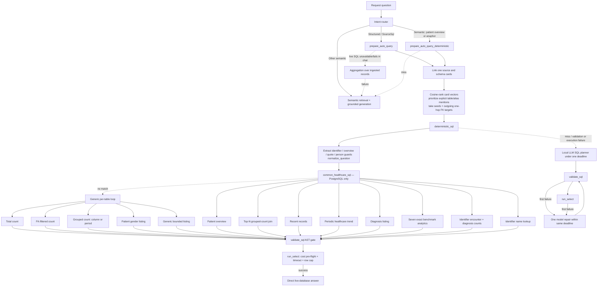

<!-- markdownlint-disable-file -->

# Deterministic query handling reference

Authoritative reference for deterministic natural-language-to-SQL handling in `onprem-rag-server`.
The **target design** is a typed `QuerySpec` intermediate representation (IR): a small grammar parses
questions into the IR, a binder resolves it against a per-source `SchemaBinding`, and a compiler emits
dialect SQL. That design is **Planned** and specified in
[plans/new/03-schema-driven-deterministic-sql.md](../new/03-schema-driven-deterministic-sql.md)
(roles and binding in [plan 01](../new/01-service-line-ontology-and-schema-binding.md)). The code that
runs today is the hardcoded template matcher in `src/nl2sql/routes.rs`, documented in
[§9 Legacy template matcher](#9-legacy-template-matcher-current-code-to-be-removed-after-golden-suite-passes).

| Section | Status |
| --- | --- |
| §1 principle, §9 legacy matcher, §9.6 eval coverage | **Implemented** (current code) |
| §2–§8 `QuerySpec` IR, grammar, predicates, binder, compiler, model fallback, golden suite | **Planned** — plan 03 |

## 1. Purpose and design principle

Deterministic handling compiles narrowly recognized structured questions directly to SQL before the
local text-to-SQL model is invoked. It is a constrained fast path, not a general parser.

> **It must never guess.** A miss is cheap and falls through to the local planner or another grounded
> path; a wrong match would return a confidently wrong answer.

Both the legacy matcher and the IR obey this: frames must be fully consumed (every non-filler token
accounted for), every referenced table and column must exist in linked schema evidence, and ambiguity
returns `None` / `NoParse`. Deterministic SQL never bypasses safety: it passes through the same
`validate_sql` AST allowlist and `run_select` execution controls as model-generated SQL.

What the IR changes is *where the schema lives*. Today the grammar, the physical column names, and
the SQL text are one Rust function per shape, bound to the dev seed (`patients`, `encounters`,
`deliveries`…). The IR separates three concerns that change at different rates:

| Concern | Changes when | Lives in |
| --- | --- | --- |
| Language → intent (grammar) | new phrasing | `nl2sql/ir/parse.rs` |
| Intent → physical columns (binding) | new hospital | `SchemaBinding` (plan 01) |
| Physical → SQL text (compiler) | new dialect | `nl2sql/ir/compile.rs` |

The same IR is what the router's Tier 1.5 emits as a routing decision (plan 02), what the model
planner is asked to fill as a fallback (§7), what the DocumentDB aggregation fallback consumes
(plan 04), what "and by gender?" follow-ups mutate (plan 06), and what the UI renders as provenance.
CI must find zero physical table or column names in `nl2sql/ir/*` outside tests and fixtures.

## 2. `QuerySpec` IR (`nl2sql/ir/spec.rs`)

**Status: Planned — plan 03 §2.**

| Field | Type | Meaning |
| --- | --- | --- |
| `subject` | `Subject { concept: EntityConcept, table: Option<String> }` | The concept rows are drawn from; `table` filled at bind time |
| `shape` | `Shape` | Result shape (table below) |
| `measures` | `Vec<Measure { op, target: Option<ColumnRef>, alias }>` | `Count`, `CountDistinct`, `Sum`, `Avg`, `Min`, `Max`, `Median` (dialect-dependent), `Rate { numerator: Filter }`; empty for `List`/`Lookup` |
| `dimensions` | `Vec<Dimension { column: ColumnRef, label }>` | `GROUP BY`; may be on a joined table |
| `filters` | `Vec<Filter { column, op, value }>` | AND-ed; `op ∈ Eq, Ne, In, Gt, Gte, Lt, Lte, Between, Like, ILike, IsNull, IsNotNull, IsTrue, IsFalse`; `value ∈ Str, Num, Bool, Date, Ts, List, Range, Param` |
| `time` | `Option<TimeScope { column, range: Option<TimeRange>, bucket: Option<BucketUnit> }>` | Filter on `EventTime`/`StartTime` plus optional bucket |
| `order`, `limit` | `Vec<Order { target: Measure(alias) | Column(ColumnRef), dir }>`, `Option<u32>` | Ordering and top-N |
| `joins` | `Vec<JoinRef { hops: Vec<JoinHop>, alias, kind: Inner | Left }>` | Resolved at bind time from FK paths |
| `projection` | `Vec<ColumnRef>` | Display columns for `List`/`Lookup` |
| `provenance` | `SpecProvenance` | Grammar rule that fired, focus substitutions, `derived_from` message id for mutations |

A `ColumnRef { concept, role: ColumnRole, name_hint, physical: Option<(table, column)> }` is a
*logical* column — concept plus role — resolved to a physical `table.column` only by the binder.

### 2.1 `Shape`

| `Shape` | Result | `QueryIntent` (router/UI contract) | Example |
| --- | --- | --- | --- |
| `Scalar` | One row, one or more measures | `Aggregation` | "how many deliveries last month" |
| `Grouped` | One row per dimension value | `Aggregation` | "… by ward" |
| `Trend` | One row per time bucket | `Trend` | "encounters per week" |
| `TopN` | Ordered, limited groups | `Aggregation` | "which doctor saw the most patients" |
| `Rate` | Percentage of a numerator filter over the subject | `Aggregation` | "what is our no-show rate" |
| `Exists` | Boolean / zero-or-more | `Aggregation` | "are there any unpaid bills" |
| `List` | Bounded rows with projection | `Enumeration` | "list patients admitted over 14 days" |
| `Lookup` | One entity by identifier or name | `Lookup` | "tell me about PT-00042" |

`QuerySpec::intent()` keeps the existing `QueryIntent` enum stable for the router and clients.

## 3. Grammar (`nl2sql/ir/parse.rs`)

**Status: Planned — plan 03 §3.**

`parse(resolved_question, &RouteEntities, &SchemaBinding, scope) -> ParseOutcome` where
`ParseOutcome ∈ { Parsed { spec, missing: Vec<MissingSlot> }, NoParse }`. Input entities (concepts,
enum filters, time range, metric, dimension, identifiers, top-N) come from the router's
binding-driven extraction (plan 02 §3.2). The grammar is a small set of slot-filling rules tried in
order; a rule fails cheaply when its anchor token is absent, and a question parses only when every
remaining token is in the filler allow-list — the legacy name-lookup "full consumption" rule
generalised.

| # | Rule (informal) | Shape | Required slots |
| --- | --- | --- | --- |
| R1 | `how many|count|number of <concept> [filters] [time] [by <dim>]` | Scalar / Grouped | subject |
| R2 | `total|sum of <Amount/Quantity col> [of <concept>] [filters] [time] [by <dim>]` | Scalar / Grouped | subject, measure target |
| R3 | `average|mean|median|longest|shortest|highest|lowest <Measure/Duration/Amount col> …` | Scalar / Grouped / TopN | subject, target |
| R4 | `<concept> per|by|each <day|week|month|quarter|year> …` or `trend|over time|monthly …` | Trend | subject, `EventTime` |
| R5 | `which|what|who <dim-concept> had|ordered|prescribed|saw|performed the most|fewest <concept> [time]` | TopN | subject, dimension via FK path |
| R6 | `top|most common|most frequent <N>? <concept|col> [by count] [time]` | TopN | subject |
| R7 | `what is our|the <rate word> …` — rate word ∈ enum value or `Flag` column ("no-show rate", "caesarean rate", "mortality rate") | Rate | subject, numerator filter |
| R8 | `list|show|which <concept> [filters] [time] [limit]` / `who is|are <filters>` | List | subject |
| R9 | `tell me about|find|look up|record of <identifier|person name>` | Lookup | Patient/Provider identifier |
| R10 | `is|are there any|do we have <concept> [filters]` | Exists | subject |
| R11 | `<concept> (in|on|at) <Location/Ward/Department value>` — filter modifier on R1/R8 | — | join via `*Ref` |
| R12 | `currently|right now|open|active|pending|admitted|in theatre` → `Status` enum filter or `EndTime IS NULL` | — | — |
| R13 | `over|more than|at least <N> <days|hours|minutes>` on a `Duration` column or `EndTime − StartTime` | filter | — |
| R14 | `expires|due|scheduled (within|in the next) <N> <unit>` → `EventTime BETWEEN now AND now+N` | filter | `EventTime` |
| R15 | `without|missing|no <concept>` → anti-join (`NOT EXISTS`) along the FK path | filter | FK path |
| R16 | Domain phrases (`low birth weight`, `category 1`, `abnormal`, `overdue`, `unpaid`…) → predicate table (§4) | filter | — |

Rules compose: R1 + R11 + R12 + time yields "how many patients are currently admitted in ICU".

- **Concept resolution:** a noun phrase maps to a concept via `descriptor.singular/plural/synonyms`, a bound table name, or an admin alias. Enum values map to filters through `ColumnBinding.enum_values` on the subject and its one-hop neighbours ("caesarean" → `Delivery.delivery_mode = 'caesarean'`). Person-name detection reuses `contains_likely_person_name`.
- **Dimension resolution:** `by ward` → `WardRef` join to the Ward table's name column; else a `Location` column whose name contains "ward"; else a `Category` column whose name contains "ward". Same for provider/doctor/nurse, department, insurer, medication/drug, diagnosis (→ `Code` + `Description`).
- **Missing slots:** a rule that fires without a resolvable subject ("how many were cancelled?") returns `Parsed { missing: [Subject] }` so the router can fill it from focus or ask one clarifying question. `MissingSlot ∈ { Subject, Patient, TimeRange, Metric, Dimension }`.

## 4. Domain predicate table (`nl2sql/ir/predicates.rs`)

**Status: Planned — plan 03 §4.** Ontology-level definitions expressed in roles, never physical names.

| Phrase | Concept | Predicate |
| --- | --- | --- |
| low birth weight | Newborn | `Measure(name_hint: weight) < 2500` (unit from `_g` vs `_kg`) |
| stillbirth | Delivery / Newborn | `Status|Category enum ∈ {stillbirth, stillborn}` |
| category 1 / red | Triage | `Measure(name_hint: category) = 1` or `Category enum = red` |
| abnormal / critical | LabResult | `Flag(name_hint: abnormal|critical) IS TRUE` |
| no-show / DNA | Appointment | `Status enum = no_show` |
| outstanding / unpaid | Bill | `Amount(name_hint: due|balance) > 0` or `Status enum ∈ {billed, partial}` |
| readmission | Admission | `Flag(name_hint: readmission) IS TRUE` |
| out of stock | Medication / StockBatch | `SUM(Quantity(name_hint: on_hand)) = 0` (HAVING) |
| expiring within N days | StockBatch / License / BloodUnit | `EventTime(name_hint: expir) BETWEEN now AND now+N` |
| lost to follow-up | ProgramEnrollment | `Status enum = lost_to_followup` |
| break-glass | AccessLog | `Flag(name_hint: break_glass) IS TRUE` |
| in charge | Shift | `Flag(name_hint: in_charge) IS TRUE` |
| pending certification | Mortality | `Identifier|BusinessId(name_hint: certificate) IS NULL` |
| length of stay | Admission | `Duration(name_hint: length|los)` else `EndTime − StartTime` |
| door-to-doctor | Triage | `Duration(name_hint: door_to_doctor)` else `seen_time − arrival_time` |
| theatre time | Surgery | `Duration` else `EndTime − StartTime` |

A predicate whose roles are absent in the hospital's schema is `Unbound`; the parse reports
`missing: [Metric]` and the router clarifies or falls to the planner.

## 5. Binder (`nl2sql/ir/bind.rs`)

**Status: Planned — plan 03 §5.** `bind(spec, &SchemaBinding, scope) -> Result<QuerySpec, BindError>`.

- `Subject.table = binding.by_concept(concept)` restricted to `scope`.
- Each `ColumnRef`: same table if the role is present; else one-hop FK neighbours (adds a `JoinRef`); two hops for `Dimension`s only (Prescription → Encounter → Department). Patient-scoped filters use `TableBinding.patient_path` (≤ 3 hops).
- `TimeScope.column` defaults to the subject's single `EventTime`; verbs (admitted / discharged / booked / scheduled / delivered) pick `StartTime` / `EndTime` / `EventTime` by name hint.
- `BindError ∈ { NoSubject, NoRole(role), NoPath(a, b), Ambiguous(role, candidates) }`; `Ambiguous` surfaces as `MissingSlot::Dimension` with candidate names as clarify options.

Binding only ever emits tables that are in `scope` (the agent's allow-list, plan 05) — the compiler
and `validate_sql` re-check this.

## 6. Compiler (`nl2sql/ir/compile.rs`)

**Status: Planned — plan 03 §6.** `compile(&spec, dialect, max_rows) -> CompiledSql { sql, params_inlined, explanation }`.

| Construct | PostgreSQL | MySQL | SQL Server |
| --- | --- | --- | --- |
| Identifier quoting | `"x"` | `` `x` `` | `[x]` |
| Time bucket | `DATE_TRUNC('month', c)` | `DATE_FORMAT(c, '%Y-%m-01')` | `DATETRUNC(month, c)` (2022+), `DATEFROMPARTS(YEAR(c), MONTH(c), 1)` under `ONPREM_MSSQL_COMPAT_LEVEL` |
| Duration (minutes) | `EXTRACT(EPOCH FROM (e - s))/60` | `TIMESTAMPDIFF(MINUTE, s, e)` | `DATEDIFF(MINUTE, s, e)` |
| `now()` | `NOW()` | `NOW()` | `SYSDATETIME()` — relative ranges are inlined as ISO literals computed server-side so SQL is self-contained provenance |
| `Median` | `PERCENTILE_CONT(0.5) WITHIN GROUP` | `NoParse` → planner | `PERCENTILE_CONT(0.5) WITHIN GROUP` |
| Row cap | `LIMIT n` | `LIMIT n` | `TOP n` (`WITH TIES` when "which … most" and n = 1, preserving the tie-keeping A08 behaviour) |

Common rules: aliases `t0..tn`; `Count → COUNT(*)`, `CountDistinct → COUNT(DISTINCT t.c)`,
`Rate → 100.0 * SUM(CASE WHEN pred THEN 1 ELSE 0 END) / COUNT(*)`; values inlined as escaped literals
(`'` doubled) and re-parsed by the validator; `NOT EXISTS` for R15; `List` projection =
`BusinessId, PersonGivenName, PersonFamilyName, EventTime, Status` then up to four more non-PII,
non-`FreeText` columns — never `Contact`/`Identifier` roles unless the user is admin **and** asked by
name; `LIMIT max_rows` on every non-scalar shape (the validator re-injects anyway). `explanation` is a
generated sentence ("Counted deliveries with delivery_mode = caesarean between 2026-08-01 and
2026-08-31, grouped by ward") used as `sql.explanation` and by the narrator.

## 7. Model fallback emits the IR

**Status: Planned — plan 03 §7.** `nl2sql/generate.rs::plan_spec` is a tool call whose JSON schema
*is* `QuerySpec` (concepts and roles as closed enums; physical names forbidden). `prepare_with_cards`
becomes: IR parse → (miss) `plan_spec` → `bind` → `compile` → `validate_sql` → (fail) existing raw
`plan_sql` + one repair as the last resort. A wrong `QuerySpec` is rejected by `bind` before any SQL
exists; small local models fill a typed schema far more reliably than they write dialect SQL.

## 8. Golden suite and acceptance

**Status: Planned — plan 03 §9–10.**

- `nl2sql/ir/tests/golden.jsonl`: `{ question, binding: "dev"|"alt", expect_shape, expect_sql_pg, expect_sql_mysql, expect_sql_mssql }`. Seeded with the 10 A-series questions and their **current** SQL (byte-equivalent modulo whitespace/aliasing, or asserted on result set against the live seed) plus ≥ 60 questions from [hospital-agents-and-data-map.md §5](hospital-agents-and-data-map.md#5-what-each-agent-can-now-answer).
- Alt-binding run: the same 60 questions against `alt_schema_binding.json` (plan 01 §10) must parse to the same `Shape` and bind to the alternative names.
- Property tests: every compiled statement parses in `sqlparser` for its dialect; every emitted table ∈ scope.
- Live: golden PostgreSQL SQL run against the dev container and compared with `eval/QUESTIONS.md` ground truth.
- Gates: A-series 10/10 unchanged; ≥ 55/60 new questions deterministic on the dev seed and ≥ 50/60 on the alt schema; deterministic path p50 < 300 ms; zero physical names in `nl2sql/ir/*`.

The legacy template families (§9) are deleted only after this suite passes on the IR path.

## 9. Legacy template matcher (current code, to be removed after golden suite passes)

**Status: Implemented.** Everything in this section describes `src/nl2sql/routes.rs` as it runs today.
The code contains **19 deterministic template families**: 14 specialized families in
`common_healthcare_sql` (including seven exact benchmark shapes) and 5 generic/schema-driven
families. Counts are by independently generated SQL shape, not by phrase.

### 9.1 Request pipeline and attempt order

#### 9.1.1 Schema linking precedes matching

`prepare_query` calls `link`; automatic chat handling calls `link_auto_source`, which uses
`link_best_source` and lazily refreshes missing catalogs once. Both paths:

1. Embed the question locally with `embed_query`.
2. Rank active `TableCard`s by cosine similarity to `cardVector` (`rank_cached_cards`). A vector
   dimension mismatch scores `0.0`.
3. Run `prioritize_table_mentions`: an explicit table-name mention (singular/plural tolerant) or a
   configured business alias outranks embedding score.
4. Select the first `nl2sql_tables_max` ranked cards as seeds, then include each seed's **outgoing**
   one-hop `fk_edges` targets (`select_with_relationships`). Incoming edges and recursive expansion
   are not added. The final list can therefore exceed `nl2sql_tables_max`.
5. For auto-source selection, choose the source owning the best-ranked card; no cross-source query is
   built.

Templates see only these linked cards. Missing a needed fact, dimension, or lookup card therefore
causes a deterministic miss even if the table exists elsewhere in the source.

#### 9.1.2 Exact compiler order

`deterministic_sql` first extracts the raw identifier and patient-overview subject, records whether
raw input contains a quote or likely person name, then normalizes the question. It attempts:

1. `common_healthcare_sql` in this internal order:
   1. patient overview;
   2. when there is no identifier, quote, or likely person name: `top_grouped_count_join_sql`,
      `recent_records_subject`, then `periodic_trend_subject`;
   3. when there is no identifier or quote: diagnosis listing;
   4. seven exact benchmark analytics, in source order;
   5. when an identifier exists: encounter/diagnosis count, then name lookup.
2. If no specialized match succeeds, each linked card in linker order, then its plural and naïvely
   singularized entity names, attempts:
   1. `is_count_question`;
   2. `relationship_filtered_count_sql`;
   3. `grouped_count_sql`;
   4. `patient_gender_listing_sql`;
   5. `listing_limit`.

The first emitted SQL wins. Unsafe table cards are skipped by the generic loop.

`prepare_with_cards` calls `try_deterministic` before obtaining the Foundry manager or starting the
planner. A deterministic compilation, validation, or execution miss returns `None`; only then does
planning begin. The planner and its possible repair share the single deadline configured by
`ONPREM_NL2SQL_PLAN_TIMEOUT_SECS`.

### 9.2 Matching foundation

#### 9.2.1 `normalize_question`

Every ASCII alphanumeric character and underscore is lowercased and retained. Every other character
becomes a space; whitespace is collapsed and trimmed. Thus punctuation and hyphens are removed as
boundaries: `SYN-2024-0001` becomes `syn 2024 0001`, while `_` remains. Matching is otherwise literal;
normalization does not stem words or understand synonyms beyond explicit maps.

#### 9.2.2 Schema lookup in `common_healthcare_sql`

Its local `table(name, columns)` closure matches the unqualified final component of a card table name,
case-insensitively, and requires every named column. Specialized templates are PostgreSQL-only:
`common_healthcare_sql` immediately declines MySQL and SQL Server.

#### 9.2.3 Healthcare subject maps

`HEALTHCARE_RECORD_SUBJECTS` is shared by top-N joins, recent records, and periodic trends:

| Canonical subject | Accepted aliases | Target table(s) |
| --- | --- | --- |
| `encounters` | `encounter`, `encounters`, `visit`, `visits` | `encounters` |
| `prescriptions` | `prescription`, `prescriptions`, `medication`, `medications` | `prescriptions` |
| `admissions` | `admission`, `admissions` | `admissions` |
| `diagnoses` | `diagnosis`, `diagnoses` | `diagnoses` |
| `lab_orders` | `lab order`, `lab orders`, `lab panel`, `lab panels`, `lab test`, `lab tests`, `labs` | `lab_orders` |
| `payments` | `payment`, `payments` | `payments` |

`healthcare_record_subject` requires exactly one canonical subject and rejects any question containing
`patient` or `patients`. Matching uses normalized whole-token padded phrases.

`HEALTHCARE_GROUP_ENTITIES` supports only:

| Dimension table | Accepted aliases | Output label alias |
| --- | --- | --- |
| `providers` | `provider(s)`, `doctor(s)`, `clinician(s)`, `prescriber(s)` | `provider` |
| `patients` | `patient(s)` | `patient` |

### 9.3 Template family inventory

All frames are matched on `normalize_question` output (§9.2.1). "PG" = PostgreSQL-only (`common_healthcare_sql` declines MySQL and SQL Server); "all" = dialect-specific SQL for all three connectors. Every family requires the listed columns on *linked* cards and returns `None` otherwise. The grammar rule column names the IR rule (§3) intended to absorb the family.

| Family (matcher) | Frames | Schema required | SQL shape | Notable declines | Dialects | IR rule |
| --- | --- | --- | --- | --- | --- | --- |
| Patient overview (`patient_overview_subject`) | `Tell me about …`, `Who is …`, `Give me an overview of …`, `Find …`, `Look up …`, `Pull up [the] record for …`; name = 2–3 title-cased parts, or identifier + only `patient`/`the`/`record` | `patients(patient_no, first_name, middle_name, last_name, date_of_birth, gender, blood_type)` | select those columns; exact `patient_no` or `ILIKE` name parts; order `patient_no`; limit `min(nl2sql_max_rows, 10)` | non-person concepts; 1- or 4-part names; extra identifier text; `Who is patient <ID>` (left to name lookup). Linking question gets `patient` appended for name-only prompts | PG | R9 |
| Top-N grouped-count join (`top_grouped_count_join_sql`) | `Who <verb> the most <subject>?` (providers implied), `Which <group alias> <verb> the most <subject>?`; verbs `ordered`, `prescribed`, `had` | one `HEALTHCARE_RECORD_SUBJECTS` fact card + `providers`/`patients` dimension card + first fact FK edge to it | group by label (`first_name || ' ' || last_name` → `name` → `full_name` → key); order count desc; limit `nl2sql_max_rows.clamp(1,10)`; ties not preserved | identifier, quote, likely person name, multiple subjects, unsupported entity (e.g. counties), unsafe identifiers | PG | R5 |
| Recent records (`recent_records_subject`; guard `is_recent_records_question`) | subject last; prefix exactly `give me an overview of the most recent`, `show [me] [the] most recent`, `what are the latest`, `list [the] recent`, optional numeric limit | one mapped subject card + `preferred_trend_date_column` | date + up to 5 subject-specific display columns; newest first; limit explicit or 10, clamped `1..=25` and `nl2sql_max_rows` | quote, person name, identifier, patient wording, unknown subject, no temporal column | PG | R8 + order |
| Periodic healthcare trend (`periodic_trend_subject`) | `<alias> per <period>`; period adjective + `count(s)`/`volume(s)`; trend word + `by <period>`; legacy month default: trend word + `over time`/count/volume, or count/volume + `going up or down`. Periods day/week/month/year | one `HEALTHCARE_RECORD_SUBJECTS` subject + preferred date column (`<singular>_date` → subject list → `created_at`; type must contain `date`/`time`) | `date_trunc('<period>', col)::date`, `COUNT(*)`, `GROUP BY 1`, `ORDER BY 1`, `LIMIT nl2sql_max_rows` | identifier, quote, person name, patient wording, two periods, bare `Show encounters over time` | PG | R4 |
| Diagnosis listing (inline) | list frame (`which`/`list`/`show` + patient wording, or `who` + `has`/`diagnosed`) + diagnosis frame (`diagnosed with`, `patients with`, `who has been diagnosed with`, `which patients have`); term = remaining tokens after filler removal, `[A-Za-z0-9 -]` only | `diagnoses(patient_id, diagnosis_desc)`, `patients(id, patient_no, first_name, last_name)` | join on `patient_id`; `diagnosis_desc ILIKE '%term%'`; distinct number/name; order `patient_no`; limit `nl2sql_max_rows` | identifier, quote (so `Crohn's` misses), count wording, empty/unsafe term | PG | R8 + R16 |
| Seven exact benchmark analytics (`common_healthcare_sql`) | exact normalized strings — see §9.3.1 | per row in §9.3.1 | per row | any paraphrase | PG | R1–R3, R6 |
| Identifier encounter + diagnosis count | exact `show encounter and diagnosis counts for patient <ID>`; ID = `\b[A-Za-z]{2,6}-\d{2,4}-\d{2,6}\b`, first match, uppercased | `patients(id, patient_no, first_name, last_name)`, `encounters(id, patient_id)`, `diagnoses(id, patient_id)` | left joins; `COUNT(DISTINCT …)` for both; group by patient identity | no identifier, any extra/missing word | PG | R1 + patient filter |
| Identifier name lookup (`is_name_lookup_question`) | identifier removed; ≥ 1 of `name`/`named`/`called`/`who`; every other token in a closed filler list (full consumption) | `patients(patient_no, first_name, last_name)` | equality lookup, `LIMIT 1` | extra constraints (e.g. treating doctor) | PG | R9 |
| Generic total count (`is_count_question`) | `how many`/`count`/`number of`/`what is the number of`/`total number of` + entity (table name, spaces for `_`, or naive singular); residue empty or one of `do we have`, `are there`, `are indexed`, `indexed`, `exist`, `are stored`, `in total`, `total` | any linked safe card | `COUNT(*) AS <singular>_count` | any unconsumed qualifier (`How many active patients?`) | all | R1 |
| FK-filtered count (`relationship_filtered_count_sql`) | exact `how many <entity> are from|come from|are in <value>`; value 1–128 chars | outgoing FK edge to a linked target with label column `name`/`title`/`label`/`code`/`<relation>_name`; scored: sample match +10, relation word +4, `from` + geographic relation +5 | join base FK → target key; case-insensitive label equality | no positive candidate, unsafe metadata; equal-score ambiguity not detected | all | R1 + R11 |
| Grouped count (`grouped_count_sql`) | column shape: exact `count|number of|show [the] number of <entity> by <column label>`; periodic shape: `per|by day|month|year` | safe column, or `<singular>_date` else first `date`/`time`-typed column | column/count, order count desc; or dialect bucket (`DATE_TRUNC` / `DATE_FORMAT` / `DATEFROMPARTS`), chronological | unsafe column; no week support; may pick arbitrary first temporal column | all | R1 + dim / R4 |
| Patient gender listing (`patient_gender_listing_sql`) | entity `patient(s)`; starts with `list`/`show`/`display`/`get`; whole token `female` or `male` (female wins if both); not full-consumption | `patient_no, first_name, last_name, gender` | first three columns; lowercased gender equality; dialect `TOP`/`LIMIT nl2sql_max_rows` | other entities | all | R8 + enum filter |
| Generic bounded listing (`listing_limit`) | `list`/`show me`/`show`/`display`/`get` [`the`] + exactly `<entity>`, `all <entity>`, or `first <N> <entity>` | any linked safe card | `SELECT *` with `TOP`/`LIMIT`; N clamped `1..=nl2sql_max_rows` | any other residue | all | R8 |

#### 9.3.1 Exact benchmark analytics (ground truth for A03–A09)

These compare the normalized question by exact equality. All require PostgreSQL and the listed linked schema.

| Exact normalized question | Required schema | Generated SQL shape |
| --- | --- | --- |
| `show me patients whose first name starts with p` | `patients(patient_no, first_name, last_name)` | select number/name; `first_name ILIKE 'P%'`; order by first/last/number; limit `nl2sql_max_rows` |
| `how many female and male patients are there` | `patients(gender)` | cast gender to text; count/group/order by gender; validator adds outer limit |
| `which month had the most encounters and how many` | `encounters(encounter_date)` | monthly `DATE_TRUNC`; count; descending count then month; `LIMIT 1` |
| `what is the most common diagnosis and how many times does it occur` | `diagnoses(diagnosis_desc)` | count by description; descending count then description; `LIMIT 1` |
| `what is the average length of stay for discharged admissions` | `admissions(length_of_stay_days, discharge_date)` | rounded average plus non-null value count; require non-null discharge; validator adds limit |
| `which medications were prescribed most often` | `prescription_items(medication_id)`, `medication_catalog(id, generic_name)` | CTE counts joined generic names; keep all rows equal to maximum (tie-preserving); order by name; validator adds limit |
| `how many lab results were abnormal` | `lab_results(is_abnormal)` | count rows where boolean is true; validator adds limit |

The code does **not** contain an exact A01 or A02 string in this block: A01 is served by generic total
count and A02 by generic patient gender listing. The IR golden suite (§8) must reproduce each row's
result set, including the tie-preserving A08 shape.

### 9.4 Shared guard rails and safety layers

#### 9.4.1 Raw-question guards

- `contains_likely_person_name` applies a case-sensitive regex for two title-cased name-like words,
  optionally after `for`, `of`, or `patient`, with hyphen/apostrophe support. It guards top-N,
  recent-record, and trend matching. Because it runs on raw text, all-lowercase names may not trip it.
- Raw single or double quotes block top-N, recent/trend, and diagnosis-list templates.
- Any extracted record identifier blocks top-N, recent/trend, and diagnosis listing.
- `extract_record_identifier` allows only letters, digits, and fixed hyphens and uppercases the value
  before interpolation.

These checks are computed in `deterministic_sql` immediately before normalization (not in
`try_deterministic` itself).

#### 9.4.2 Identifier and schema guards

`is_safe_identifier` requires a nonempty ASCII letter/underscore first and only ASCII alphanumeric or
underscore thereafter. `is_safe_table_name` applies that rule to every dot-separated component.
Generic card iteration skips unsafe table names; templates that interpolate metadata additionally
check relevant tables/columns as described above.

Every specialized SQL shape requires linked cards and explicitly required columns. The final allowed
relation list is exactly the linked card table names.

#### 9.4.3 `validate_sql` AST gate

Every deterministic statement is parsed with the selected PostgreSQL, MySQL, or SQL Server dialect,
then normalized from its AST. The validator requires exactly one `Statement::Query`; rejects locks;
rejects relations not in the linked-table allowlist (CTE names declared by the query are allowed);
and blocks dangerous function/text signatures including sleep/wait, file output/read, dynamic SQL,
`OPENROWSET`, `XP_CMDSHELL`, and `DBCC`.

It enforces an outer cap of at least one and at most `nl2sql_max_rows`: PostgreSQL/MySQL `LIMIT` is
inserted or clamped; SQL Server requires an outer `SELECT` (set operations decline) and receives a
constant non-percent, non-ties `TOP`. Existing nonconstant or unsupported limits are replaced.

#### 9.4.4 EXPLAIN cost pre-flight and execution caps

`run_select` loads the source connector and, when `nl2sql_max_plan_cost > 0`, calls `estimate_cost`
with `nl2sql_timeout_secs`. A returned estimate above the threshold produces `AppError::BadRequest`.
No estimate (`Ok(None)`) or an estimation error does **not** block execution; estimation errors are
logged and execution continues.

The connector then executes with `nl2sql_max_rows` and `nl2sql_timeout_secs`, providing a second row
cap beyond AST rewriting. On the deterministic path, any execution error—including cost rejection—
causes `try_deterministic` to return `None`, after which `prepare_with_cards` invokes the planner.
On the model path, the first validation or execution failure can trigger one repair attempt; therefore
a cost rejection can become the repair error supplied to the model. There is no model repair inside
`try_deterministic` itself.

#### 9.4.5 Configuration knobs

| Environment variable | Field | Default | Effect |
| --- | --- | ---: | --- |
| `ONPREM_NL2SQL_PLAN_TIMEOUT_SECS` | `nl2sql_plan_timeout_secs` | 30 s | One deadline shared by initial model plan and any repair; deterministic compilation is before it |
| `ONPREM_NL2SQL_MAX_PLAN_COST` | `nl2sql_max_plan_cost` | 1,000,000 | Positive values enable cost pre-flight; estimate above it is rejected |
| `ONPREM_NL2SQL_MAX_ROWS` | `nl2sql_max_rows` | 500 | Template limits, AST outer cap, and connector result cap |
| `ONPREM_NL2SQL_TABLES_MAX` | `nl2sql_tables_max` | 4 | Number of ranked seed cards before outgoing one-hop FK expansion |

`ONPREM_NL2SQL_TIMEOUT_SECS` (default 30 s) controls cost estimation and query execution timeouts.

### 9.5 Anaphoric and speculative deterministic handling

Superseded in the target design by model-free focus resolution and spec mutation
([plan 06](../new/06-conversation-memory-and-suggestions.md)); today's behaviour is identifier-only.

`resolve_followup_question` only acts when the current question has no identifier and contains either
`the/this/that patient` or a whole-token pronoun in `their`, `his`, `her`, `they`, `them`, `she`, `he`.
It scans prior working-memory turn contents oldest to newest, takes the last turn containing an
identifier (and the first identifier within that turn), and returns
`<trimmed question> patient <UPPERCASED-ID>`. It is narrow identifier grounding, not general entity or
coreference resolution.

`prepare_auto_query_deterministic` performs auto-source linking, compilation, validation, and
execution only. It never obtains the Foundry planner; a miss or failure returns `None`. This makes it
safe for speculative use.

Chat integration:

- `Structured/SourceSql`: first calls `prepare_auto_query` on the raw question (deterministic, then
  planner). Only `Ok(None)` attempts an augmented follow-up; an `Err` falls directly toward ingested
  structured handling. Since `prepare_auto_query` normally returns `Some` or `Err` after linking,
  follow-up retry here is chiefly relevant when no source is linked.
- `Semantic`: `semantic_sql_candidate` permits only a recognized patient overview or an augmented
  anaphoric follow-up, then calls deterministic-only preparation before semantic retrieval.
- Dedicated agents attempt deterministic SQL for all HealthQuery/Trends questions, recognized patient
  overviews in PatientLookup, and `is_recent_records_question` in Summarize.

If live SQL does not answer a structured chat request, the fallback chain is `run_structured` over
ingested DocumentDB records, then semantic retrieval/generation on structured failure. A semantic
speculative miss goes directly to semantic retrieval/generation.

### 9.6 Evaluation coverage

Coverage below follows `eval/QUESTIONS.md` and names the actual deterministic family. These rows are
the seed of the IR golden suite (§8) and must keep passing on both paths.

| Eval | Deterministic handling |
| --- | --- |
| A01 | Generic total count (`is_count_question`) |
| A02 | Patient gender listing (`patient_gender_listing_sql`) |
| A03 | Exact first-name-prefix benchmark template |
| A04 | Exact gender grouped-count benchmark template |
| A05 | Exact peak encounter month template |
| A06 | Exact most-common diagnosis template. `eval/QUESTIONS.md` phrases ground truth as “patients,” but the executable exact question is “how many times does it occur”; the SQL counts diagnosis rows. |
| A07 | Exact discharged-admission average template |
| A08 | Exact tie-preserving medication CTE template |
| A09 | Exact abnormal-lab-result count template |
| A10a | Identifier encounter-and-diagnosis count |
| A10b | `resolve_followup_question` + identifier name lookup through `prepare_auto_query_deterministic` |
| S06 | Top-N grouped-count join: `lab_orders.ordered_by → providers.id` |
| S07 | Top-N grouped-count join: `prescriptions.prescriber_id → providers.id` |
| S08 | Top-N grouped-count join: `encounters.provider_id → providers.id` |
| S09 | Intentionally unsupported: counties are absent from `HEALTHCARE_GROUP_ENTITIES`; deterministic handling must decline and use the local planner/fallback chain |

Related current S-series coverage outside the requested S06–S09 range: S02 is diagnosis listing, S04
is periodic healthcare trend, and S05 is patient overview.

### 9.7 Known limits (legacy matcher)

Each limit below is a direct motivation for the IR (§2–§6); the IR rule that addresses it is noted where applicable.

- `common_healthcare_sql`, including patient overview, diagnosis listing, recent records, healthcare
  trends, and top-N joins, is PostgreSQL-only. *(IR: per-dialect compiler, §6.)*
- Seven benchmark analytics remain exact normalized strings with hardcoded healthcare table/column
  names. Normalization tolerates punctuation/case, not paraphrases. *(IR: R1–R3, R6 on roles.)*
- Linked-card availability is part of matching. Directional outgoing-only FK expansion means a
  dimension selected as the sole seed does not pull in facts that reference it.
- Generic entity singularization removes only one terminal `s`; it is not linguistic inflection.
- Generic gender listing does not consume every token and chooses `female` first if both gender words
  occur.
- FK-filtered counts support one outgoing hop and equality on one label. Candidate scoring can choose
  among edges but does not detect equal-score ambiguity.
- Top-N joins support only provider/patient dimensions, three verbs, one fact FK hop, and top 10. They
  use a simple `LIMIT`, so ties at the boundary are not preserved.
- Trend/recent subjects and preferred dates are closed maps. Healthcare trends support week; generic
  periodic grouped counts do not. Generic periodic fallback may pick the first temporal column.
- Patient encounter/diagnosis counts accept any supported identifier shape, but working-memory
  grounding only carries the most recent matching identifier into an anaphoric follow-up.
- Diagnosis listing performs substring matching on `diagnosis_desc`; it does not ground ICD codes or
  canonical diagnoses, and apostrophes force a miss.
- There is no general numeric comparison, date-range filter, arbitrary aggregate, multi-filter
  composition, multi-hop join planner, or full-consumption parser across all templates. *(IR: composable
  R1–R16, binder FK paths, `TimeScope`.)*
- Cost-estimation failure is fail-open; only a successful estimate above the configured threshold is
  rejected. *(Unchanged by the IR.)*

### 9.8 Adding or changing a deterministic template (legacy path)

Prefer adding a grammar rule, predicate, or binder case to the IR (§3–§5) once plan 03 lands; new
physical-name templates in `routes.rs` are accepted only as stop-gaps that the golden suite (§8) will
have to reproduce.

1. **Choose the narrowest location.** Prefer a schema-driven generic matcher when the shape is truly
   cross-domain; otherwise add a closed healthcare shape in `common_healthcare_sql` before the generic
   loop. Document its position because first match wins.
2. **Define complete-consumption frames.** Match normalized whole tokens/exact residue. Reject unknown
   qualifiers, multiple subjects/periods, person-specific wording, quotes, and identifiers unless the
   template explicitly grounds them.
3. **Ground every interpolation.** User literals need a restricted character grammar or escaping;
   periods/operators/verbs come from closed constants. Require `is_safe_identifier` /
   `is_safe_table_name` for metadata-derived names.
4. **Require linked schema evidence.** Check every table and column. Resolve joins from `fk_edges`, not
   conventional names; account for the linker's seed plus outgoing-one-hop behavior.
5. **Be dialect explicit.** Either return `None` outside supported source kinds or emit correct syntax
   for all three connectors.
6. **Bound output.** Use `nl2sql_max_rows` (and any narrower semantic cap); preserve ties explicitly
   when correctness requires it.
7. **Return `None` on ambiguity.** Never select a plausible interpretation merely to increase
   deterministic coverage.
8. **Keep the mandatory pipeline.** Route emitted SQL through `try_deterministic` so `validate_sql`,
   cost pre-flight, timeout, and connector row cap remain active.
9. **Test both acceptance and refusal.** Add table-driven unit cases in `nl2sql::routes::tests` for
   supported phrasings, missing cards/columns/FKs, unsafe input, ambiguity, dialects, and max-row
   clamping. Add or update the corresponding eval case and ground-truth SQL.
10. **Update this inventory.** Record trigger frames, schema requirements, SQL shape, declines, attempt
    order, and evaluation coverage whenever behavior changes.
