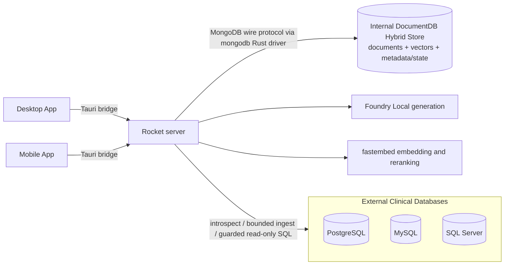
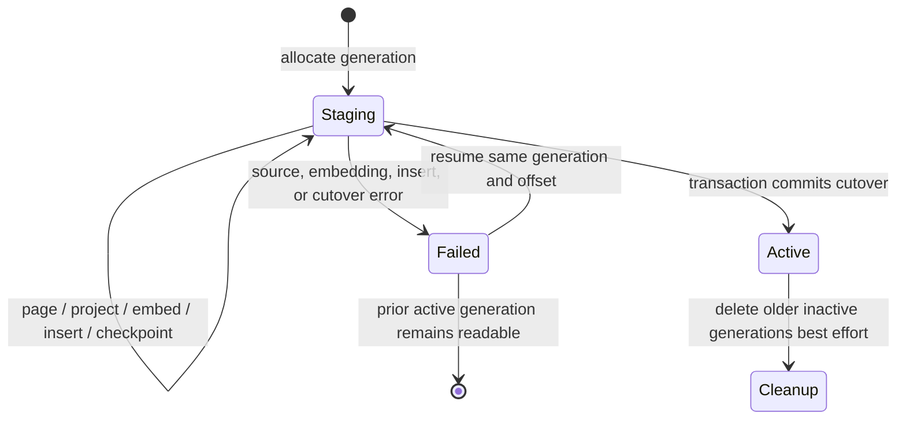
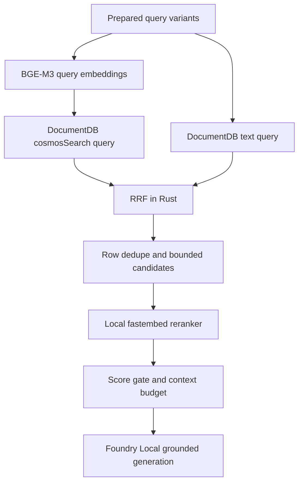

# DocumentDB Architecture

> **Authoritative current-state guide (2026-09-02).** This guide describes the store used by the current Rust server. Repository code and the dated evidence in [Verified platform notes](verified-platform-notes.md) are authoritative for supported syntax.

## Role in the system

DocumentDB is the application's **INTERNAL HYBRID STORE**: it holds copied document data, vector embeddings, retrieval text, ingestion and schema metadata, and application state. It is **not** one of the ingestion/source databases.

The external clinical databases are separately registered PostgreSQL, MySQL, and SQL Server systems. The server reads them through source connectors for schema introspection, bounded ingestion, and guarded live read-only SQL. Their rows are copied into the internal store only through the ingestion pipeline. DocumentDB itself is never presented as an operational-source connector.



The Desktop App and Mobile App share a Tauri v2 application shell and web-view implementation. Neither client connects directly to DocumentDB.

## Engine and access model

The development deployment runs the local DocumentDB engine from `ghcr.io/documentdb/documentdb/documentdb-local:latest`. It exposes a MongoDB-compatible wire gateway, conventionally on port 10260. PostgreSQL and pgvector are implementation context inside the engine; application code does not use `sqlx` or raw PostgreSQL SQL to access the internal store. It uses the `mongodb` Rust driver (`3.8.1` in `Cargo.toml`) and BSON commands, finds, updates, and aggregation pipelines.

`DocumentDb` is a thin cloneable wrapper around `mongodb::Database`. Client creation is lazy; `ping()` is the explicit reachability test. The selected database defaults to `onprem_rag` and is configured by `ONPREM_DOCUMENTDB_URI` and `ONPREM_DOCUMENTDB_DB`.

Do not infer compatibility with MongoDB Atlas, Azure Cosmos DB variants, or later DocumentDB builds from the shared wire protocol. Search/index features and aggregation syntax are engine-specific and must be verified against the deployed image.

## Data ownership and collection inventory

Schemas are application contracts enforced in Rust rather than a database-wide JSON-schema validator.

| Collection | Identifier and principal fields | Owning subsystem and purpose |
| --- | --- | --- |
| `users` | UUIDv7 string `_id`; username, unique email, display name, Argon2 hash, role, token version, timestamps | `auth/`; authentication, RBAC, and token revocation state |
| `sources` | UUIDv7 string `_id`; name, engine, host/port/database/user, encrypted password, optional query/table, last test status | `connectors/`; saved **external** source definitions, not source rows |
| `records` | deterministic composite string `_id`; `source_id`, `table`, `row_pk`, `chunk_index`, `fields`, `text`, `contentVector`, `ingest_generation`, `active`, optional `extracted`, timestamp | `ingest/`, `retrieval/`, `aggregation/`, Data Explorer; active chunk store and vector/text corpus |
| `indexed_tables` | `{source_id}:{table}` | `ingest/`; last-known-good `active_generation`, refresh/status fields, row/vector counts, timestamps |
| `jobs` | UUIDv7 string `_id`; source, saved request, status/counters, bounded log, checkpoint table/offset/generation, timestamps | `ingest/`; durable progress, reconnect snapshot, and resume state |
| `schema_catalog` | one table card per source/catalog version; table/columns/FKs/samples/profiles, `card_text`, `cardVector`, hash/version/time | `nl2sql/catalog.rs`; versioned source-schema metadata for linking and SQL planning |
| `schema_catalog_state` | source ID as `_id`; active version/hash, status/health, checks, failure state | `nl2sql/catalog.rs`; atomic last-known-good schema-catalog pointer |
| `schema_catalog_history` | generated ObjectId; source, trigger/outcome, prior/new hash, timing, count/error | `nl2sql/catalog.rs`; bounded operational refresh history |
| `schema_metadata_overrides` | source ID as `_id`; business aliases and undeclared relationships | `nl2sql/routes.rs` and `linker.rs`; administrator curation independent of generated versions |
| `chat_conversations` | ObjectId `_id`; user, title, optional `agent_kind`, timestamps, optional rolling `summary` and `summary_upto` | conversation routes and `memory.rs`; user-scoped conversation metadata |
| `chat_messages` | ObjectId `_id`; conversation/user, role/content/time; optional citations, verification, structured result, SQL result, agent kind | conversation routes; authoritative transcript and answer provenance |
| `settings` | named string `_id`; currently `app_settings` with `router_overrides`, updater and timestamp | `settings.rs`; server-wide persisted model routing choices |
| `audit_log` | generated ObjectId; actor, action, resource, optional details, timestamp | `auth/audit.rs`; best-effort security and administrative trail |

There is no active `sql_examples` collection in current code: NL-to-SQL allocates an empty few-shot list. Do not document a proposed collection as implemented.

### Planned collections and fields

**Status: Planned — see [plans/new/01-service-line-ontology-and-schema-binding.md §5](../new/01-service-line-ontology-and-schema-binding.md) and [plans/new/06-conversation-memory-and-suggestions.md §2](../new/06-conversation-memory-and-suggestions.md).**

| Collection | Identifier and principal fields | Owning subsystem and purpose |
| --- | --- | --- |
| `schema_bindings` | source ID as `_id`; `catalog_version`, `dialect`, `tables[]` with concept/role/confidence/`enum_values`/`pii`/`patient_path`, `coverage`, `built_at` | `ontology/binder.rs`; per-source binding of the fixed service-line ontology, rebuilt on catalog refresh and overrides save, loaded into `AppState` |
| `schema_binding_history` | versioned binding copies; last 5 per source | `ontology/binder.rs`; admin diff view |

Planned fields on existing collections: `chat_conversations.focus` (`ConversationFocus`), and `chat_messages.{provenance, spec, suggestions, focus_used, clarify, mode}`. `schema_metadata_overrides` gains `table_concepts`, `column_roles`, and `service_lines` arrays.

## Record and chunk schema

One `records` document represents one embedded chunk from one external source row. The current `_id` format is:

`{source_id}:{table}:{row_pk}:{chunk_index}:{ingest_generation}`

The generation suffix is essential: the active and staged versions of the same row/chunk can coexist until cutover. Older comments that omit the suffix describe the pre-generation format, not current writes.

| Field | Meaning |
| --- | --- |
| `source_id` | Saved external source UUIDv7 |
| `table` | Physical external table name |
| `row_pk` | Stable connector-derived row identity; natural ID when available, ordered-position fallback otherwise |
| `chunk_index` | Zero-based chunk within the projected row |
| `fields` | Structured source columns after explicit user exclusions; copied onto every chunk |
| `text` | Local text projection used for full-text indexing and embedding; audit fields and opaque IDs are omitted as noise, while business identifiers remain |
| `contentVector` | BGE-M3 vector, expected to have 1,024 dimensions |
| `ingest_generation` / `active` | Staging/version marker and current-read flag |
| `extracted` | Optional annotation of conditions, medications, labs, and best-effort code systems; not PHI redaction |
| `ingested_at` | Local ingestion timestamp |

Default chunking is approximately 384 whitespace-delimited words with 64-word overlap. Storage is chunk-grained, but aggregation and Data Explorer deduplicate/group by row. Retrieval also keeps only the strongest chunk per `(source_id, table, row_pk)` in the final candidates.

## Ingestion generations and publication

Each table refresh receives a UUIDv7 `ingest_generation`. New chunk documents are inserted with `active: false`; current readers continue using the previous active generation.



`activate_generation` uses a DocumentDB transaction to:

1. set the table's currently active records to inactive;
2. set the staged generation active; and
3. update the `indexed_tables` pointer and counts.

Only after commit does best-effort cleanup delete older inactive generations. Page checkpoints advance only after all chunks for the page are written. Resume replays safely by deleting matching inactive row keys from the same staged generation before reinsertion. A table failure stops the job at the first failed table so its checkpoint remains unambiguous.

At startup, legacy records lacking markers are backfilled as `active: true`, generation `legacy`. Work left `running` by a process exit is marked failed; `refresh_status: indexing` is reset without deleting active or staged data.

## Schema catalog generations

The source-schema catalog has a separate generation system. It is not coupled to record ingestion generations.

A refresh introspects one external source, takes bounded samples/profiles, creates table cards, embeds `card_text` locally with BGE-M3, and inserts a complete UUIDv7 `catalog_version`. Only after all cards are stored does `schema_catalog_state.active_version` move. Old versions are deleted afterward on a best-effort basis. On failure, the prior active pointer remains and health/history record the sanitized error.

Readers first obtain each source's active version, then load only matching cards. The linker currently caches those cards and their vectors in process and computes cosine similarity in Rust; it does not rely on the provisioned `schema_catalog` search indexes for its current ranking path. Administrator aliases/relationships are merged from `schema_metadata_overrides`, and cache entries are invalidated after refresh or override changes.

## Indexes and verified search boundary

### `records`

| Index | Definition and use |
| --- | --- |
| `records_contentVector_cosmos` | `contentVector: "cosmosSearch"`; `vector-ivf`, `numLists: 100`, cosine (`COS`), configured dimensions; semantic kNN |
| `records_text` | legacy text index on `text`; lexical `$text` ranking |
| `records_source_table_active_row` | `source_id`, `table`, `active`, `row_pk`, `chunk_index`; active row reads and explorer grouping |
| `records_source_table_active_generation` | `source_id`, `table`, `active`, `ingest_generation`; cutover/cleanup support |

### Other managed indexes

- `users_email_unique`: unique email.
- `chat_conv_user_updated`: user plus descending update time.
- `chat_msg_conv_created`: conversation plus ascending creation time.
- `schema_catalog_source_version`: source, catalog version, table.
- `schema_catalog_cardVector_cosmos`: IVF cosine vector index on `cardVector`.
- `schema_catalog_text`: text index on `card_text`.
- `schema_history_source_completed`: source plus descending completion time.

Index creation is idempotent and best-effort during boot for users, chats, record compound indexes, and schema metadata. The two required `records` search indexes are ensured by the ingestion pipeline before processing rows, not unconditionally by `main.rs`. Consequently `/ready` can remain not-ready on a fresh store until those search indexes exist.

### Planned indexes for the retrieval filter

**Status: Planned — see [plans/new/04-structured-execution-and-fallbacks.md §4](../new/04-structured-execution-and-fallbacks.md).** `ensure_indexes` will additionally create on `records`:

- `{ table: 1, active: 1 }` — table-scoped lexical filtering;
- `{ source_id: 1, table: 1, active: 1 }` — source-and-table scope;
- `{ "fields.<patient business id>": 1 }` — one index per column bound with the `BusinessId` role on a Patient-bound table, so patient-key filtering does not scan.

The exact record search syntax was live-verified on 2026-08-23 against `documentdb-local:latest` at that date:

- vector: `$search.cosmosSearch` must be the first pipeline stage, with `$meta: "searchScore"`;
- lexical: `$text`, `$meta: "textScore"`, and score sort;
- vector index: `cosmosSearchOptions` with IVF/COS/1,024 dimensions;
- Atlas-style `$vectorSearch` and native `$rankFusion` were not available on the tested path.

This evidence does not establish syntax on another Mongo-compatible server, a later image, or every Azure-hosted offering. Re-run the checks after an engine, index, dimension, or operator change. Some source comments still say the vector syntax is unverified; the dated live evidence in [Verified platform notes](verified-platform-notes.md) supersedes those stale comments.

## Hybrid retrieval: two queries, Rust fusion

For every prepared query variant, retrieval launches two independent internal-store operations when hybrid mode is enabled:

1. a `cosmosSearch` vector aggregation over `contentVector`, followed by `active: true` filtering and a bounded limit; and
2. a `$text` find over `text`, also restricted to `active: true` and ranked by `textScore`.

These searches run concurrently. Their native scores are not compared because cosine and text scores have different scales. Rust performs reciprocal rank fusion:

$$
\operatorname{RRF}(d)=\sum_i \frac{1}{k+\operatorname{rank}_i(d)},\qquad k=60\text{ by default.}
$$

The server then deduplicates source rows, takes an adaptive bounded candidate prefix, optionally reranks with local `bge-reranker-v2-m3`, trims weak passages, applies a relevance gate, and supplies bounded passages to Foundry Local. DocumentDB stores and retrieves the evidence; it does not run the reranker or the final LLM.

### Planned: scoped retrieval with a `cosmosSearch` filter

**Status: Planned — to be VERIFIED live before adoption; see [plans/new/04-structured-execution-and-fallbacks.md §4](../new/04-structured-execution-and-fallbacks.md).** A `RetrievalFilter { tables, source_ids, row_pks, patient_key, explicit }` will scope both search sides. Because `$search.cosmosSearch` must be the first stage, a preceding `$match` is not permitted; the intended shape is the `cosmosSearch` `filter` option:

```json
{ "$search": { "cosmosSearch": { "vector": […], "path": "contentVector", "k": 50,
                                  "filter": { "table": { "$in": ["admissions", "clinical_notes"] } } } } }
```

If the deployed image rejects `filter`, the fallback is to over-fetch `k × 4` (capped at 400) and `$match` afterwards. The `$text` side uses a plain `$match` combining `$text` with the filter fields. When an *inferred* filter empties the result set, retrieval retries once unfiltered and records the relaxation in provenance; an explicit scope is never relaxed. Whether `filter` is supported on `vector-ivf` in `documentdb-local:latest` has **not** been verified; record the outcome in [Verified platform notes](verified-platform-notes.md) once tested.



## Structured aggregation

The aggregation subsystem maps logical table names to the single `records` collection. Plans are validated against an in-memory catalog built from `indexed_tables` and sampled active `fields`. Rust constructs the pipeline; the model cannot submit an arbitrary pipeline.

Every current-data pipeline matches `active: true` and the selected physical `table`, then groups by `row_pk` before counting or aggregating so multiple chunks cannot inflate statistics. Filter fields are translated under `fields.*`; group/metric fields are allowlisted; result limits are capped (500 for aggregate rows, 200 for list rows); and pipelines have a 30-second `maxTimeMS`.

This DocumentDB path answers over the latest successfully ingested snapshot. The distinct live-source SQL path executes guarded read-only SQL against one external source and is not a DocumentDB query.

## Conversations and memory

DocumentDB is authoritative for chat transcripts and compacted memory:

- conversation and message ownership is scoped by JWT user ID;
- ownership mismatch returns `404`;
- user messages are persisted before generation; successful assistant messages are persisted afterward;
- citations and verification, structured aggregation provenance, or live-SQL provenance are stored as compact JSON strings on assistant messages;
- working memory loads a bounded tail after `summary_upto`, clips old assistant content, and prepends the rolling summary;
- write-behind compaction summarizes old turns locally, then compare-and-swaps `summary_upto` to prevent concurrent compactions from interleaving;
- optional retention first deletes messages for stale conversation IDs and then conversations; default retention is disabled (`0`).

Conversation and full-message list APIs are currently unpaged, although working-memory reads are bounded and audit/explorer reads are paged.

## Startup, health, readiness, and index lifecycle

Startup performs the following when the internal store responds to ping:

1. seed/backfill the default admin;
2. create the user, chat, record compound, and schema-catalog indexes on a best-effort basis;
3. backfill legacy ingestion-generation fields;
4. recover abandoned ingestion state; and
5. build the in-memory structured-query catalog from active records.

A failed ping does not abort Rocket startup: the server logs degradation and starts with an empty aggregation catalog. `GET /health` always returns HTTP 200 while the process is alive and reports DocumentDB as `up` or `down`. `GET /ready` requires a successful ping, both required record search indexes, Foundry availability, completed/disabled warmup, and free admission capacity; otherwise it returns `503`.

Index creation failures during boot are logged and non-fatal. Search-index creation failure during ingestion is fatal to that ingestion run. There is no app-owned DocumentDB start/stop/restart lifecycle; deployment tooling owns the engine/container.

## Deletion and consistency behavior

- Deleting one indexed table removes its `indexed_tables` entry and every matching record chunk, then rebuilds the in-memory aggregation catalog.
- Deleting one source removes the source definition, all of its records and indexed-table state, all schema cards/state/history/overrides, and invalidates the schema graph cache.
- Clearing a source's indexed data removes records and indexed-table entries but retains the source definition.
- Clearing all indexed data removes all records and indexed-table entries; source definitions remain.
- Updating source connection configuration invalidates that source's schema catalog generations, state, history, and overrides because their assumptions may no longer hold.
- Conversation deletion removes the owned conversation first and then its messages. This is a cascade implemented in application code, not a database foreign key.
- Audit writes are best-effort and are not transactional with the primary mutation.

Record cutover is transactional, but most cross-collection deletions and audit writes are sequential rather than globally atomic. Operators should therefore treat backup/restore and interrupted destructive-operation recovery as deployment concerns requiring validation.

## Security and deployment caveats

- DocumentDB contains PHI-bearing source fields/text, vectors, conversations, citations, model outputs, schema samples, and encrypted source credentials. Protect its files, backups, logs, and administrative endpoint as clinical data.
- The default development URI enables TLS but accepts invalid certificates. Production must trust and validate the DocumentDB CA and use non-default credentials.
- Source credentials are AES-256-GCM encrypted before storage, but loss/rotation of `ONPREM_CREDENTIALS_KEY` has no automated migration workflow.
- Database authorization is not a substitute for application authorization. Current record aggregation has a placeholder role-level auth filter: all authenticated users can currently see all indexed records. Per-clinic/per-source ACL filtering is not implemented.
- The local container's internal PostgreSQL port should not normally be published; the application uses only the MongoDB-wire gateway.
- No cloud database or model fallback is part of the architecture. Network segmentation, encrypted transport, least privilege, backup encryption, retention, and restore drills are operator requirements.
- Do not use MongoDB Atlas-only syntax by analogy. Verify commands against the exact DocumentDB build before changing indexes or pipelines.

## Current limits

- IVF uses a fixed `numLists: 100`; it is not tuned dynamically from corpus size.
- HNSW is not implemented or validated for the deployed engine.
- Hybrid search is multiple queries plus application-side RRF, not one atomic native rank-fusion query.
- Semantic retrieval has no general source/table/patient/date metadata-filter API and no structured-cohort-to-vector filter injection (Planned: `RetrievalFilter`, above).
- Schema-card vector/text indexes are provisioned, but the current linker loads active cards and ranks vectors in Rust.
- Record paging from external databases uses `OFFSET`, and full ingestion is page-bounded rather than fully channel-pipelined.
- Cross-collection operations, retention cascades, and audit writes are not universally transactional.
- Production corpus-scale index tuning, backup/restore, failure injection, and long soak evidence remain open.

## Code map

| Area | Source |
| --- | --- |
| Driver wrapper, collection names, core indexes, recovery | [`documentdb/mod.rs`](../../onprem-rag-server/src/documentdb/mod.rs) |
| Vector/text indexes and query syntax | [`documentdb/vector.rs`](../../onprem-rag-server/src/documentdb/vector.rs) |
| Engine container and port boundary | [`docker-compose.yml`](../../docker-compose.yml) |
| Configuration | [`config.rs`](../../onprem-rag-server/src/config.rs) |
| Startup/readiness | [`main.rs`](../../onprem-rag-server/src/main.rs), [`routes/health.rs`](../../onprem-rag-server/src/routes/health.rs) |
| Record writes, generations, checkpoints | [`ingest/mod.rs`](../../onprem-rag-server/src/ingest/mod.rs), [`ingest/routes.rs`](../../onprem-rag-server/src/ingest/routes.rs) |
| Hybrid retrieval and RRF | [`retrieval/mod.rs`](../../onprem-rag-server/src/retrieval/mod.rs), [`retrieval/rrf.rs`](../../onprem-rag-server/src/retrieval/rrf.rs) |
| Aggregation and active-record catalog | [`aggregation/`](../../onprem-rag-server/src/aggregation/) |
| Versioned schema metadata and linking | [`nl2sql/catalog.rs`](../../onprem-rag-server/src/nl2sql/catalog.rs), [`nl2sql/linker.rs`](../../onprem-rag-server/src/nl2sql/linker.rs) |
| Conversations and compacted memory | [`routes/conversations.rs`](../../onprem-rag-server/src/routes/conversations.rs), [`memory.rs`](../../onprem-rag-server/src/memory.rs) |
| Sources, settings, users, audit | [`connectors/routes.rs`](../../onprem-rag-server/src/connectors/routes.rs), [`settings.rs`](../../onprem-rag-server/src/settings.rs), [`auth/`](../../onprem-rag-server/src/auth/) |

## Related guides

- [Documentation index and authority policy](README.md)
- [Architecture and data model](architecture-and-data-model.md)
- [Ingestion, schema catalog, and Data Explorer](ingestion-schema-catalog-and-explorer.md)
- [Retrieval, chat memory, and concurrency](retrieval-chat-memory-and-concurrency.md)
- [Routing, agents, and structured query](routing-agents-and-structured-query.md)
- [Security, authentication, and audit](security-auth-and-audit.md)
- [Operations, performance, and observability](operations-performance-and-observability.md)
- [Verified platform notes](verified-platform-notes.md)
- [Role of Foundry Local](foundry-local-role.md)
