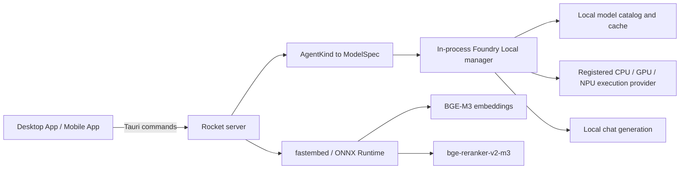

# Role of Foundry Local

> **Authoritative current-state guide (2026-09-02).** Project code is the source of truth for this integration. Microsoft documentation is used only to validate general Foundry Local concepts. This guide does not describe cloud Microsoft Foundry agents, projects, deployments, or hosted model endpoints.

## What Foundry Local is here

Foundry Local is the server's **local generative-model runtime and model lifecycle manager**. The Rust server embeds `foundry-local-sdk` v1 and creates one native `FoundryLocalManager` for the process. On Windows the crate enables its `winml` feature. A resolved model creates a chat client that calls the native core in process; there is no application-to-cloud model request and no separate Foundry HTTP endpoint or dynamic port.

In this application Foundry Local does four jobs:

1. discovers and registers local execution providers (EPs);
2. resolves catalog aliases or pinned variant IDs and manages their local weights;
3. loads local chat models and runs streaming or non-streaming generation; and
4. supplies local model judgment for bounded routing, planning, extraction, verification, and memory tasks.

This is consistent with Microsoft's description of Foundry Local as an on-device runtime with native SDKs, a curated optimized-model catalog, local caching, and hardware acceleration. The exact behavior below follows this repository's Rust implementation rather than a generic SDK example.

The Desktop App and Mobile App share a Tauri v2 application shell and web-view implementation. The Tauri Rust bridge, not the web layer, communicates with the server.

## Boundaries: what it is not

### Not cloud Microsoft Foundry

The application does not create or invoke a cloud Foundry project, hosted agent, model deployment, or managed endpoint. It has no cloud inference fallback. Installing or caching local model artifacts can require network access beforehand, but inference and PHI processing are intended to remain on the server host. Air-gapped deployments must pre-stage both Foundry and fastembed artifacts.

### Not the embedding or reranking engine

Foundry Local is used for **generative chat models only** in this project. It does not create `contentVector` or score retrieved passages.

- `embed/mod.rs` uses fastembed BGE-M3, 1,024 dimensions, for record, schema-card, and query embeddings.
- `retrieval/rerank.rs` uses fastembed `bge-reranker-v2-m3` as the cross-encoder reranker.
- Both are local ONNX Runtime workloads, process-global and mutex-serialized behind `spawn_blocking`.
- Changing the embedding model or dimensions requires rebuilding compatible vectors and indexes; Foundry model selection does not change embeddings.

## Model-driven role inventory

### Current (`AgentKind`, Implemented)

`AgentKind` is a task label, not an autonomous cloud agent. `ModelSpec::for_kind` maps it to a model alias, generation settings, and device preference. All current defaults are `qwen3-8b`, all current role preferences are GPU-only, and persisted overrides can replace the alias with a concrete variant ID.

| `AgentKind` | Config / override key | Effective use and routing behavior | Default generation mode |
| --- | --- | --- | --- |
| `PatientLookup` | `ONPREM_MODEL_LOOKUP` / `lookup` | Explicit agent first tries a narrow deterministic live-source patient query; a miss uses semantic retrieval and grounded generation. Auto lookup normally maps to the semantic path. | thinking off, temperature 0.1, tools declared, GPU |
| `HealthQuery` | `ONPREM_MODEL_HEALTH_QUERY` / `health_query` | Plans constrained DocumentDB aggregations/lists after deterministic or live-source SQL fallbacks; then narrates exact rows. | thinking off, temperature 0.2, tools declared for the spec, GPU |
| `Trends` | `ONPREM_MODEL_TRENDS` / `trends` | Plans time-bucketed DocumentDB aggregation and narrates exact rows when live-source SQL does not answer first. | thinking on, temperature 0.3, tools declared for the spec, GPU |
| `Summarize` | `ONPREM_MODEL_SUMMARIZE` / `summarize` | Explicit agent tries narrow deterministic recent-record SQL, otherwise semantic retrieval and grounded summary generation. | thinking off, temperature 0.2, no tools, GPU |
| `Chat` | `ONPREM_MODEL_CHAT` / `chat` | Grounded semantic answers, small talk, and conversation-meta replies. The legacy `/chat` semantic generator uses the manager's current chat model rather than `spec_for`; the `chat` setting route keeps that current model synchronized when an override is set. | thinking off, temperature 0.3, no tools, GPU |
| `MultiHop` | shares `ONPREM_MODEL_CHAT` / `chat` | Has a model spec and can be requested explicitly, but currently falls through to one semantic retrieval/generation pass. There is no iterative multi-tool executor. | thinking on, temperature 0.3, tools declared, GPU |
| `QueryRewrite` | `ONPREM_MODEL_FAST` / `fast` | Internal rewrite, multi-query expansion, and intended fast-lane role. Agent semantic paths use the persisted override; the legacy `/chat` preparation path instead uses the manager's current chat model. Conversation compaction constructs this role from environment config directly, so persisted overrides do not affect compaction. | thinking off, temperature 0.1, no tools, GPU |
| `Classify` | `ONPREM_MODEL_CLASSIFY` / `classify` | Tier-2 intent classification only when lexical routing is ambiguous or mixed and model routing is enabled. Results are cached; failure falls open to semantic retrieval. The router currently constructs the spec from config directly, so persisted `classify` overrides are shown/stored but are not applied to Tier-2 routing. | thinking off, temperature 0, JSON planning, max 128, GPU |
| `Extract` | `ONPREM_MODEL_EXTRACTOR` / `extractor` | Optional ingestion-time extraction of conditions, medications, labs, and best-effort codes. It annotates; it does not redact. Row-level failures/timeouts are skipped. The ingestion worker constructs the spec from config directly, so persisted extractor overrides are not currently applied there. | thinking off, temperature 0.1, forced tool preferred, GPU |
| `Verify` | `ONPREM_MODEL_VERIFIER` / `verifier` | Optional post-stream claim verification against retrieved passages. Errors/timeouts produce an explicit skipped result and do not retract the answer. `/chat` obtains this role through `spec_for`, so its persisted override applies. | thinking off, temperature 0.1, forced tool preferred, GPU |
| `TextToSql` | `ONPREM_MODEL_TEXT2SQL` / `text_to_sql` | Used only after deterministic SQL templates miss. Emits one plain/fenced SQL statement; server AST validation, allowlists, limits, cost checks, timeouts, and read-only execution are mandatory before use. | thinking off, temperature 0, no tools, max 256, GPU |

### Manifest and override caveats

`GET /models/roles` currently publishes nine Foundry-managed rows (`Chat` through `Verify`) plus the two fastembed roles; it does **not** publish `TextToSql`, although `TextToSql` is implemented and independently configurable. The explicit `/agents/<kind>` parser can deserialize all enum variants, including internal kinds, but the product surface intentionally exposes Auto, Health Query, Trends, Patient Lookup, Summarize, and Chat. Internal role URLs should not be treated as stable product APIs.

`AppState::spec_for` applies a persisted override from `settings.app_settings.router_overrides` over the environment default. `Chat` and `MultiHop` share `chat`. The shared model setting updates `chat`, `classify`, `fast`, `extractor`, and `text_to_sql` atomically; it does not update Health Query, Trends, Summarize, Patient Lookup, or Verify. The exceptions in the table above are current code limitations where a caller uses `ModelSpec::for_kind` or `current_model` directly.

### Planned (`ModelRole`)

**Status: Planned — see [plans/new/05-hospital-agents-server.md §1](../new/05-hospital-agents-server.md).** The product identity (`AgentKind { Ask, Line(ServiceLine) }`, with `AgentMode { Ask, Trends, Handover }`) moves to `agents/`, and `foundry/router.rs` keeps only *model* roles via `ModelSpec::for_role`:

| `ModelRole` | Default temperature | Foundry Local job |
| --- | --- | --- |
| `Grounded` | 0.3 | grounded semantic answers, conversational replies |
| `Narrate` | 0.2 | narrate validated rows with the agent persona; `thinking` on in Trends mode; SBAR template in Handover mode |
| `Rewrite` | 0.1 | rewrite/expansion of the already focus-resolved question |
| `Classify` | 0.0 | Tier-2 `classify_route` tool call, listing only usable service lines; `service_line` and `confidence` added to the output |
| `Extract` | 0.1 | opt-in ingestion annotation |
| `Verify` | 0.1 | opt-in post-stream claim verification |
| `TextToSql` | 0.0 | one raw SQL statement, used only when `PlanSpec` output fails to bind |
| `PlanSpec` | 0.0 | **new** — emits a `QuerySpec` JSON (the plan 03 IR) which Rust binds to the `SchemaBinding` and compiles to dialect SQL; a structurally validated proposal rather than free SQL text. Config `ONPREM_MODEL_PLAN_SPEC`, defaulting to the SQL model |
| `Compact` | 0.2 | working-memory summarisation, now fed the conversation focus |

**Model-free by design:** deterministic `QuerySpec` routing (Tier 1.5), pronoun/ellipsis resolution from `ConversationFocus`, spec mutation for bare follow-ups, clarify questions, capability answers ("what can you do?"), and suggestion generation never call Foundry Local. This keeps p50 latency for deterministic turns under the plan-08 budget and makes Foundry LRU unload/reload (40 s+) a rarer event. Persisted overrides keep the single `chat` key; legacy agent kinds map to `Ask` plus a mode for one release.

## Lifecycle and residency

### Manager and cache

`FoundryManager::init` builds `FoundryLocalConfig("onprem-rag-server")`, optionally sets a model cache directory, and creates the SDK's process singleton. Cache selection is:

1. non-empty `ONPREM_FOUNDRY_CACHE_DIR`;
2. `serviceSettings.cacheDirectoryPath` from `~/.foundry/foundry.config.json`; or
3. the SDK default, normally `~/.foundry/cache`.

The explicit handoff matters because the embedded core is separate from the Foundry CLI/service instance and does not automatically inherit that process's cache or EP registration state.

### Catalog resolution and model operations

- A bare alias is looked up as a catalog model; device preferences choose a matching variant ID.
- A full variant ID is treated as pinned and bypasses normal alias choice.
- An unknown name returns a recoverable unavailable error with known aliases.
- First routed use downloads missing weights, then loads the model.
- `POST /models/pull` streams download progress and may load afterward.
- `POST /models/unload` removes residency but leaves cached weights.
- `POST /models/delete` unloads, removes cached weights, and clears persisted overrides that name the deleted variant.
- A recognized corrupt/truncated cache is removed, downloaded again, and loaded once more. Other load errors do not trigger a multi-gigabyte purge.

Downloads may proceed concurrently, but native `load`/`unload` calls are serialized process-wide by `LOAD_GATE`: concurrent native lifecycle operations have caused Windows process crashes. An active stream owns a busy guard for its concrete variant. Manual unload/delete refuses while busy, and LRU eviction never chooses a busy model.

### Lazy residency and LRU

Routed generation resolves and loads lazily. GPU-class variant IDs are tracked least-recently-used; `ONPREM_MAX_RESIDENT_MODELS` defaults to **1**. Before another GPU model loads, the oldest non-busy GPU resident is unloaded. If all residents are busy, the server temporarily exceeds the cap rather than invalidate an active generation. CPU and NPU variants are exempt from this GPU count.

Current role specs are GPU-only despite older comments and plans about Phi/NPU placement. The manager still supports ordered CPU/GPU/NPU selection, `ONPREM_NPU_ENABLED` defaults false, NPU selection requires OS-detected hardware, and NPU variants above `ONPREM_NPU_CTX_CAP` (default 4,224) are skipped. If a selected NPU variant fails to load, generation/planning retries a CPU variant. No equivalent automatic GPU-to-CPU fallback occurs for today's GPU-only role specs.

### Warmup and execution providers

With `ONPREM_WARMUP_ENABLED=true` (default), startup launches background work that:

- initializes BGE-M3 and the reranker;
- downloads/registers EP plugins into the embedded Foundry core; and
- preloads the routed `TextToSql` model only if its weights are already cached.

Warmup never downloads a missing chat model solely to make startup ready. If warmup is disabled, EP registration still starts in the background. Physical Windows hardware detection (PowerShell/CIM) and Foundry EP discovery are separate signals: a present GPU/NPU does not prove its EP is registered or that a model executes successfully.

## Inference modes and safety boundary

### Streaming content generation

Grounded RAG, conversational replies, conversation-meta replies, and structured-result narration use `generate_stream_with` (or the legacy current-model wrapper). Visible content streams as JSON-encoded SSE tokens so whitespace survives transport. Qwen `<think>...</think>` spans are removed incrementally and are never sent as answer text.

Semantic generation receives only bounded, numbered retrieved passages plus bounded conversation memory. Structured narration receives validated database rows and a prompt forbidding invented values. Narration explicitly disables tools: it is **content streaming only**.

### Planning and constrained outputs

The model proposes; Rust validates and executes.

- **Route classification:** asks for a `classify_route` JSON object, then maps labels leniently; bad output falls open to semantic.
- **Aggregation/list planning:** asks for JSON matching the tool schema, then applies a catalog allowlist and builds the DocumentDB pipeline in Rust.
- **Extraction and verification:** prefer forced tool calls, with a narrow fallback to JSON content if the native grammar compiler rejects the schema.
- **Text-to-SQL:** emits plain SQL because constrained tool grammar is not reliable for supported local ONNX variants; SQL is never executed without the independent Rust safety pipeline.
- **Parse failures:** structured planners retry once with a stricter JSON-only prompt.
- **Planned — `PlanSpec`:** the model emits a `QuerySpec` JSON; Rust binds slots to bound column roles, compiles the dialect SQL, then runs the same validation pipeline. Raw `TextToSql` becomes the fallback when binding fails ([plans/new/04 §2.1](../new/04-structured-execution-and-fallbacks.md)).

Although some `ModelSpec`s declare tools, streamed tool deltas are not an application execution channel. Tool calls are used only in dedicated planning methods that parse a bounded result. The server, not the model, chooses the operation, validates its arguments, and performs it. Narration and ordinary answer streams consume content only.

## Privacy and failure behavior

- PHI-bearing prompts and outputs are sent only to local in-process inference. There is no cloud fallback.
- Model/catalog downloads and EP setup are supply/deployment operations and may require network access; they must be completed or pre-staged before operating offline.
- Foundry initialization failure is non-fatal to process startup. DocumentDB, auth, source management, and liveness can remain available; Foundry-dependent routes return `503`.
- Query rewrite/expansion failures use the original query. Tier-2 classification fails open to semantic. Extractor failures leave rows unannotated. Verification failures report skipped. Structured planning failures generally fall back to safer semantic retrieval at the orchestration layer.
- A generation setup error occurs before SSE when possible; a failure after streaming begins is emitted as an `error` event and partial content is not persisted as a successful assistant turn.
- Model-generated plans are untrusted input. Catalog validation, SQL AST checks, row caps, timeouts, score gates, and grounded prompts remain authoritative.

## Admission, concurrency, and serialization

The server's process-local generation semaphore defaults to two active generation requests and waits up to two seconds before returning `429`. A permit spans the streamed response. This admission limit is separate from:

- the process-wide native load/unload mutex;
- per-variant busy counts protecting active streams;
- the GPU-resident LRU cap;
- mutex serialization inside the fastembed embedder and reranker; and
- extractor concurrency/timeouts.

Concurrent requests can therefore share a loaded model, but actual throughput remains constrained by the local execution provider, native runtime, prompt length, and serialized lifecycle operations. Cancellation currently drops the client transport/stream; complete propagation through every already-running native operation is not proven.

## Status and open limits

### Implemented

- Rust `foundry-local-sdk` v1, with `winml` enabled on Windows.
- One in-process native manager, explicit cache path, catalog discovery, EP registration, download/load/unload/delete, corruption repair, busy protection, and GPU LRU.
- Local streaming generation, JSON/tool planning, plain-SQL generation, optional extraction, optional verification, and role configuration.
- Default `qwen3-8b` consolidation and persisted per-role model settings.

### Partial or unverified

- Standard role specs are GPU-only; NPU machinery exists but is disabled by default and has not been validated across target hardware.
- `MultiHop` has a role spec but no iterative tool loop.
- The model-role manifest omits `TextToSql`.
- Persisted overrides are bypassed by the current Tier-2 classifier, ingestion extractor, conversation compactor, and parts of legacy `/chat` query preparation as described above.
- Extraction and verification are disabled by default and require representative clinical quality validation.
- End-to-end cancellation, accelerator compatibility, memory ceilings, and production concurrency require hardware-specific validation.

## Code map

| Area | Source |
| --- | --- |
| Dependencies and Windows feature | [`onprem-rag-server/Cargo.toml`](../../onprem-rag-server/Cargo.toml) |
| Defaults, cache, role and admission configuration | [`config.rs`](../../onprem-rag-server/src/config.rs) |
| Manager, catalog, lifecycle, generation, tools | [`foundry/mod.rs`](../../onprem-rag-server/src/foundry/mod.rs) |
| Role specs and override keys | [`foundry/router.rs`](../../onprem-rag-server/src/foundry/router.rs) |
| Model, EP, setup, and override routes | [`foundry/routes.rs`](../../onprem-rag-server/src/foundry/routes.rs) |
| Physical hardware inventory | [`foundry/hardware.rs`](../../onprem-rag-server/src/foundry/hardware.rs) |
| Reasoning-span filtering | [`foundry/think_filter.rs`](../../onprem-rag-server/src/foundry/think_filter.rs) |
| Runtime ownership and effective specs | [`state.rs`](../../onprem-rag-server/src/state.rs) |
| Startup and warmup | [`main.rs`](../../onprem-rag-server/src/main.rs) |
| Structured planning/narration | [`answer.rs`](../../onprem-rag-server/src/answer.rs), [`aggregation/`](../../onprem-rag-server/src/aggregation/), [`nl2sql/`](../../onprem-rag-server/src/nl2sql/) |
| Routing and explicit agents | [`router/`](../../onprem-rag-server/src/router/), [`agents/`](../../onprem-rag-server/src/agents/) |
| Semantic prompting and memory | [`rag/`](../../onprem-rag-server/src/rag/), [`memory.rs`](../../onprem-rag-server/src/memory.rs) |
| Non-Foundry embedding | [`embed/mod.rs`](../../onprem-rag-server/src/embed/mod.rs), [`retrieval/rerank.rs`](../../onprem-rag-server/src/retrieval/rerank.rs) |

## Related guides

- [Documentation index and authority policy](README.md)
- [Architecture and data model](architecture-and-data-model.md)
- [Models, accelerators, and lifecycle](models-accelerators-and-lifecycle.md)
- [Routing, agents, and structured query](routing-agents-and-structured-query.md)
- [Retrieval, chat memory, and concurrency](retrieval-chat-memory-and-concurrency.md)
- [Ingestion, schema catalog, and Data Explorer](ingestion-schema-catalog-and-explorer.md)
- [Operations, performance, and observability](operations-performance-and-observability.md)
- [Security, authentication, and audit](security-auth-and-audit.md)
- [Verified platform notes](verified-platform-notes.md)
- [Official Foundry Local repository and SDK documentation](https://github.com/microsoft/foundry-local)
