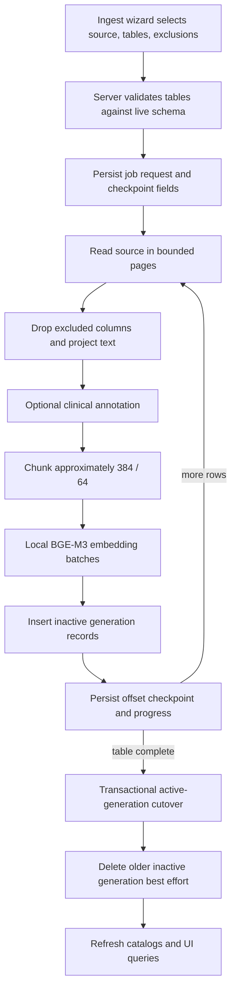
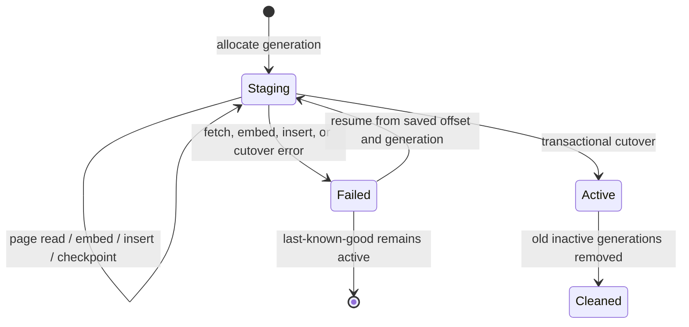

# Ingestion, schema catalog, and Data Explorer

> **Authoritative current-state guide (2026-09-02).** This document covers source introspection, generation-aware ingestion, schema metadata, and the active-generation explorer. For the surrounding topology, see [Architecture and data model](architecture-and-data-model.md). For the user-facing screens and state model, see [Application and feature architecture](application-and-feature-architecture.md).

## Scope and invariants

The ingestion subsystem copies selected operational SQL rows into local DocumentDB, projects and chunks their text, embeds them locally with fastembed BGE-M3, and publishes a searchable generation only after a successful table run.

Core invariants:

1. PHI and model traffic remain on premises.
2. Supported source engines are PostgreSQL, MySQL, and SQL Server.
3. Excluded columns are removed before storage and text projection.
4. The optional clinical extractor **annotates** records; it does **not redact PHI** or alter embedded text.
5. A failed refresh does not replace the last-known-good active table generation.
6. Retrieval, aggregation, and Data Explorer read active records only.
7. Source schema metadata has its own source-specific, versioned last-known-good catalog.

## End-to-end flow

## Source connectors

`connectors::SourceConnector` is implemented for:

| Engine | Driver | Notable decoding behavior |
| --- | --- | --- |
| PostgreSQL | `sqlx` | Whole rows decoded through `to_jsonb`; avoids per-column type branching |
| MySQL | `sqlx` | Per-column fallthrough decoding |
| SQL Server | `tiberius` | Per-column decoding; DECIMAL/NUMERIC preserved as strings, MONEY as numeric, GUID/date types supported |

The trait provides connection testing, schema introspection, exact table counts, bounded page reads, plan-cost estimation where supported, and execution of already validated read-only SELECTs.

Table identifiers are checked against connector introspection before being interpolated into driver-specific SQL. Generated source SQL is separately gated by the NL-to-SQL validator.

### Current paging: implemented with OFFSET

`fetch_table_page` accepts `order_by`, `offset`, and `page_size`. Each connector issues stable ordered `OFFSET`/`LIMIT`-style queries. A primary-key column is preferred for ordering; connector fallbacks apply where no declared primary key exists.

This bounds application memory and supports durable page checkpoints, but it is **not keyset pagination**. Earlier performance plans prescribed keyset/cursor reads; that remains a planned optimization for large and concurrently changing tables. OFFSET cost can grow with deep pages, and source mutations during a run can affect positional stability.

## Ingestion request and validation

`POST /ingest` is admin-only and accepts a saved source, ordered table list, optional per-table excluded columns, and an optional row limit. Before creating the detached job, it:

1. decrypts the saved source credential;
2. introspects the live schema;
3. rejects unknown table names;
4. acquires global and per-source ingestion capacity;
5. persists the complete resumable request in `jobs`.

The server returns a UUIDv7 job ID immediately. The background task owns the admission permit and continues if the initiating HTTP request ends.

## Record projection, chunking, and embeddings

For each source row:

- excluded columns are removed from `fields` before any projection;
- stable row identity comes from a natural ID candidate or connector row position fallback;
- audit timestamps and opaque IDs are omitted from chunk text as noise but remain available in structured `fields` unless explicitly excluded;
- patient identity enrichment may add a bounded local `patient_ref` for related rows;
- text is chunked with configured word-approximate size/overlap;
- chunks are embedded locally with fastembed BGE-M3 (1024 dimensions);
- each chunk stores its source/table/row/chunk identity, structured fields, text, vector, generation, active flag, timestamp, and optional extracted annotation.

Embedding batches default to 32 and page size defaults to 256 (`ONPREM_INGEST_EMBED_BATCH_SIZE`, `ONPREM_INGEST_PAGE_SIZE`). Pages are bounded, but chunk material for the current page is assembled before its embedding batches are written; this is not a fully channel-pipelined source→embed→write implementation.

## Clinical extractor

### Implemented but disabled by default

`ingest/extract.rs` optionally uses a local Foundry model to annotate eligible long rows with mentioned conditions, medications, and labs plus best-effort ICD-10, RxNorm, and LOINC codes.

Important semantics:

- extraction sees the whole row before chunking;
- the annotation is copied to every chunk of that row;
- failures, timeouts, unavailable models, or invalid output do not fail ingestion;
- empty codes are allowed and codes are not terminology-server validated;
- progress exposes `extracted_rows`;
- enabling it requires `ONPREM_EXTRACT_ENABLED=true` and a usable local role model.

**It does not scrub or redact PHI.** The record `text` and vector input are unchanged by extraction. PII removal happens only when the user explicitly excludes columns in the wizard. This corrects older “flag/scrub PHI” wording.

## Generation-aware cutover

Each table refresh receives an `ingest_generation` UUIDv7. New records are inserted with `active: false`; IDs include the generation, so they can coexist with the current active records.

`activate_generation` performs one DocumentDB transaction that:

1. marks the table’s previously active records inactive;
2. marks all records in the staged generation active;
3. updates `indexed_tables.active_generation`, counts, status, refresh state, and timestamps.

Only after successful cutover does cleanup remove older inactive generations. On table failure, a prior active generation remains searchable. If no prior generation exists, the table is recorded as errored and has no active data.

Every query path that represents current ingested data filters `active: true`, including vector/text retrieval, structured aggregation catalog building, and Data Explorer.

## Checkpointing, resume, and recovery

The job document persists:

- requested tables, exclusions, and row limit;
- checkpoint table, OFFSET, and generation;
- progress counters, bounded log, and terminal state.

After a page is completely written, the job advances `checkpoint_offset`. Before replaying a resumed page, ingestion deletes only matching inactive records in that staged generation for the fetched row keys, making page replay idempotent.

`POST /ingest/<job>/resume` accepts failed or partial jobs with valid modern checkpoint metadata, reacquires admission, and restarts from the saved table/offset/generation. It stops at the first failed table so the checkpoint identifies a single unambiguous recovery position.

At server boot, `recover_abandoned_ingestions`:

- changes table `refresh_status: indexing` back to idle without touching active generations;
- marks jobs left `running` as failed with a sanitized recovery reason;
- retains staged and active records for safe retry/cleanup.

### Current limitation

Resume is server-implemented and bridge/UI support is not a complete first-class recovery workflow. Operators can invoke the route, but the standard wizard does not yet present a dedicated resume action.

## Progress transport

Each progress snapshot includes table position, row totals, success/failure counts, embedded text bytes, extracted-row count, and a server-capped log.

The current design uses a process-local broadcast notification to wake connected SSE clients. Each wake reloads the durable `jobs` snapshot; a 15-second fallback read handles missed notifications and reconnects. This supersedes the original fixed 500 ms DocumentDB poller.

The job still rewrites the current bounded log array with snapshots. A delta-oriented log representation and throttled counter writes remain possible optimizations.

## Ingest status and partial jobs

Terminal statuses are:

- `completed`: every selected table succeeded;
- `partial`: one or more succeeded and one failed/interrupted;
- `failed`: no selected table completed.

The pipeline currently stops after the first table failure to preserve a clear resume checkpoint. This differs from the earliest wizard plan, which proposed continuing through all tables after errors.

## Schema analysis in the wizard

`GET /sources/<id>/schema` returns source table/column metadata and estimates. `POST /schema/analyze` performs:

1. an always-on deterministic column-name PII heuristic;
2. optional local Foundry enrichment for summary, table suggestions, PII candidates, and data-quality notes;
3. fail-open fallback to deterministic output.

Analysis is advisory. PII columns are flagged but not automatically excluded. The user’s explicit exclusions determine what is omitted from storage and embeddings.

## Versioned source schema catalog

The NL-to-SQL catalog is distinct from `indexed_tables` and the row-derived Data Explorer profile.

### Captured cards

Each `schema_catalog` table card contains:

- source and table identity;
- estimated row count;
- columns, SQL types, nullability, PK/FK flags;
- declared foreign-key edges;
- bounded representative values;
- approximate sampled column profiles (distinct count, null ratio, numeric/date bounds, sample count);
- searchable card text and a local BGE-M3 vector;
- `catalog_version`, structural `schema_hash`, and capture time.

Credentials are never copied into metadata cards.

### Last-known-good publication

A refresh introspects all tables, samples/profiles them, builds cards, embeds all card text locally, and inserts a complete new version. Only then does it update `schema_catalog_state.active_version`. Cleanup of prior versions occurs afterward and is harmless if it fails because readers filter by the active pointer.

The structural hash excludes row counts and sampled profiles, so ordinary data growth does not look like schema drift.

### Refresh triggers — implemented

Catalog refresh occurs on:

- source creation;
- successful saved-source connection test;
- completed ingestion job execution when text-to-SQL is enabled;
- manual admin refresh;
- lazy initialization for eligible older sources;
- background structural polling.

Source configuration changes invalidate catalog cards, state, history, overrides, and graph cache. Source deletion cascades through those metadata collections.

### Drift and health — implemented

A background worker checks connected sources at `ONPREM_SCHEMA_POLL_INTERVAL_SECS` (default 300; zero disables) with bounded concurrency. Changed structural hashes trigger a new generation. Failures preserve the active version while updating health, last check, sanitized error, failure count, and history.

### Overrides and runtime cache — implemented

Admins can maintain business aliases and undeclared relationships. Overrides live separately so refreshes do not erase curation and are validated against the active catalog. The schema linker merges declared edges and overrides into a graph cached by source and active catalog version. Refreshes and edits invalidate that cache.

The linker prioritizes exact table/alias mentions, ranks cards with local embeddings, and expands selected tables one hop to include FK targets. It selects one source for a SQL question rather than federating across operational databases.

## Schema binding

**Status: Planned — see [plans/new/01-service-line-ontology-and-schema-binding.md](../new/01-service-line-ontology-and-schema-binding.md).**

The binding layer sits on top of the versioned catalog and maps each source's physical schema to the fixed hospital ontology (13 `ServiceLine`s, ~40 `EntityConcept`s, ~20 `ColumnRole`s) so that routing, deterministic SQL, linking, aggregation, retrieval scope, personas, and the agent roster never depend on dev-seed table names.

### Binder inputs

- active `TableCard`s of the source (`schema_catalog` at `schema_catalog_state.active_version`);
- `MetadataOverrides` (aliases, relationships, and the extended `table_concepts` / `column_roles` / `service_lines`);
- the wizard's persisted PII analysis, when present;
- BGE-M3 vectors of the fixed concept descriptors, embedded once at boot and cached.

### Binder outputs

A `SchemaBinding { source_id, catalog_version, dialect, tables, built_at, coverage }` where each `TableBinding` carries the argmax `EntityConcept` with confidence (weighted name tokens 0.35, column tokens 0.30, required roles 0.15, descriptor embedding 0.15, FK shape 0.05, over two passes so anchor tables inform FK shape), the owning `service_lines`, per-column `ColumnRole`s with confidence, bounded `enum_values` (≤ `ONPREM_BINDING_ENUM_MAX` 25, never for PII roles), a `pii` flag, exactly one `EventTime`, and the shortest FK `patient_path` (≤ `ONPREM_BINDING_MAX_HOPS` 3). `coverage` states per service line which tables are bound, which required concepts are missing, and whether the line is usable (any owned concept bound at ≥ `ONPREM_BINDING_MIN_CONFIDENCE` 0.55). Persisted to `schema_bindings` (`_id = source_id`) with the last 5 versions in `schema_binding_history`; loaded into `AppState`.

### When it runs

After every successful catalog refresh (non-fatal on failure) and after every overrides save. It is not triggered by ingestion generations; ingested `records` are matched to a binding by `(source_id, table)` when the aggregation catalog is rebuilt.

### Overrides

`MetadataOverrides` gains `table_concepts` (`{ table, concept | "ignore" }`), `column_roles` (`{ table, column, role }`), and `service_lines` (`{ table, add, remove }`). Validation checks enum spellings and refuses to `ignore` the only Patient binding. Overridden tables are marked `overridden: true`.

### Admin endpoints

| Method & path | Purpose |
| --- | --- |
| `GET /sources/<id>/binding` | Full binding, coverage, and the **orphan diagnostic** (`orphans: []` — tables owned by no service line) |
| `POST /sources/<id>/binding/rebuild` | Force a rebuild |
| `GET /sources/<id>/binding/history` | Last 5 versions with concept diffs |
| `PUT /nl2sql/<id>/catalog/overrides` | Extended body; triggers a rebuild |
| `GET /agents` (user) | Roster derived from bindings: usable lines, bound tables per source, example questions |

The dev seed must bind without overrides (≥ 62/64 concepts); an alternative-naming schema fixture guards against overfitting. A binding is a read allow-list, not an authorization boundary.

## Data Explorer

### Active-generation row view — implemented

Storage is chunk-grained, while the explorer is row-grained. `GET /records`:

1. matches `source_id`, `table`, and `active: true`;
2. optionally applies case-insensitive regex to chunk text;
3. sorts by row/chunk;
4. groups by `row_pk` and takes the first chunk’s shared `fields`;
5. returns a paginated row page.

The UI renders mobile row cards or a desktop grid and opens a row-detail drawer. Because fields are cloned across a row’s chunks, taking the first active chunk reconstructs the structured source row.

### Table inspector — implemented

`GET /tables/<table_id>/info` combines:

- current counts/status/timestamps from `indexed_tables`;
- non-secret source connection details;
- a lightweight row-derived profile from one active record;
- up to five recent source-level ingestion jobs.

The recent jobs are connection-scoped because jobs do not persist full per-table run records. The inspector profile is sampled from ingested fields and is not the authoritative source schema catalog.

### Destructive operations — implemented

Admins can remove one table, all indexed data for one source, or all indexed records/history. Source deletion also cascades records, indexed-table state, and schema metadata. These operations rebuild/invalidate relevant in-memory catalogs.

### Deliberately absent

- No explorer “clear cache” operation.
- No generic “reindex search” operation.
- No MongoDB operational-source browser.
- No claim that row search is semantic; explorer search is regex text matching.

## Status summary

### Implemented

- PG/MySQL/MSSQL introspection and paging.
- Bounded page ingestion, batch embedding, durable OFFSET checkpoints, server resume route.
- Staged record generations with transactional last-known-good cutover.
- Active-generation filtering across retrieval, aggregation, and explorer.
- Optional annotation-only extractor.
- Source-specific versioned schema catalog, sampling/profiling, drift polling, history, overrides, and graph cache.
- Responsive row-grained Data Explorer and destructive admin actions.

### Partial or unverified

- Paging is OFFSET-based rather than keyset/cursor-based.
- The processing pipeline is page-bounded but not fully overlapped with bounded channels.
- Resume lacks a complete normal UI workflow.
- Extractor quality has not been fully validated against live configured models and terminology services are absent.
- Production-scale recovery/soak drills remain to be completed.

### Planned

- Keyset/cursor paging where source schemas permit it.
- More efficient progress/log writes and deeper pipeline overlap.
- Production capacity profiles and repeated failure-injection validation.
- Index sizing based on measured corpus scale.
- Per-source schema binding of the service-line ontology with admin overrides and diagnostics (above).

## Superseded design notes

- Whole-table buffering and delete-before-replace are superseded by bounded pages and staged generations.
- The 500 ms polling-only progress stream is superseded by broadcast wakeups plus durable fallback reads.
- “Continue after every table failure” is superseded by stop-at-first-failure for deterministic resume.
- Extractor “PHI scrub” wording is superseded by annotation-only behavior; only explicit column exclusions remove data.
- Data Explorer’s proposed separate raw-row store was not needed; active chunk records are grouped by row key.
- Schema-drift badges proposed for the explorer were not adopted; catalog health/history lives in the connection metadata UI.
- The performance plan’s keyset requirement remains planned; current production code uses OFFSET.

## Source plans consolidated

- `../old/02-verification-and-decode-findings.md`
- `../old/07-ingest-wizard-implementation.md`
- `../old/08-data-explorer-implementation.md`
- `../old/23-performance-efficiency-roadmap.md`
- `../old/24-production-validation-runbook.md`
- `../old/25-ingestion-extractor-and-verifier.md`
- `../old/26-schema-metadata-catalog.md`
- `../old/Sol-Findings.md`
- `../old/Sol-implementation plan.md`
