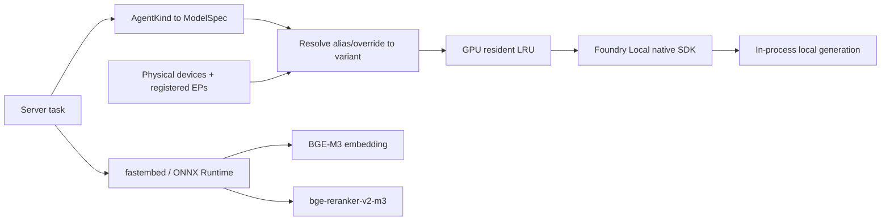
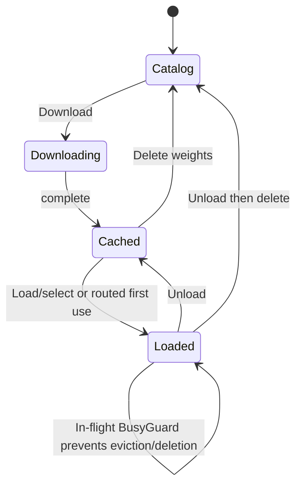

# Models, accelerators, and lifecycle

> Authoritative description of current local model execution, task routing, hardware discovery, downloads, and residency. No model request is sent to a cloud service.

## Runtime architecture

Foundry Local runs through its native SDK **in the server process**. There is no Foundry HTTP endpoint, external service lifecycle, or cloud fallback. The CLI's service process and cache/EP registration state are not the server's runtime; the configured cache path is explicitly passed to the in-process core.

fastembed is a separate local stack used for BGE-M3 embedding and `bge-reranker-v2-m3`. Foundry Local has no embedding role in this application.

## Current task roles

The current default is deliberately consolidated on **`qwen3-8b`** to reduce model swaps and fit local hardware constraints. Persisted per-role overrides take precedence over environment defaults.

### Current (`AgentKind`, Implemented)

| `AgentKind` / role | Default | Mode and purpose |
| --- | --- | --- |
| `Chat` | `qwen3-8b` | GPU, thinking off; grounded semantic answers and conversation replies. |
| `HealthQuery` | `qwen3-8b` | GPU, thinking off; structured aggregation planning/narration where needed. |
| `Trends` | `qwen3-8b` | GPU, thinking on; temporal structured interpretation. |
| `Summarize` | `qwen3-8b` | GPU, thinking off. The historical on-demand 12B summarizer is not the current default. |
| `PatientLookup` | `qwen3-8b` | GPU, low temperature; semantic or deterministic-source lookup path. |
| `MultiHop` | `qwen3-8b` | GPU, thinking/tools configured, but a general multi-hop agent loop remains unimplemented. |
| `QueryRewrite` | `qwen3-8b` | GPU, low temperature; rewrite, expansion, and memory compaction. |
| `Classify` | `qwen3-8b` | GPU, deterministic tool-call router classification. |
| `Extract` | `qwen3-8b` | GPU, local structured clinical annotation; opt-in. |
| `Verify` | `qwen3-8b` | GPU, local post-stream claim checking; opt-in. |
| `TextToSql` | `qwen3-8b` | GPU, temperature 0, thinking/tools off, bounded plain-SQL output. |

`TextToSql` is a first-class role and can be overridden independently through the persisted router settings. The SQL path uses deterministic templates before invoking this role.

### Planned (`ModelRole`)

**Status: Planned — see [plans/new/05-hospital-agents-server.md §1](../new/05-hospital-agents-server.md).** The single overloaded `AgentKind` splits into two enums: `ModelRole` in `foundry/router.rs` (what a model call is *for*) and a product `AgentKind { Ask, Line(ServiceLine) }` in `agents/`. `ModelSpec::for_role(role, cfg)` replaces `for_kind`; the per-kind table collapses to per-role settings. All roles keep `qwen3-8b` as the default unless overridden; `ONPREM_MODEL_*` keys keep their names and `ONPREM_MODEL_PLAN_SPEC` is added, defaulting to the SQL model.

| `ModelRole` | Temperature | Purpose |
| --- | --- | --- |
| `Grounded` | 0.3 | Grounded semantic answers and conversational replies |
| `Narrate` | 0.2 | Narration of structured rows; `thinking` enabled in Trends mode (the former `Trends` kind) |
| `Rewrite` | 0.1 | Query rewrite/expansion on the *already focus-resolved* question; memory compaction |
| `Classify` | 0.0 | Tier-2 route classification (extended with `service_line` and `confidence`) |
| `Extract` | 0.1 | Opt-in clinical annotation |
| `Verify` | 0.1 | Opt-in post-stream claim checking |
| `TextToSql` | 0.0 | Raw SQL proposal (rung 3 fallback when `PlanSpec` cannot bind) |
| `PlanSpec` | 0.0 | **New.** The model emits a `QuerySpec` JSON (plan 03 IR) that Rust binds against the `SchemaBinding` and compiles; preferred over raw SQL because the output is validated structurally before any dialect text exists |
| `Compact` | 0.2 | Working-memory summarisation (split from `Rewrite`) |

By design the following stay **model-free**: routing when the deterministic `QuerySpec` parse succeeds, pronoun/ellipsis resolution from `ConversationFocus`, spec mutation for bare follow-ups, clarify templates, capability answers, and suggestion generation. Model calls are reserved for grounded generation, narration, ambiguous classification, rewrite of long questions, and the two SQL proposal roles. Legacy `/agents/health_query|trends|patient_lookup|summarize|chat` map to `Ask` with a mode for one release.

Historical plans assigned Phi-4 mini roles to NPU/CPU and proposed `mistral-nemo-12b` for summaries. That is not the present default map: all standard Foundry roles currently prefer one GPU model, `ONPREM_MAX_RESIDENT_MODELS` defaults to `1`, and NPU use defaults off. NPU resolution/fallback support remains in the manager for an explicitly NPU-routed future or override, including the 4,224-token context guard.

## Hardware and execution providers

Two different facts are reported:

| Signal | Meaning |
| --- | --- |
| Physical hardware detection | Best-effort OS inventory of CPU, GPU, and NPU devices. On Windows this uses local CIM queries and is cached for the process lifetime. |
| Foundry execution providers | Providers known to the in-process Foundry core, classified as CPU/GPU/NPU/Other and marked registered or unavailable. Registered is the usability signal. |

The server registers available execution-provider plugins in the background at startup. An admin can retry registration explicitly. Registration may download provider binaries, is non-fatal, and writes status to the local activity log.

A bare model alias lets the SDK select an available variant. A pinned full variant forces a provider but can become unavailable when that EP is absent. Resolution errors list available aliases rather than returning only an opaque SDK failure.

## Model lifecycle

- **Download** caches weights and streams progress.
- **Load/select** downloads if needed, loads the variant, and can make it the active chat model.
- **Unload** removes resident weights but keeps the disk cache.
- **Delete** unloads when needed and removes cached weights.
- Corrupt cached weights detected during load are purged and downloaded again.
- Busy guards prevent unload/delete and prevent LRU eviction of models serving active generations.
- GPU residents are tracked in LRU order. At the configured cap, the oldest non-busy GPU model is unloaded. If every resident is busy, the cap is temporarily exceeded rather than crashing an active generation.
- NPU/CPU variants are exempt from the GPU LRU accounting, although current default roles are GPU-only.

## Warmup

Warmup is enabled by default and non-blocking:

- fastembed embedder and reranker are initialized in the background to reduce the first semantic-request cliff;
- the cached `TextToSql` model is preloaded after execution-provider registration;
- missing Foundry weights are not downloaded merely for startup warmup;
- startup remains available even when a warmup or EP registration step fails.

Warmup reduces model/session initialization delay but cannot remove all local inference latency, model swaps, prompt prefill, or disk-download time.

## Centralized download state

Model downloads use the same stream architecture as chat and ingestion:

1. the bridge stamps every `model://progress|status|error|done` event with `variant_id`;
2. one boot-time listener routes progress/status into a Zustand registry keyed by variant;
3. the model store owns invocation completion, notifications, and query invalidation;
4. Models components render from the registry rather than component-local state.

Progress therefore survives route changes and concurrent downloads do not cross-wire. State is intentionally session-only: a download does not survive app termination, so disk persistence would create stale progress.

## Ingestion extractor and answer verifier

The extractor is an **annotator, not a redactor**:

- it reads the whole row before chunking and stores `records.extracted` entities/codes;
- the original `text` and embedding input are unchanged;
- annotations are copied to the row's chunks;
- failures and timeouts leave the row unannotated rather than failing ingestion;
- codes are hints and are not validated by a terminology server;
- it is off by default because it adds a local model call per eligible row.

The verifier runs after a semantic answer has streamed, checks claims against retrieved passages, combines deterministic citation-overflow checks, emits a verdict, and persists it as `verify_json` on the corresponding assistant message. It fails open with an explicit skipped reason and is off by default.

## Local performance constraints

The deployment target is constrained by local memory bandwidth, accelerator support, and model context:

- Quantized 7–8B models are the practical default on the target integrated GPU; 12B is slower and 14B+/20B is generally unsuitable for interactive default use.
- NPU variants may have a 4,224-token context cap, too small for normal multi-passage RAG plus history. Small bounded tasks could use them only when explicitly routed and validated.
- A single consolidated GPU model minimizes multi-gigabyte swaps. Even so, concurrent generations contend for the same local device and are admission-limited.
- fastembed embedding/reranking sessions are locally serialized for safety, creating a queue under load.
- First-time model/EP downloads can be large; air-gapped installations must pre-stage the Foundry cache and fastembed artifacts.
- Performance claims are hardware-, variant-, corpus-, and concurrency-specific. Capacity profiles and long soak validation remain operational work, not guaranteed characteristics.

## Partial and planned gaps

| Gap | Status |
| --- | --- |
| General agentic multi-hop loop | Planned; `MultiHop` has a spec but no iterative tool executor. |
| `ModelRole` split and `PlanSpec` role | Planned; see above and [plans/new/05](../new/05-hospital-agents-server.md). |
| Dedicated long-context summarizer lifecycle | Not current behavior; summaries use the configured role, default `qwen3-8b`. |
| Validated NPU placement for standard roles | Support exists in resolution, but defaults are GPU-only and NPU is disabled by default. |
| Live extractor/verifier quality validation | Unit/schema paths exist; representative live-model clinical quality still needs validation. |
| Production capacity profiles | Planned: measure safe concurrency, TTFT, memory, and failure recovery per hardware profile. |

## Source plans consolidated

- `../old/05-accelerator-detection.md`
- `../old/06-agents-routing-and-aggregation.md`
- `../old/11-models-settings-implementation.md`
- `../old/20-performance-fast-path.md` (warmup)
- `../old/23-model-download-persistence.md`
- `../old/25-ingestion-extractor-and-verifier.md`
- `../old/docs/model-selection-and-routing.md`
- `../old/docs/accelerator-and-hardware-detection.md`
