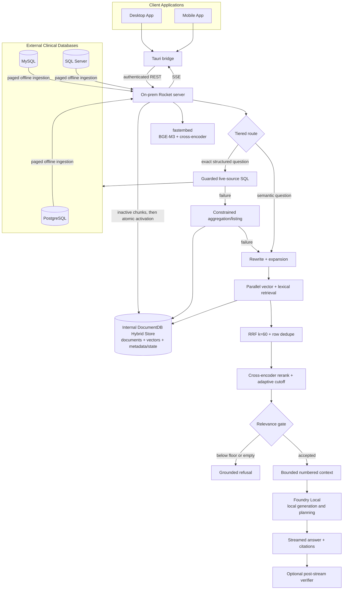

# RAG Patterns

> **Authoritative current-state guide (2026-09-02).** This guide names the retrieval-augmented generation patterns implemented by the current server and clients. It describes code, not a generic RAG catalog. Status meanings follow the [documentation authority policy](README.md). All data and inference remain on premises.

## Scope and architectural boundary

The product uses two complementary grounding paths:

1. **Offline ingestion RAG** copies selected rows from operational databases into an internal hybrid store, then answers narrative questions from retrieved passages.
2. **Structured RAG** answers eligible exact questions against a live operational source first, then falls back through constrained DocumentDB operations and semantic retrieval.

The **Desktop App** and **Mobile App** use the same Tauri bridge/event contract. The shared web-view implementation uses React, but the clients are not direct database or server callers: the bridge owns the JWT and relays server SSE.

## Pattern status matrix

| Pattern | Status | Current implementation and boundary |
| --- | --- | --- |
| Offline ingestion RAG | **Implemented** | Selected source rows are paged, projected, chunked, embedded locally, staged in DocumentDB, and atomically activated per table. |
| Chunk text plus row metadata | **Implemented** | Each chunk stores source/table/row/chunk identity, the projected text, original allowed `fields`, vector, generation, active flag, and optional annotations. |
| Token-accurate chunking | **Planned** | Current 384/64 defaults count whitespace-delimited words as an approximate token proxy. |
| BGE-M3 symmetric embeddings | **Implemented** | fastembed produces 1,024-dimensional, prefix-free vectors for documents and queries. Foundry Local is not the embedding engine. |
| Semantic vector retrieval | **Implemented** | Active chunks are searched through the DocumentDB `cosmosSearch` IVF cosine index. |
| Lexical `$text` retrieval | **Implemented** | Active chunk text is searched by the legacy text index; ICD-like and all-caps terms receive exact-term quoting hints. |
| Parallel hybrid retrieval | **Implemented** | Every query-variant × enabled search-side operation runs concurrently, subject to request admission. |
| Conversation-aware rewrite | **Implemented** | Server working memory is used to make follow-ups standalone; errors fall back to the original query. |
| Multi-query expansion | **Implemented** | Default total is three queries. Rewrite and expansion share one local model call when history exists; short, quoted, and identifier-like queries skip expansion. |
| Reciprocal rank fusion | **Implemented** | All ranked lists are combined in Rust with $\operatorname{RRF}(d)=\sum_i 1/(60+r_i(d))$; raw vector/text scores are never compared. |
| Row deduplication | **Implemented** | Only the strongest chunk for `(source_id, table, row_pk)` survives before candidate truncation, with a defensive second dedupe after reranking. |
| Cross-encoder reranking | **Implemented** | `bge-reranker-v2-m3` jointly scores the primary standalone query and a bounded fused candidate prefix. |
| Adaptive rerank cutoff | **Implemented** | Candidate depth is bounded by configured top-N and can stop at an RRF elbow after at least `max(top_k, 8)` candidates. Very weak reranked tail passages are trimmed below half the gate. |
| Calibrated score gate/refusal | **Partial** | Pointed questions use sigmoid-transformed reranker scores and default floor `0.30`; broad queries refuse only on empty retrieval. The mechanism is implemented, but corpus-specific calibration is not complete. |
| Grounded prompt and citations | **Implemented** | Only numbered retrieved records are citable; conversation memory supplies continuity, not evidence. Per-row and total approximate-token budgets bound context. |
| Post-generation verifier | **Implemented, opt-in** | Citation overflow is checked deterministically. A local claim verifier can emit supported/partial/unsupported and is persisted on the exact assistant message; it is disabled by default and fails open as skipped. |
| Server memory and compaction | **Implemented for `/chat`** | User-owned conversations persist in DocumentDB. Working memory is a rolling summary plus a bounded chronological tail; write-behind compaction uses compare-and-swap. |
| Structured RAG / live-source SQL | **Implemented** | Exact structured requests prefer one linked live source, deterministic SQL, then local planner SQL; every statement is validated and bounded before execution. |
| Deterministic query fast paths | **Implemented** | Conservative SQL templates and a direct ingested patient-count plan avoid model planning; ambiguity returns a miss rather than a guess. |
| Active-generation / last-known-good | **Implemented** | New chunks remain inactive until transactional cutover. Failed refreshes leave the prior active generation searchable. |
| General semantic metadata filters | **Planned** | No general allow-listed source/table/patient/date filter contract is injected into both vector and `$text` retrieval. |
| Parent/sibling expansion | **Planned** | Retrieval does not fetch all sibling chunks or reconstruct a full parent row after reranking. |
| Full hybrid cohort executor | **Partial/planned** | The router recognizes hybrid cohort-plus-narrative questions, but execution currently uses ordinary semantic retrieval rather than structured cohort keys enforced on both search sides. |
| Scoped retrieval (table/source filter) | **Planned** | `RetrievalFilter` derived from the service-line binding, applied to `cosmosSearch` and `$text`; see §8. |
| Hybrid cohort → filtered retrieval → synthesis | **Planned** | Cohort `QuerySpec` yields row keys that scope retrieval before grounded generation; see §8. |
| Provenance-first answers | **Planned** | A PHI-free `provenance` event precedes tokens and is persisted with every answer; see §8. |
| Schema-binding-driven schema linking | **Planned** | Linker, deterministic SQL, and aggregation read a per-source `SchemaBinding` instead of dev-seed table names; see §8. |

## 1. Offline ingestion RAG and active generations

`ingest/mod.rs` is a bounded extract-project-chunk-embed-store pipeline. It validates selected table names against live schema, reads pages from PostgreSQL, MySQL, or SQL Server, removes explicitly excluded columns, and builds row text from the remaining useful fields. Opaque IDs and audit timestamps are omitted from the text projection as retrieval noise while remaining in structured `fields` unless the user excluded them.

The chunk is the retrieval unit; the source row remains the provenance unit. A record carries:

- deterministic source, table, `row_pk`, and `chunk_index` identity;
- cloned structured `fields` for citation display and structured operations;
- locally embedded `text` and `contentVector`;
- `ingest_generation` and `active` state; and
- optional extractor annotations copied to every chunk from the row.

Chunk windows default to approximately **384 words with 64-word overlap**. The names retain “tokens” in configuration, but `chunk_text` uses `split_whitespace`; this is intentionally documented as approximate rather than tokenizer-accurate.

Each table refresh uses a new UUIDv7 generation. Chunks are inserted as inactive, checkpoints advance only after a page is written, and a DocumentDB transaction deactivates the prior generation, activates the completed generation, and updates `indexed_tables.active_generation`. Cleanup of older inactive records follows best effort. This **last-known-good publication** pattern keeps retrieval available when a refresh fails or is resumed.

See [Ingestion, schema catalog, and Data Explorer](ingestion-schema-catalog-and-explorer.md) and [DocumentDB architecture](documentdb-architecture.md).

## 2. Dense, lexical, and hybrid retrieval

### BGE-M3 semantic side

`embed/mod.rs` owns one process-global fastembed BGE-M3 instance behind a mutex. Its synchronous work runs in `spawn_blocking`, preserving the Tokio reactor. Document and query embeddings share the same prefix-free encoder, and output dimensions are checked against the configured 1,024-dimensional index contract. Query vectors use a normalized-text, 1,024-entry process-local LRU; expansion misses are embedded together in one batch.

`documentdb/vector.rs` performs k-nearest-neighbor search through the `cosmosSearch` `vector-ivf` index using cosine similarity. It over-fetches before applying `active: true`, then returns the configured per-side count.

### `$text` lexical side

Hybrid mode also queries the DocumentDB `$text` index. This side protects recall for literal clinical language—drug names, codes, identifiers, and values—that dense retrieval can underweight. ICD-like tokens and uppercase drug-like tokens are added as quoted terms. It is a complement to BGE-M3, not a second confidence scale.

### Parallel fan-out and RRF

For the primary rewrite and each expansion, vector search and—when hybrid mode is selected—lexical search are created as independent futures and awaited together. The implementation then discards engine-score comparability and fuses rank positions:

$$
\operatorname{score}(d)=\sum_i\frac{1}{60+r_i(d)}
$$

The default $k=60$ dampens one-list rank spikes and rewards chunks that recur across variants or retrieval sides. Ties break by chunk ID for deterministic output.

## 3. Rewrite, expansion, dedupe, rerank, and refusal

`rag/mod.rs` treats model-assisted query preparation as a best-effort recall aid:

- no history means no rewrite;
- with history, summary and recent turns resolve pronouns and references;
- expansion normally yields three total variants;
- when history and expansion are both needed, one call requests the standalone query and variants;
- malformed or unavailable output degrades to rewrite-only or the raw question.

After RRF, `retrieval/mod.rs` deduplicates by source row **before** truncating candidates. This prevents several overlapping chunks from one row consuming all result slots. Reranking then applies the local BGE cross-encoder to the primary standalone query and the adaptive candidate prefix. Raw logits are passed through sigmoid for a stable $(0,1)$ operational scale; this is not proof of probability calibration.

The rerank candidate cutoff begins no earlier than `max(top_k, 8)` and stops at the first configured-window score elbow where the next fused score is less than 65% of the preceding score. After reranking, tail passages below `score_gate / 2` are removed while preserving at least one.

The answer gate distinguishes two shapes:

- **Pointed questions** refuse when no passage exists or the top reranker score is below the configured floor, default `0.30`.
- **Broad overview/list questions** skip reranking and are not compared to the reranker threshold because RRF scores occupy a different scale; they refuse only when retrieval is empty.

The floor is configurable and implemented, but remains only operationally selected. Representative answerable/no-answer evaluation is still required before describing it as clinically calibrated.

## 4. Grounding, citations, and verification

The generation prompt says to use only numbered retrieved passages, cite them as `[1]`, `[2]`, and refuse unsupported answers. Working memory can clarify the question but is explicitly non-citable. `apply_context_budget` clips each selected row and the total context with the same word approximation used elsewhere.

Citations are emitted before JSON-encoded SSE token events; JSON encoding preserves leading spaces. The answer and its exact passages are persisted together when a conversation is present.

Verification is a **post-stream safety annotation**, not a generation gate:

1. citation markers beyond the supplied passage count are detected deterministically;
2. when enabled, the `Verify` role extracts factual clinical claims and checks each only against bounded numbered passages;
3. invalid passage references are removed, and “supported” without a valid passage is demoted;
4. the report is emitted and saved on the exact assistant message.

Timeouts, unavailable models, malformed output, disabled verification, or absent passages produce a skipped result; the already-streamed answer remains. Representative live-model verifier quality is still unvalidated.

## 5. Conversation-aware RAG and memory

For `/chat` with `conversation_id`, the server verifies ownership, loads memory, and persists the user turn before route execution. `memory.rs` assembles:

- an optional rolling summary containing older turns; and
- a newest-first-selected, then chronologically restored verbatim tail bounded by turn and approximate-token limits.

Assistant messages are clipped in working memory. The summary is injected as a synthetic leading turn for rewrite/expansion, while summary and tail also enter the answer prompt. Conversation-meta questions bypass record retrieval and answer only from this memory.

After a successful assistant turn, compaction may run detached. It folds older overflow turns into a concise summary with the `QueryRewrite` role and compare-and-swaps `summary_upto`, preventing overlapping compactions from interleaving. Memory loading fails open to an empty context, and optional retention deletes expired conversations and messages.

Dedicated agent conversations persist too, but their endpoint currently loads a fixed recent raw history window and wraps it as memory rather than consuming the rolling summary. That is a **partial** parity gap discussed in [Agentic Patterns](agentic-patterns.md).

## 6. Structured RAG before semantic fallback

The system does not use semantic top-k retrieval as an exact counting engine. Tiered routing sends counts, grouped results, rankings, trends, and enumerations toward structured execution.

When live-source SQL is enabled, the order is:

1. link one operational source and a bounded set of active schema cards;
2. attempt conservative deterministic SQL templates;
3. if they miss, use the local `TextToSql` role to produce one statement;
4. parse and normalize one read-only query, enforce linked-table allowlists, block dangerous constructs, clamp outer row limits, perform cost preflight, and execute with connector caps/timeouts;
5. permit at most one model repair inside the original planning deadline;
6. on failure, use validated DocumentDB aggregation/listing over active ingested rows; and
7. on further failure, use semantic hybrid retrieval and grounded generation.

Narrow patient overviews, identifier follow-ups, recent-record summaries, and recognized analytics can also take a speculative deterministic-only path before semantic retrieval. A miss never invokes the planner on that speculative path.

For the exact compiler inventory and refusal rules, see [Deterministic query handling reference](deterministic-sql-matcher.md). For backend selection and schema linking, see [Routing, agents, and structured query](routing-agents-and-structured-query.md).

## 7. Cache, warmup, and admission patterns

These patterns keep local inference bounded without caching final PHI-bearing answers:

- **Query-vector cache:** normalized query text to BGE-M3 vectors, process-local LRU of 1,024 entries.
- **Routing cache:** only expensive Tier-2 route decisions are cached; catalog replacement clears the LRU.
- **Schema graph cache:** source/version-scoped schema graph snapshots are invalidated on catalog or override changes.
- **Warmup:** background startup initializes embedder and reranker and can preload an already-cached SQL model after execution-provider registration. Startup remains available on failure; readiness reports warming/ready/failed.
- **Admission:** timed semaphores bound generations, retrieval requests, global ingestions, and per-source ingestions; saturation returns `429`.
- **Model residency:** Foundry model busy guards and GPU LRU management prevent unloading a model used by an active generation.

fastembed model instances remain mutex-serialized. Parallel DocumentDB searches improve request latency, but embedding and reranking can queue under concurrent load.

## 8. Planned patterns: scope, cohort, provenance, and binding

**Status: Planned — see [plans/new/01](../new/01-service-line-ontology-and-schema-binding.md), [04](../new/04-structured-execution-and-fallbacks.md), [05](../new/05-hospital-agents-server.md), and [06](../new/06-conversation-memory-and-suggestions.md).** None of these is in code today; the implemented patterns above are unchanged.

### Scoped retrieval (table/source filter)

A `RetrievalFilter { tables, source_ids, row_pks, patient_key, explicit }` narrows both search sides before fusion. `tables` comes from the service line's bound tables plus shared concepts (Patient, Encounter, Provider, Department, DiagnosisCode), so a Maternity question never surfaces billing passages. The vector side uses the `cosmosSearch` `filter` option (or over-fetch and `$match` if unsupported); the lexical side adds the filter to its `$match`. An inferred filter that empties results is relaxed once and recorded; an explicit one is not. The filter is a read allow-list, not authorization.

### Hybrid cohort → filtered retrieval → synthesis

The hybrid route becomes real: the cohort `QuerySpec` is forced to a list shape projecting `[PrimaryKey, BusinessId, PatientRef]` and run through the structured ladder; the resulting keys (≤ 200) build an explicit `RetrievalFilter`; retrieval runs on the narrative part of the question; narration receives the cohort summary line ("Cohort: 37 admissions over 14 days") and the citations. SSE emits the cohort `sql`/`spec`/`rows` **and** `citations`.

### Provenance-first answers

The `StructuredExecutor` returns a `Provenance` (ordered rungs with hit/miss/skipped and PHI-free reasons, backend, service line, scope, source, timings). It is emitted as a `provenance` SSE event **before** the first token and persisted on the message with the `QuerySpec`, so the client never infers the path from which events happened to arrive, and a semantic answer reached after a structured miss carries the miss reasons.

### Schema-binding-driven schema linking

The linker filters candidate cards to the service line's scope *before* ranking; the deterministic compiler binds `QuerySpec` slots to `ColumnRole`s (EventTime, PatientRef, Status, Amount, …) from the binding rather than to physical names; the aggregation planner is given a scoped catalog so it cannot name an unowned collection; personas list the hospital's own table names and enum vocabulary. Explicit mentions cannot escape scope — a Maternity question naming `payments` yields a redirect to Revenue or Ask, not a join.

## Decision table

| Question or workload shape | Pattern selected | Why | Current fallback |
| --- | --- | --- | --- |
| Initial corpus load or refresh | Offline ingestion + active-generation publication | Makes narrative retrieval local and keeps the prior searchable generation intact until completion | Failed/partial job retains last-known-good data and checkpoint |
| Narrative question using synonyms | BGE-M3 vector retrieval | Semantic similarity tolerates wording differences | Hybrid mode also runs `$text` |
| Drug name, ICD-like code, quoted phrase, or exact clinical term | `$text` lexical side | Literal tokens can be lost in dense similarity | RRF combines lexical and vector rankings |
| Ambiguous narrative wording | Multi-query expansion | Widens recall across synonyms and paraphrases | Raw/standalone query if local rewrite fails |
| Follow-up with pronouns or prior entity | Conversation-aware rewrite | Produces a self-contained retrieval query | Original question on rewrite failure; narrow identifier follow-up may use deterministic SQL |
| Several search variants and score types | RRF with $k=60$ | Rank fusion avoids comparing cosine and text scores | None; empty fusion refuses |
| Many chunks from one source row | Row dedupe | Preserves result diversity and citation slots | Defensive post-rerank dedupe |
| Pointed clinical fact question | Cross-encoder + relevance floor | Improves precision and prevents weak evidence from reaching generation | Explicit no-relevant-records response |
| Broad overview/list request | RRF-only broad handling | Reranker floors are unsuitable for broad recall and RRF has another scale | Refuse only on empty retrieval |
| Count, trend, rank, or bounded listing | Live-source structured RAG | Returns exact current rows rather than estimating from top-k passages | DocumentDB structured operation, then semantic RAG |
| Known conservative SQL frame | Deterministic fast path | Lower latency and lower planner risk; never guesses | Local SQL planner or normal fallback chain |
| Answer requiring prose over records | Grounded prompt with numbered citations | Constrains generation to retrieved evidence | Gate refusal when evidence is insufficient |
| Need an additional faithfulness signal | Optional verifier | Checks claims after streaming without delaying first token | Explicit skipped verdict; answer remains |
| Cohort filter followed by narrative synthesis | Hybrid cohort route | Intended to enforce an exact cohort before semantic search | **Currently ordinary semantic retrieval; full executor not implemented** (Planned: §8) |
| Question asked on a department agent tab | Scoped retrieval + binding-driven linking (Planned) | Keeps evidence within the service line's bound tables | Relaxation only for inferred scope; explicit scope redirects to the owning agent |

## Code map

| Concern | Primary code |
| --- | --- |
| Row projection, chunking, batching, checkpoints, generations | `onprem-rag-server/src/ingest/mod.rs`, `ingest/routes.rs` |
| Optional row annotation | `onprem-rag-server/src/ingest/extract.rs` |
| BGE-M3 lifecycle and query cache | `onprem-rag-server/src/embed/mod.rs` |
| Vector/text indexes and active-only search | `onprem-rag-server/src/documentdb/vector.rs` |
| Retrieval fan-out, row dedupe, adaptive cutoff, gating | `onprem-rag-server/src/retrieval/mod.rs` |
| RRF | `onprem-rag-server/src/retrieval/rrf.rs` |
| Cross-encoder and sigmoid | `onprem-rag-server/src/retrieval/rerank.rs` |
| Rewrite, expansion, context budgets, grounded prompt | `onprem-rag-server/src/rag/mod.rs` |
| Chat orchestration, fallbacks, SSE, verification persistence | `onprem-rag-server/src/rag/routes.rs` |
| Working memory and compaction | `onprem-rag-server/src/memory.rs` |
| Structured planning/narration | `onprem-rag-server/src/answer.rs`, `aggregation/` |
| Live-source schema linking and guarded SQL | `onprem-rag-server/src/nl2sql/` |
| Model roles and lifecycle | `onprem-rag-server/src/foundry/`, especially `foundry/router.rs` |
| Admission | `onprem-rag-server/src/admission.rs` |
| Run-scoped client state and event fan-out | `onprem-rag-app/src/stores/chat.ts`, `stores/agents.ts`, `lib/conversationRuntime.ts`, `lib/bridgeEvents.ts`, `src-tauri/src/commands.rs` |

## Known non-implementations

Do not infer these capabilities from adjacent metadata or route types:

- **General metadata filters:** source/table/patient/date constraints are not a public semantic retrieval filter layer.
- **Full parent/sibling expansion:** selected chunks are not expanded into a complete row or neighboring chunk window after reranking.
- **Token-accurate chunking/budgets:** chunk, context, and memory sizes are whitespace approximations.
- **Full hybrid cohort execution:** no structured cohort-to-`row_pk` allowlist is applied to both `cosmosSearch` and `$text` before synthesis.
- **Answer cache:** final answers and PHI-bearing prompts are deliberately not cached.

## Related authoritative guides

- [Architecture and data model](architecture-and-data-model.md)
- [DocumentDB architecture](documentdb-architecture.md)
- [Retrieval, chat memory, and concurrency](retrieval-chat-memory-and-concurrency.md)
- [Ingestion, schema catalog, and Data Explorer](ingestion-schema-catalog-and-explorer.md)
- [Routing, agents, and structured query](routing-agents-and-structured-query.md)
- [Deterministic query handling reference](deterministic-sql-matcher.md)
- [Foundry Local roles](foundry-local-role.md)
- [Models, accelerators, and lifecycle](models-accelerators-and-lifecycle.md)
- [Operations, performance, and observability](operations-performance-and-observability.md)
- [Evaluation, production validation, and release](evaluation-production-and-release.md)
