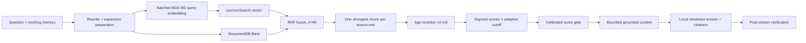
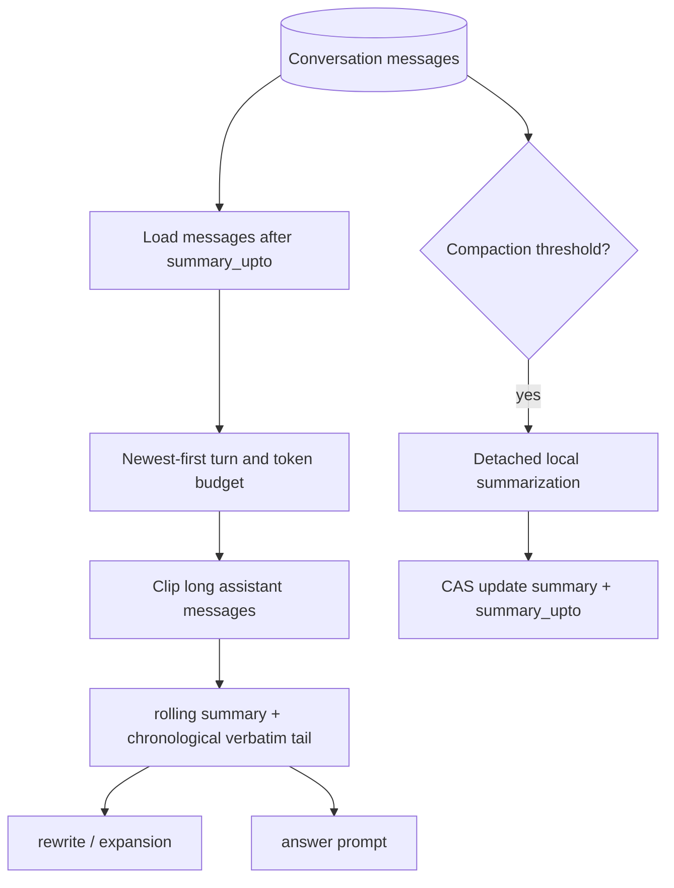

# Retrieval, chat memory, and concurrency

> Authoritative description of the currently implemented semantic chat path. All inference and data processing stay on premises. See also [`routing-agents-and-structured-query.md`](routing-agents-and-structured-query.md) and [`models-accelerators-and-lifecycle.md`](models-accelerators-and-lifecycle.md).

## Current semantic path

| Stage | Current behavior |
| --- | --- |
| Query preparation | With history, one local model call produces the standalone rewrite and expansion variants together. On failure it degrades to the older two-step local path. With no history, rewrite is skipped; short, quoted, or identifier-like questions also skip expansion. |
| Embedding | fastembed **BGE-M3**, 1024 dimensions, prefix-free. Queries are batched and cached; records and queries use the same encoder. Foundry Local is not used for embeddings. |
| Retrieval | Default **hybrid** search: `cosmosSearch` vector search plus DocumentDB `$text` for exact clinical terms. All query-variant × search-side operations run concurrently. ICD-like and all-caps terms receive lexical exact-term handling. |
| Fusion | Reciprocal rank fusion across all variants and sides with $k=60$. Vector and text scores are not compared directly. |
| Row dedupe | Implemented before truncation and again defensively after reranking: only the strongest chunk for each `(source_id, table, row_pk)` occupies a result slot. |
| Reranking | fastembed **`bge-reranker-v2-m3`** reranks an adaptive prefix of the fused list, bounded by the configured top-N. Raw logits are converted with sigmoid to $(0,1)$. |
| Adaptive selection | A fused-score elbow can reduce rerank work. After reranking, passages below half the configured gate are trimmed from the tail, while retaining at least one passage. |
| Refusal gate | The default gate is `0.30` on sigmoid-transformed reranker scores. Pointed questions below the floor refuse generation. Broad overview/list questions are not compared against a reranker threshold on a mismatched score scale, but still refuse when retrieval is empty. The threshold is operationally selected but still needs corpus-specific evaluation calibration. |
| Prompt | Context is capped globally and per selected row. Conversation memory is continuity context only; numbered retrieved records are the sole citable evidence. |
| Generation | A Foundry Local model streams JSON-encoded SSE token payloads. Citations precede tokens. No cloud model call is made. |
| Verification | Deterministic citation-overflow checking and the optional local verifier run after streaming. A report is emitted and persisted as `verify_json` on the exact assistant message, so it survives refetch and overlapping runs. Verification is off by default. |

Chunking is enabled by default at approximately 384 whitespace-delimited tokens with 64-token overlap. The final default context cap is six passages, subject to score trimming and prompt budgets.

### Scoped retrieval with `RetrievalFilter`

**Status: Planned — see [plans/new/04-structured-execution-and-fallbacks.md §4](../new/04-structured-execution-and-fallbacks.md).**

`retrieve_observed_filtered(…, filter: &RetrievalFilter)` adds a typed scope to both search sides:

| Field | Origin | Effect |
| --- | --- | --- |
| `tables` | router decision `scope` (the service line's bound tables plus shared concepts) | `table ∈ tables` on vector (`cosmosSearch` `filter` option, or over-fetch + `$match` fallback) and lexical (`$match` with `$text`) |
| `source_ids` | selected source(s) | `source_id ∈ …` |
| `row_pks` | hybrid cohort keys, ≤ `ONPREM_HYBRID_COHORT_MAX` (200) | restricts to exact cohort rows |
| `patient_key` | focus or question patient identifier | resolved once to the patient row's `row_pk`; children matched on `fields.<PatientRef col>` for tables with a 1-hop `patient_path`, plus the patient row itself |
| `explicit` | `true` when the user or agent tab named the scope | an inferred filter that empties results is relaxed once (`ONPREM_RETRIEVAL_FILTER_RELAX`) and the relaxation is recorded in provenance; an explicit filter never is |

The filter is a read allow-list derived from the schema binding, not an authorization control. Required compound indexes and the live verification of the `cosmosSearch` `filter` option are described in [DocumentDB Architecture](documentdb-architecture.md).

## Implemented boundaries and gaps

| Capability | Status | Detail |
| --- | --- | --- |
| Duplicate chunks from one row | **Implemented** | Retrieval keeps one highest-ranked chunk per source row. |
| Full parent-row expansion | **Not implemented** | Sibling chunks are not fetched and reconstructed after reranking. `fields` remains available as citation metadata, but generation receives the selected chunk text rather than a merged complete row. |
| General metadata filters | **Not implemented** | There is no general allow-listed source/table/patient/date filter in the semantic retrieval API and no cohort-to-`row_pk` filter injection. Do not claim patient-safe prefiltering is active. **Planned:** `RetrievalFilter` (below). |
| Context budgeting | **Implemented, partial substitute** | Selected row texts are clipped by per-row and total approximate-token budgets; this bounds prompts but does not perform parent expansion. |
| Token-accurate chunking | **Not implemented** | Chunking and memory budgets use word/whitespace approximation. |
| Early pipeline status SSE | **Partial** | Routing is emitted first and citations/tokens expose coarse progress, but retrieval still completes before the token stream is useful; full stage-by-stage early cancellation is not complete. |

## Server-owned conversation memory

When `conversation_id` is present, the server verifies JWT ownership, loads memory, persists the user turn before generation, and persists a successful assistant turn afterward. Without it, `/chat` remains stateless and accepts caller-provided history for evaluation and compatibility.

`memory.rs` implements bounded working memory:

- Working memory is a **rolling summary plus a verbatim tail**.
- The tail is bounded by turn count and approximate token count; assistant messages are clipped before inclusion.
- The same memory reaches rewrite/expansion and grounded generation. Conversation-meta questions are answered from memory without record retrieval.
- Compaction is write-behind and non-blocking. It folds old turns with the local QueryRewrite-role model and compare-and-swaps `summary_upto` to avoid interleaved updates.
- Message content is byte-capped before storage.
- An optional boot-time/daily retention sweep deletes expired conversations and their messages; the default retention value `0` keeps them indefinitely.
- The client does not persist transcripts or PHI-bearing drafts to browser storage; DocumentDB remains authoritative.

### Conversation focus

**Status: Planned — see [plans/new/06-conversation-memory-and-suggestions.md](../new/06-conversation-memory-and-suggestions.md).**

A second, typed memory complements `WorkingMemory` (plan 06 §1):

| | `WorkingMemory` (Implemented) | `ConversationFocus` (Planned) |
| --- | --- | --- |
| Content | rolling summary + verbatim tail | typed slots: patient / provider / place entities, last concept and service line, time range, last `QuerySpec`, last-result digest, pending clarify slot |
| Producer | persistence + write-behind compaction (model call) | executor outcome after each turn — **no model call** |
| Consumer | model prompts (grounded, rewrite, meta) | router focus resolution, persona focus block, suggestions, spec mutation |
| Storage | `chat_conversations.summary`, `summary_upto` | `chat_conversations.focus`, loaded in the same round trip |

Focus is authoritative for *reference* ("she", "that ward", "the same period"); the summary remains context for style and long-range recall. Conversation-meta questions keep using `WorkingMemory`. Update rules: a patient is set from a resolved key, a single-patient result, or a one-row lookup and is kept across aggregate questions until replaced; the time range is kept unless stated; "new topic" / "forget that" resets everything; `pending_clarify` is set by a clarify turn and cleared by any answer.

**Focus resolution and spec mutation are model-free.** Before routing, `focus::resolve` substitutes pronouns and ellipsis deterministically (`her` → `patient PT-00042`; `there` → the place; `then` → the time range). Bare follow-ups ("and by gender?", "only caesareans", "as a percentage", "top 5", "what about last month") mutate the last `QuerySpec` instead of rewriting text, so they route as deterministic structured turns. Substitutions are reported in `routed.focus_used` and persisted on the message. The model `QueryRewrite` role receives the already-resolved question and never has to resolve pronouns.

**Clarify round-trip.** When the router cannot bind a required slot and focus cannot fill it, it emits one templated `clarify` event (`question`, `slot`, `options`) and persists the assistant turn with `clarify: {slot}`. A short next message or one matching the slot type fills the slot in the stored partial spec and re-routes; otherwise it is treated as a fresh question. Never two clarifications in a row — the second time falls through to semantic retrieval.

**Suggestions.** After each answer the server emits ≤ `ONPREM_SUGGESTIONS_MAX` (4) `suggestions` `[{ text, kind: drill|widen|compare|switch|explain, spec?, agent? }]`, generated **without a model** from mutated `QuerySpec`s that already pass binding, so a click never produces a miss or a clarify. Candidates depend on the outcome (scalar → by-dimension / trend / filter / rate; grouped → drill / switch dimension; trend → compare periods; patient lookup → chart set of bound concepts with a `patient_path`; empty result → widen). Ranking prefers a different mutation kind from the last turn, in-scope suggestions, and enum cardinality 2–8; PII-role columns are never suggested. Suggestions are persisted on the assistant message so reloads show them.

## Client concurrency and cancellation

The client no longer has a single global pending response.

- Chat and agents each maintain a **per-run registry keyed by `run_id`** and **per-conversation prompt queues**.
- App-level orchestration owns request lifetimes, so route or conversation navigation does not discard stream state.
- Distinct conversations can stream concurrently. A normal follow-up to a busy conversation queues; **Send now** bypasses that queue and may not see the unfinished answer in server-loaded history.
- Bridge events carry `run_id`; boot-time listeners route and animation-frame-batch tokens per run, preventing cross-stream token mixing.
- Every run can be cancelled independently. The Tauri bridge drops the associated HTTP/SSE stream, and logout cancels active bridge runs and resets registries.
- Failed or stopped runs preserve partial output and can be retried. Successful runs invalidate persisted messages before optimistic run state is removed.
- Rename/delete is blocked only for conversations with active work; navigation and new-conversation actions remain available.

The server additionally applies admission limits to generations, retrievals, and ingestion. These bound server work but do not yet provide complete disconnect propagation through every pre-stream retrieval/model stage.

## Operational notes

- fastembed sessions are synchronous and protected by process-level serialization; calls run off the async executor. This is safe but can queue under concurrent load.
- Concurrent retrieval reduces single-request latency but multiplies DocumentDB work; server admission control is the bounding mechanism.
- The score gate must be calibrated on representative answerable and no-answer clinical questions. Sigmoid bounds logits but does not itself produce a calibrated probability.
- The post-stream model verifier is opt-in because it adds a local model round trip and its live-model quality has not been fully validated.

## Source plans consolidated

- `../old/01-retrieval-design.md`
- `../old/03-ws6-retrieval-chat-implementation.md`
- `../old/09-chat-implementation.md`
- `../old/19-retrieval-and-faithfulness.md`
- `../old/20-performance-fast-path.md`
- `../old/22-chat-memory-and-compaction.md`
- `../old/23-performance-efficiency-roadmap.md`
- `../old/25-concurrent-chat-orchestration.md`
- `../old/25-ingestion-extractor-and-verifier.md` (verifier section)
- `../old/docs/retrieval-pipeline.md`
