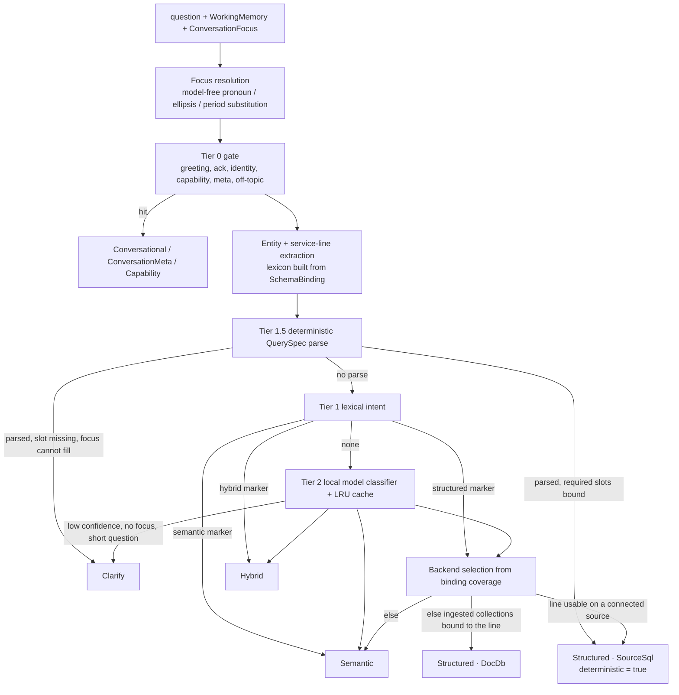
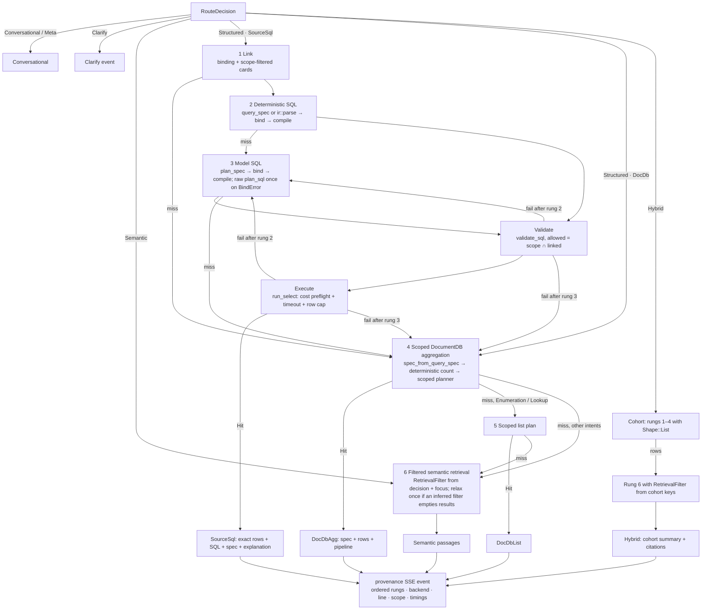
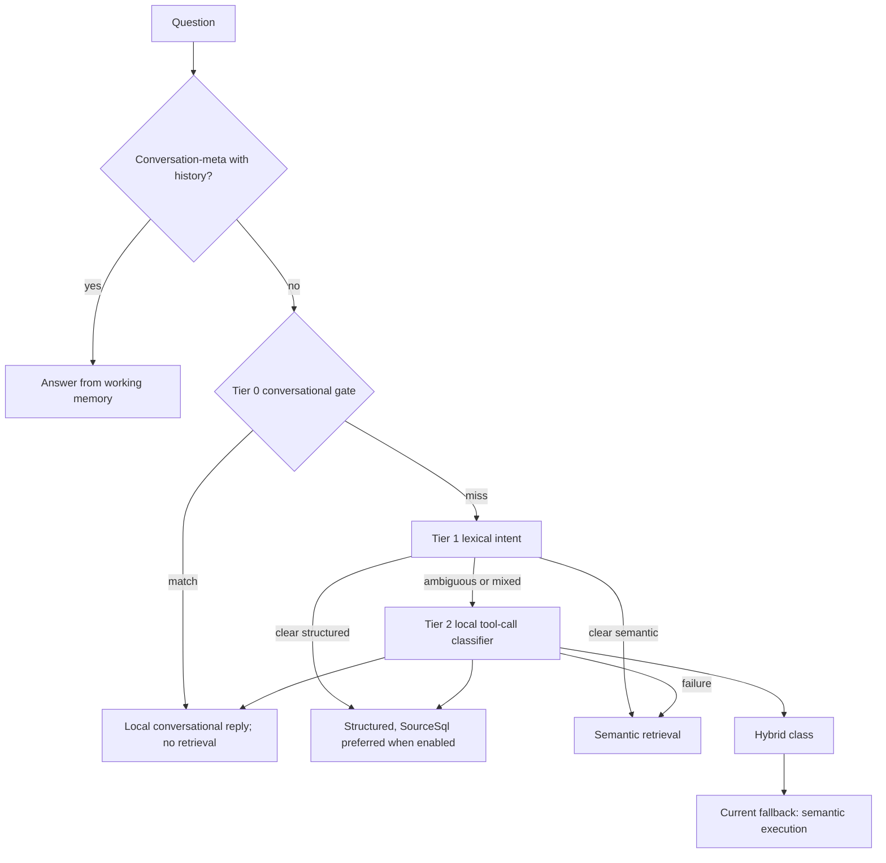
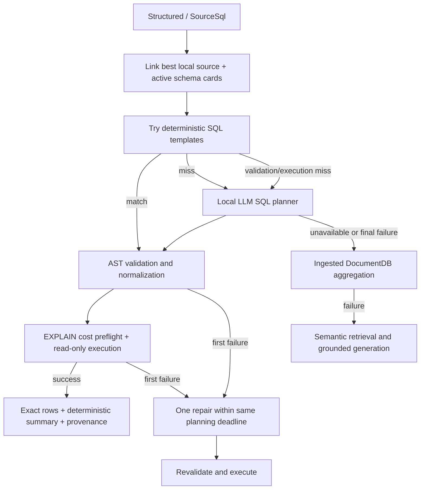

<!-- markdownlint-disable MD013 -->

# Routing, agents, and structured query

> Authoritative description of intent routing, structured execution, and agent behavior. The **target design** (router v3, `QuerySpec` IR, one `StructuredExecutor`, service-line agents) is **Planned** and specified in [`plans/new/`](../new/00-README.md); the [Current implementation](#current-implementation-router-v2-legacy-agent-kinds) section describes what runs today. The SQL matcher / IR detail lives in [`deterministic-sql-matcher.md`](deterministic-sql-matcher.md); the agent roster and data boundary in [`hospital-agents-and-data-map.md`](hospital-agents-and-data-map.md).

## Status summary

| Area | Status | Specification |
| --- | --- | --- |
| Router v2: Tier 0/1/2, `StructuredBackend` chosen by lexical shape, `RouteEntities` carried but unused | Implemented | [Current implementation](#current-implementation-router-v2-legacy-agent-kinds) |
| Router v3: focus resolution, Tier 1.5 deterministic parse, backend from binding coverage, Clarify | Planned | [02-intent-router-v3.md](../new/02-intent-router-v3.md) |
| `QuerySpec` IR replacing the hardcoded template families | Planned | [03-schema-driven-deterministic-sql.md](../new/03-schema-driven-deterministic-sql.md) |
| Single `StructuredExecutor` ladder, scoped aggregation, retrieval filter, `provenance` event, real Hybrid | Planned | [04-structured-execution-and-fallbacks.md](../new/04-structured-execution-and-fallbacks.md) |
| Service-line agents, Ask, Trends/Handover modes, binding-generated personas | Planned | [05-hospital-agents-server.md](../new/05-hospital-agents-server.md) |
| `ConversationFocus`, model-free anaphora, clarify round-trip, answerable suggestions | Planned | [06-conversation-memory-and-suggestions.md](../new/06-conversation-memory-and-suggestions.md) |

## Target design: router v3

**Status: Planned — see [plans/new/02-intent-router-v3.md](../new/02-intent-router-v3.md).**

The router stays tiered, local, and fail-open, but every decision names the **service line**, **backend**, and **entities** the executor needs, and a successful deterministic `QuerySpec` parse is itself a routing decision.

| Stage | Mechanism | Model call | Result |
| --- | --- | --- | --- |
| Focus | `focus::resolve` substitutes "her / that patient", "that ward / there", "same period", and turns bare ellipsis ("and by gender?", "only ICU", "as a percentage") into a mutation of the last `QuerySpec` | No | `resolved_question` + recorded substitutions (`focus_used`) |
| Tier 0 | Anchored regex gate (existing) plus a **Capability** route ("what can you do?") answered from the binding | No | Conversational / meta / capability reply |
| Tier 1.5 | `nl2sql::ir::parse` → `QuerySpec` (grammar R1–R16) bound against the source's `SchemaBinding` | No | `Structured { SourceSql }` with `deterministic: true`; `Clarify` when a required slot is unbound |
| Tier 1 | Lexical markers (`classify_lexical`, extended for hybrid, filtered enumeration, lookup) | No | Intent → backend selection, Semantic, or Hybrid |
| Tier 2 | `Classify` role tool call whose prompt lists only *usable* service lines; cache key includes the binding version | Yes | Same, plus `confidence`; `< 0.5` with no focus and ≤ 4 tokens → Clarify, else Semantic |
| Tier 3 | Clarify | No | One templated question; never two in a row |

### `RouteDecision`

| Field | Meaning |
| --- | --- |
| `class` | `Conversational` · `ConversationMeta` · `Structured { intent, backend }` · `Semantic` · `Hybrid { cohort_intent }` · **`Clarify { question, slot }`** (new) |
| `tier`, `deterministic`, `cached` | Which tier decided; `deterministic = true` when Tier 1.5 produced the spec (reported as tier 1) |
| `service_line` | `Option<ServiceLine>` — fixed on dedicated agent tabs, inferred on Ask |
| `source_id` | Source chosen when `backend == SourceSql` |
| `scope` | Allowed tables: `binding.tables_for(service_line)` ∪ shared-concept tables, or all tables when no line |
| `entities` | `RouteEntities { concepts, tables, patient_key, provider_ref, time_range, metric, dimension, enum_filters, top_n }` — always present; consumed by the IR binder and executor |
| `query_spec` | `Option<QuerySpec>` from Tier 1.5 or a focus spec mutation |
| `resolved_question` | Post-focus text that every downstream stage sees |

`MissingSlot ∈ { Subject, Patient, TimeRange, Metric, Dimension }`. The `routed` SSE event gains `service_line`, `deterministic`, `scope_size`, `source_id`, `focus_used`, and for Clarify `question` + `slot`; existing fields are unchanged so old clients keep working.

### Backend selection

`select_backend` replaces string-shape heuristics with binding coverage:

1. Candidate sources = connected sources with a `SchemaBinding` in which the service line is **usable** (≥ 1 owned concept bound at confidence ≥ `ONPREM_BINDING_MIN_CONFIDENCE`, default 0.55) and every mentioned concept binds. Pick the one whose scope covers the most mentioned concepts; ties → most recently refreshed → `SourceSql { source_id, scope }`.
2. Else, if the ingested aggregation catalog has collections bound to the line's concepts → `DocDb { scope }`.
3. Else → `Semantic` (fail-open). `ONPREM_TEXT2SQL_ENABLED=false` skips step 1.

### Clarify branch

Used only when the router is confident the question is structured but a required slot is unbound and focus cannot fill it. Templates are fixed per slot (no model), emitted as SSE `clarify { question, slot, options }` then `done`; the assistant message persists `clarify: { slot }` so the next short reply is treated as a slot answer and re-routed with the merged spec. Never two clarifies in a row — the second time falls through to Semantic.

## Target design: `StructuredExecutor` ladder

**Status: Planned — see [plans/new/04-structured-execution-and-fallbacks.md](../new/04-structured-execution-and-fallbacks.md).**

One `executor::run(state, ExecInput) -> (ExecOutcome, Provenance)` replaces the per-call-site ladders in `rag/routes.rs` and `agents/routes.rs`; `/chat` and every `/agents/<kind>` call it identically.

**Bounded failure** is defined precisely: a rung is a *Miss* on parse miss, bind error, validation error, connector error, timeout, cost-preflight rejection, or a zero-row scalar when the shape was `Exists`. Zero rows on a `List` / `Grouped` result is a **Hit** with an empty result and never triggers a fallback — an exact "none" is not swapped for a fuzzy guess. Rung 4 runs only for `Aggregation` / `Trend` intents with in-scope ingested collections. Per-rung deadlines come from `ExecBudget` (`ONPREM_NL2SQL_PLAN_TIMEOUT_SECS`, `ONPREM_NL2SQL_TIMEOUT_SECS`, 30 s aggregation, `ONPREM_EXEC_TOTAL_TIMEOUT_SECS` = 120); when the total is exhausted the ladder skips to rung 6 with `Skipped("budget")`.

Enablers delivered with the ladder: `Catalog::scoped(tables)` so the aggregation planner can only name owned collections; `spec_from_query_spec` for deterministic IR → `RunAggregation` / `RunList` translation on single-table specs; `RetrievalFilter { tables, source_ids, row_pks, patient_key, explicit }` applied through the `cosmosSearch` `filter` option (over-fetch `k × 4` + `$match` fallback if the container rejects it — verify live before merge) and as a plain `$match` on the `$text` side, backed by `{ table, active }` and `{ source_id, table, active }` indexes.

### Provenance event and SSE contract

Shared order for `/chat` and `/agents/*`:

`routed` → [`clarify`] → [`sql` `columns` `rows`] | [`spec` `rows` `pipeline`] | [`citations`] → **`provenance`** → `token`* → [`verify`] → [`suggestions`] → `done` | `error`

`provenance` payload is PHI-free:

| Field | Content |
| --- | --- |
| `path` | Ordered rungs actually attempted — `Link` · `DeterministicSql` · `ModelSql` · `Validate` · `Execute` · `Aggregation` · `List` · `Retrieval` · `Clarify` — each `Hit`, `Miss(reason)` (e.g. "bind error: no EventTime on Bill") or `Skipped(reason)` |
| `backend` | `source_sql` · `document_db` · `semantic` · `hybrid` · `none` |
| `service_line`, `scope`, `source_id` | What the decision bound the answer to |
| `elapsed_ms` | Per-rung timings |

`sql` gains `spec` (the `QuerySpec`) and `explanation` (compiler-generated sentence). Persisted assistant messages gain `provenance`, `spec`, `suggestions`, `focus_used`; the bridge (`src-tauri/src/commands.rs`) and `src/lib/bridge.ts` mirrors must change in the same commit or the fields are silently dropped.

### Hybrid cohort executor

Rungs 1–4 run with the cohort `QuerySpec` forced to `Shape::List` and projection `[PrimaryKey, BusinessId, PatientRef]`. The row keys (cap `ONPREM_HYBRID_COHORT_MAX` = 200; the narrator is told "first 200 of N") build an explicit `RetrievalFilter`; rung 6 runs on the narrative part of the question; narration receives the cohort summary line and citations. SSE emits `spec` / `rows` / `sql` for the cohort **and** `citations` for the passages.

## Target design: agents

**Status: Planned — see [plans/new/05-hospital-agents-server.md](../new/05-hospital-agents-server.md) and [hospital-agents-and-data-map.md](hospital-agents-and-data-map.md).**

Two orthogonal enums replace the single overloaded `AgentKind`:

| Enum | Values | Purpose |
| --- | --- | --- |
| `AgentKind` (`agents/kind.rs`, product identity) | `Ask` · `Line(ServiceLine)` for the 13 lines: Patient Chart, Front Desk, Ward Board, Emergency, Maternity, Theatre, Pharmacy, Diagnostics, Revenue, Quality & Safety, Workforce, Chronic Care, Facilities | What the user talks to; serialises as `"ask"` or the line slug |
| `AgentMode` | `Ask` (default) · `Trends` · `Handover` | Cross-cutting modes on any agent. Trends forces `Shape::Trend` (default month bucket, last 12 months). Handover forces Hybrid when a cohort is stated, else filtered Semantic on the line's tables and focus; last 24 h default; SBAR narration with citations |
| `ModelRole` (`foundry/router.rs`, renamed from `AgentKind`) | `Grounded` · `Narrate` · `Rewrite` · `Classify` · `Extract` · `Verify` · `TextToSql` · `PlanSpec` · `Compact` | What a model call is for; `ModelSpec::for_role` replaces `for_kind` |

Every agent runs one flow: load `(WorkingMemory, ConversationFocus)` → `route_v3(fixed_line = kind.line(), mode)` → `executor::run` → narrate with a persona **generated from the binding** (role line; bound concepts using the hospital's own table names and enum vocabulary, PII columns never listed; grounding rules; mode block; focus block) → suggestions → persist. **Ask** is the same flow with `fixed_line = None`; the decision's `service_line` is emitted in `routed` so the UI can badge which department answered, and a lineless `Semantic` decision answers from the whole corpus as today.

Ownership is enforced at four hooks — linker candidate filter, `Catalog::scoped`, `RetrievalFilter`, and identity → scope — all reading `SchemaBinding.tables_for(line)` ∪ shared concepts (`Patient, Encounter, Provider, Department, DiagnosisCode`). An explicit mention outside scope ("payments" on Maternity) yields a redirect to the owning agent, not a join. Patient Chart additionally admits any table with `patient_path.len() ≤ 2` when the question carries a patient key. `GET /agents` returns the roster with `usable`, bound sources, modes and example questions filtered to bound concepts.

Legacy `/agents/health_query | trends | patient_lookup | summarize | chat` map to `Ask` with mode `Ask | Trends | Ask | Handover | Ask` for one release.

## Current implementation (router v2, legacy agent kinds)

**Status: Implemented.** This section describes what runs today. Each subsection is superseded by the target design above once the referenced plan lands.

### Route selection

The router is cheapest-first and fail-open:

| Tier | Implementation | Result |
| --- | --- | --- |
| 0 | Anchored conversational and conversation-meta rules | Greetings/off-topic bypass data access; transcript questions use working memory. |
| 1 | Lexical intent markers | Identifies aggregation, trend, enumeration, lookup, narrative, and multi-hop shapes. |
| 2 | Local Foundry classifier using a strict tool schema | Used for ambiguous or structured+narrative questions; decisions are cached in a bounded in-memory LRU. Failure falls open to semantic retrieval. |

Structured questions prefer **`SourceSql` first** when text-to-SQL is enabled. This is a configured policy, not a model's unconstrained backend choice. Tier-2 entity hints (`RouteEntities { tables, metric, time_bucket }`) are retained as best-effort metadata, but current schema linking performs its own ranking rather than consuming those hints directly. There is no service-line, scope, focus, or clarify field on today's `RouteDecision`.

### Structured query execution

#### 1. Schema linking

The versioned `schema_catalog` stores one active, last-known-good generation per source. Cards contain local schema metadata, bounded profiles/samples, foreign-key edges, searchable card text, and local BGE-M3 vectors. Refresh builds a complete generation before atomically moving the active pointer; failed refreshes preserve the previous generation.

Linking is **directional**:

1. Rank active cards using local embeddings, with explicit table/business-alias mentions promoted.
2. Choose one source from the best-ranked card; cross-source SQL is not generated.
3. Take the configured seed cards.
4. Add each seed's **outgoing one-hop foreign-key targets**.

Incoming edges and recursive graph expansion are not automatically added. Curated aliases and undeclared relationships augment the cached source graph, but query-time expansion remains one-hop and directional. Missing a required reverse relationship can therefore cause a deterministic miss or planner failure.

#### 2. Deterministic templates before the model

The deterministic compiler runs before obtaining the SQL planning model. It handles conservative exact or tightly bounded patterns such as total counts, bounded listings, grouped counts, trends, patient overviews, identifier follow-ups, and selected healthcare joins. It returns no result on ambiguity. The 19 template families are hardcoded to the dev-seed table names (`patients`, `encounters`, `deliveries`…), which is the motivation for the `QuerySpec` IR.

[`deterministic-sql-matcher.md`](deterministic-sql-matcher.md) is authoritative for:

- the exact template families and attempt order;
- normalization and full-consumption rules;
- schema/FK requirements and dialect coverage;
- anaphoric identifier handling;
- acceptance/refusal fixtures and known limits.

A deterministic match still passes through the same SQL safety and execution controls as model output.

#### 3. Local SQL planner and safety envelope

If templates miss, the **`TextToSql`** task role generates plain SQL with dialect-specific schema context. It does not use unsupported constrained ONNX tool grammar.

| Control | Current behavior |
| --- | --- |
| Planning deadline | Initial plan and at most one repair share one deadline. |
| Repair | Exactly one repair can follow the first validation or execution error; there is no retry loop. |
| AST gate | `sqlparser` requires one read-only query, allow-listed linked tables, no locks/DDL/DML or dangerous functions, and rewrites from the AST. |
| Row bounds | Outer query limit/TOP is inserted or clamped, then the connector enforces a second result cap. |
| Cost preflight | Connector `EXPLAIN`/estimate runs before execution when enabled. A successful estimate over the configured threshold is rejected. Estimation errors are logged and currently fail open to bounded execution. |
| Execution | Read-only connector behavior, database timeout, Tokio timeout, and least-privilege deployment guidance. |
| Result | Columns, exact rows, executed SQL, source identity, and a deterministic summary; no second narration model call. |

#### 4. Fallback chain

For structured chat the order is:

1. live-source deterministic SQL;
2. local LLM SQL planning, validation, execution, and one repair;
3. constrained aggregation over ingested DocumentDB records;
4. semantic hybrid retrieval and grounded generation.

The same order applies to the Health Query and Trends agents, and every step in it is non-fatal: a planner that emits a malformed spec, a spec naming a collection that was never ingested, or a failing aggregation each fall to the next step instead of surfacing a raw `400` in the transcript. The DocumentDB aggregation step is skipped outright while the catalog is empty, since no collection name could validate. Structured agent turns rewrite the question against working memory before any of this, so a follow-up ("list their names") carries the prior turn's subject into deterministic SQL, routing, and planning alike.

This preserves availability without presenting semantic top-k retrieval as an exact counting engine. A successful live-source query is persisted with SQL provenance; DocumentDB structured results retain their spec/rows/pipeline provenance. The ladder is duplicated across `rag/routes.rs::chat`, `agents/routes.rs`, `resolve_followup_sql`, and `resolve_semantic_sql`, each with slightly different fallbacks and SSE; there is no `provenance` event, so the client infers the path from which events arrived.

### Agents (legacy kinds)

The agent endpoint and UI expose `auto`, Health Query, Trends, Patient Lookup, and Summarize experiences. Agent conversations share the conversation collections but carry `agent_kind`; assistant messages persist either citations, structured results, or SQL results.

| Agent behavior | Current implementation |
| --- | --- |
| Auto | Uses the shared tiered router and emits the resolved kind. |
| Health Query / Trends | Rewrite the question against working memory, prefer deterministic live SQL (including anaphoric follow-up resolution), then the structured aggregation planner, then semantic retrieval. |
| Patient Lookup | Narrow deterministic patient overview/identifier SQL when recognized; otherwise semantic retrieval. |
| Summarize | Narrow deterministic recent-record SQL when recognized; otherwise semantic retrieval. |
| Charts | Render from typed structured rows/spec where available, not inferred from prose. |
| Multi-hop agent loop | **Planned/not implemented** as a general iterative tool loop. |

The fixed dispatcher is intentional: tools are planned, validated, and executed server-side rather than streamed as arbitrary model-selected operations. `AgentKind` in `foundry/router.rs` currently conflates product identity with model roles (`PatientLookup, HealthQuery, Trends, Summarize, Chat, MultiHop, QueryRewrite, Classify, Extract, Verify, TextToSql`); the target design splits it (see [Target design: agents](#target-design-agents)).

### Hybrid cohort status

The router can classify a question as `Hybrid`, but **full hybrid cohort execution is incomplete**. Current `Hybrid` requests fall back to ordinary semantic retrieval. The following are not yet wired as one path (specified in [plan 04 §5](../new/04-structured-execution-and-fallbacks.md)):

1. execute a structured cohort query;
2. obtain all permitted entity/`row_pk` keys;
3. apply an allow-listed metadata filter to vector and `$text` retrieval;
4. synthesize only over that cohort with enforced cohort-size limits.

Consequently, the system must not claim exact cohort-conditioned semantic analytics yet.

### Other current limits

- General arbitrary aggregates, numeric comparisons, complex date predicates, and joins outside templates depend on local planner quality.
- Specialized deterministic healthcare templates are partly PostgreSQL-specific; generic templates cover narrower cross-dialect shapes.
- Cost-estimation failure is fail-open, though execution remains AST-validated, capped, timed out, and read-only.
- Catalog profiles are bounded approximations used for planning, not authoritative clinical statistics.
- Extracted clinical codes are retrieval hints and are not terminology-server-validated.
- Semantic retrieval has no table filter, so a department-scoped question can retrieve chunks from unrelated tables.
- Follow-up handling is identifier-only (`resolve_followup_question`); there is no typed conversation focus, spec mutation, clarification, or suggestion generation.

## Source plans consolidated

- `../old/06-agents-routing-and-aggregation.md`
- `../old/10-agents-implementation.md`
- `../old/17-intent-router-v2.md`
- `../old/18-text-to-sql-harness.md`
- `../old/19-retrieval-and-faithfulness.md`
- `../old/26-schema-metadata-catalog.md`
- `../old/docs/aggregation-aware-retrieval.md`
- `deterministic-sql-matcher.md` (linked authoritative detail; not duplicated)
- `../new/00-README.md` through `../new/06-conversation-memory-and-suggestions.md` (target design; Planned)
