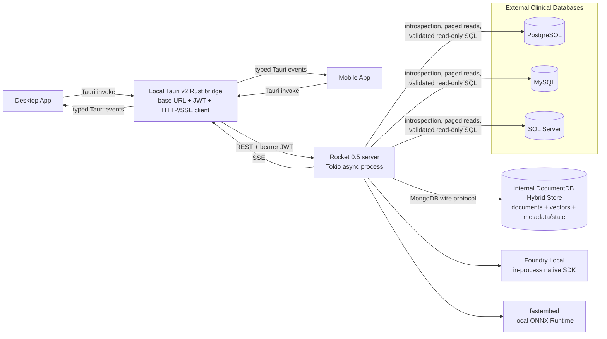
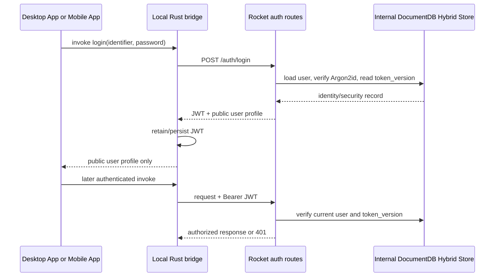
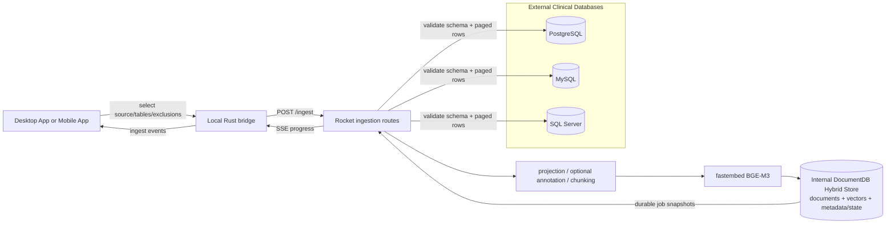
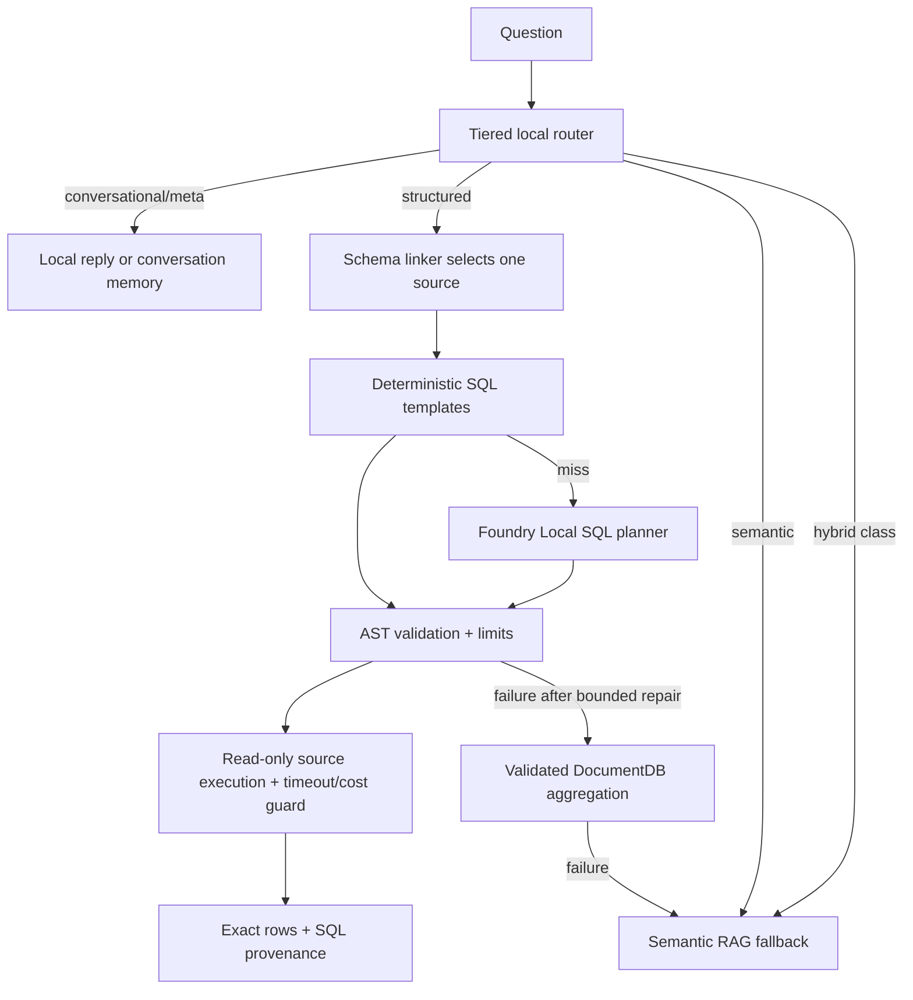
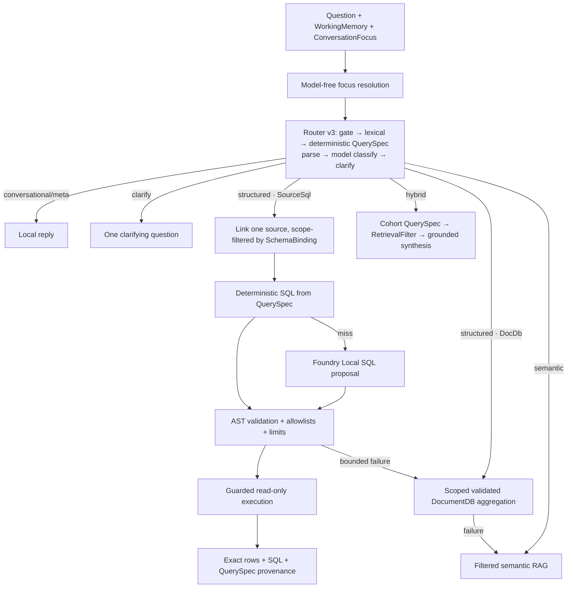

# System Architecture Design

> **Authoritative current-state guide (2026-09-02).** Current code in `onprem-rag-server/` and `onprem-rag-app/` is authoritative. **Implemented**, **Partial**, and **Planned** have the meanings defined in the [documentation authority policy](README.md). This guide describes system structure and runtime behavior; detailed persistence design is in [Data Architecture](data-architecture.md).

## Goals and non-negotiable invariants

The system provides retrieval-augmented chat, constrained agents, structured clinical queries, ingestion, and administration for health records while keeping the complete data and inference path on premises.

1. **PHI stays on premises.** Operational rows, indexed copies, prompts, conversation memory, citations, model output, credentials, and telemetry must not be sent to a cloud model or hosted retrieval service.
2. **There are no cloud model calls or cloud-model fallback.** Foundry Local and fastembed execute locally. Loss of local inference produces degradation or an explicit failure, never remote inference.
3. **The client web view is not a security boundary.** It does not own the JWT, source credentials, or direct server transport.
4. **The Rocket server is authoritative.** It enforces authentication, authorization, source access, query validation, persistence, admission, and model routing.
5. **Operational source databases and the internal hybrid store are different systems with different ownership.** PostgreSQL, MySQL, and SQL Server remain clinical systems of record; DocumentDB stores application state and indexed representations.
6. **Structured and semantic answers preserve their evidence type.** Live SQL returns source/SQL/rows; DocumentDB aggregation returns spec/rows/pipeline; semantic RAG returns record citations and optional verification.
7. **Failure does not silently broaden trust.** A failed structured path may fall back to on-prem semantic retrieval, but neither authorization nor the on-prem boundary is relaxed.

## Product clients

The product has two client forms:

- **Desktop App — Implemented.** The primary packaged client, including desktop-only single-instance and window-state behavior.
- **Mobile App — Partial.** The Android project and LAN networking configuration exist, but production device build/install, secure token storage, TLS posture, lifecycle, and hardware-back behavior are not yet validated.

The Desktop App and Mobile App share the same **Tauri v2 shell and local Rust bridge**. A web-view frontend is an implementation detail shared by both clients; React 19, Vite, TypeScript, Zustand, and TanStack Query implement that view. React is not a separate product or trusted product layer.

## Deployment topology

The current deployment model is one on-prem server process, an internal DocumentDB deployment, local model artifacts/runtime, one or more external clinical databases, and any number of Desktop App or Mobile App instances allowed by local network policy.

DocumentDB is currently run separately from Rocket, commonly through the local container configuration. Foundry Local is **embedded in the Rocket process through its native SDK**; it is not an external HTTP microservice and has no application-managed service port. fastembed is a separate local inference stack inside the server process.

## Trust boundaries

| Boundary | Responsibility and current posture |
| --- | --- |
| User/device boundary | The Desktop App or Mobile App displays PHI and accepts prompts. Device access, screen capture, local malware, and physical protection remain deployment responsibilities. |
| Web view → local Rust bridge | Calls use Tauri commands. The JWT and transport client remain in Rust managed state. The web view receives public profiles and response data, not the bearer token. **Partial hardening:** CSP is currently null and Tauri capabilities need least-privilege review. |
| Bridge local persistence | Base URL and JWT are persisted in `bridge-store.json`. **Open risk:** this is plaintext plugin-store persistence, not Windows Credential Manager or Android Keystore-backed storage. |
| Bridge → Rocket | The bridge adds bearer authentication and performs HTTP/SSE. **Open deployment risk:** defaults use plain HTTP; production PHI use requires TLS termination and approved certificates. |
| Rocket authorization boundary | JWT verification, token-version revocation, role guards, conversation ownership, source credential decryption, SQL validation, and resource limits are server-side. Client visibility rules are UX only. |
| Rocket → clinical sources | Saved passwords are AES-256-GCM encrypted in DocumentDB and decrypted only for server-side connections. Deployments should use least-privileged read-only source accounts. |
| Rocket → Internal DocumentDB Hybrid Store | Application persistence and search use the MongoDB wire protocol. **Open deployment risk:** the default URI accepts invalid TLS certificates and must be hardened. |
| Rocket → local models | Prompt and record data enter only local Foundry Local/fastembed execution. Missing models or runtimes never trigger cloud fallback. |

See [Security, Authentication, and Audit](security-auth-and-audit.md) for the full threat and deployment posture.

## Runtime component responsibilities

### Desktop App and Mobile App

Both clients provide connection/login, dashboard, source management, ingestion, Data Explorer, chat/agents, models/settings, profile/admin, and audit surfaces subject to role and platform support. Client-side navigation filtering is not authorization.

The shared frontend:

- invokes typed wrappers in `src/lib/bridge.ts` rather than calling Rocket directly;
- keeps server-derived state in TanStack Query and active workflows in Zustand;
- registers application-lifetime event listeners in `src/lib/bridgeEvents.ts`;
- keeps PHI-bearing drafts and active run buffers in session memory rather than browser storage; and
- identifies concurrent chat and agent runs by `run_id`.

### Local Tauri v2 Rust bridge

The bridge is a local security and transport adapter, not a business-logic tier. It:

- owns the configured server base URL and JWT;
- persists both through `tauri-plugin-store` under the current implementation;
- adds `Authorization: Bearer` for authenticated commands;
- translates server JSON into mirrored Rust/TypeScript contracts;
- consumes Rocket SSE and emits namespaced Tauri events; and
- owns per-run abort handles and cancels all active runs on logout.

Server response fields must be mirrored in `src-tauri/src/commands.rs` and `src/lib/bridge.ts`; otherwise fields can be silently dropped at the bridge boundary.

### Rocket server

The Rocket 0.5 process is the policy and orchestration boundary. Tokio hosts concurrent requests and detached ingestion/maintenance work. `AppState` contains the configuration, DocumentDB handle, optional in-process Foundry manager, model-role overrides, aggregation catalog, bounded route cache, admission semaphores, ingestion notification hub, and warmup status.

### Service-line ontology and schema binding

**Status: Planned — see [plans/new/01-service-line-ontology-and-schema-binding.md](../new/01-service-line-ontology-and-schema-binding.md).**

A fixed hospital ontology (13 `ServiceLine`s plus **Ask**, ~40 `EntityConcept`s, ~20 `ColumnRole`s) is bound to each connected source's physical schema by a binder that scores name/column tokens, column roles, BGE-M3 descriptor similarity, and FK shape, then applies admin overrides. The resulting per-source `SchemaBinding` is persisted in DocumentDB (`schema_bindings`, `schema_binding_history`) and cached in `AppState`; the router, deterministic SQL compiler, schema linker, scoped aggregation, retrieval filter, agent personas, and the `GET /agents` registry all read it instead of hardcoded table names. A binding is a read allow-list, not a security boundary; RBAC stays in `auth/`.

### StructuredExecutor

**Status: Planned — see [plans/new/04-structured-execution-and-fallbacks.md](../new/04-structured-execution-and-fallbacks.md).**

One `StructuredExecutor::run()` state machine replaces the per-call-site ladders in `rag/routes.rs` and `agents/routes.rs`. It consumes a router-v3 decision (service line, backend, scope, optional `QuerySpec`), walks the rungs in a fixed order under per-rung and total deadlines, and returns an outcome plus a PHI-free `Provenance` (ordered rungs with hit/miss/skipped and timings) that is streamed as an SSE event and persisted on the message. `/chat` and every `/agents/<kind>` call it identically.

### Internal DocumentDB Hybrid Store

The internal store owns users, encrypted source definitions, indexed chunks/vectors, ingestion jobs and active-generation pointers, versioned schema metadata, conversations/messages, model settings, and audit events. It also provides `cosmosSearch` vector search and `$text` lexical search. Rank fusion and reranking happen in Rust, not in DocumentDB. **Planned:** per-source schema bindings, conversation focus state, and per-message provenance/suggestions (see [Data Architecture](data-architecture.md)).

See [DocumentDB Architecture](documentdb-architecture.md) for the dedicated store guide and [Data Architecture](data-architecture.md) for collection ownership and lineage.

### Foundry Local and fastembed

- **Foundry Local — Implemented for local generation.** It handles chat generation, ambiguous route classification, query rewrite/expansion, aggregation planning/narration, SQL planning, memory compaction, and optional extraction/verification according to role configuration. It is in process and can be absent; the server then remains live while model-dependent routes report unavailable.
- **fastembed — Implemented for local embedding and reranking.** BGE-M3 produces 1024-dimensional document/query vectors, and `bge-reranker-v2-m3` reranks candidates. Synchronous sessions execute behind blocking-task boundaries and process-level guards.

For role selection and lifecycle, see [Foundry Local Role](foundry-local-role.md) and [Models, accelerators, and lifecycle](models-accelerators-and-lifecycle.md).

## Request paths

### Authentication and session

**Implemented:** Argon2id, HS256 JWTs, per-request user lookup, token-version revocation, process-local login throttling, four roles, and admin/ownership guards. **Partial:** expiry handling is reactive and token persistence is not an OS secure store.

### Ingestion

The route persists a job and returns its UUIDv7 immediately. A detached task holds the admission permit, reads bounded OFFSET pages, excludes selected columns before projection, optionally annotates rows locally, chunks text, embeds batches, and writes an inactive generation. A DocumentDB transaction publishes the completed generation and updates `indexed_tables`; a failed refresh preserves the last-known-good generation. Resume is server-implemented but the normal recovery UX is partial.

### Semantic chat

1. The server verifies conversation ownership, loads bounded server-owned memory, and persists the user turn when `conversation_id` is present.
2. The tiered router chooses conversational, conversation-meta, structured, hybrid, or semantic handling.
3. The semantic path performs local rewrite/expansion, batched BGE-M3 query embedding, concurrent `cosmosSearch` and `$text` retrieval, Rust RRF ($k=60$), row deduplication, fastembed reranking, and a relevance gate.
4. Relevant passages become the only citable grounding context for Foundry Local generation; an empty/low-scoring pointed query produces a no-relevant-records response.
5. Citations precede JSON-encoded token SSE events. The assistant message, citations, and optional verification are persisted after successful generation.

See [Retrieval, chat memory, and concurrency](retrieval-chat-memory-and-concurrency.md).

### Structured query and agents

The linker chooses one clinical source; there is no cross-source SQL federation. SQL must pass table allowlists, AST safety checks, row caps, timeouts, read-only connector execution, and cost preflight where supported. Explicit agents are constrained server-side dispatchers, not an arbitrary autonomous tool loop. The classified hybrid cohort executor is **Partial** and currently executes as semantic RAG.

See [Routing, agents, and structured query](routing-agents-and-structured-query.md) and [Deterministic query handling reference](deterministic-sql-matcher.md).

#### Target request path (router v3 + StructuredExecutor ladder)

**Status: Planned — see [plans/new/02-intent-router-v3.md](../new/02-intent-router-v3.md) and [plans/new/04-structured-execution-and-fallbacks.md](../new/04-structured-execution-and-fallbacks.md).**

The ladder emits one `provenance` event describing the path actually taken. A zero-row list or grouped result is a hit with an empty result, not a fallback trigger. When the total budget is exhausted the executor skips to filtered retrieval and records the skip.

## Streaming and event architecture

Rocket streams Server-Sent Events to the bridge. The bridge converts them into Tauri events consumed by one boot-time listener registry:

| Server stream | Bridge events | Correlation |
| --- | --- | --- |
| `/chat` | `chat://routed`, `chat://citations`, structured payload events, `chat://token`, `chat://error`, `chat://done` | `run_id` envelope |
| `/agents/<kind>` | `agent://routed`, `agent://spec`, `agent://rows`, `agent://pipeline`, `agent://citations`, `agent://token`, terminal events | `run_id` envelope |
| `/ingest/<job>/stream` | `ingest://progress`, `ingest://done`, `ingest://error` | durable `job_id` |
| model pull | `model://progress`, `model://status`, terminal events | `variant_id` |
| `/logs/stream` | `logs://line`, `logs://error` | one relay per client session |

Token data is JSON-encoded before SSE transport so leading whitespace is preserved. Chat/agent token updates are batched per run in the view. Ingestion notifications are process-local wakeups, but every event reloads the durable `jobs` snapshot and a periodic fallback read supports reconnect/missed notifications.

**Planned SSE contract extensions** (see [plans/new/04-structured-execution-and-fallbacks.md §6](../new/04-structured-execution-and-fallbacks.md) and [plans/new/06-conversation-memory-and-suggestions.md](../new/06-conversation-memory-and-suggestions.md)), shared by `/chat` and `/agents/*` and relayed as `chat://*` / `agent://*`:

- `routed` gains `service_line`, `deterministic`, `focus_used` (and `question`/`slot` for a clarify decision); existing fields are unchanged.
- New events in order: `routed` → [`clarify`] → structured payloads or `citations` → `provenance` → `token`* → [`verify`] → [`suggestions`] → `done` | `error`.
- `provenance` is PHI-free (rung names, reasons, timings); `sql` payloads gain `spec` and `explanation`.
- Each new field must be mirrored in `commands.rs` and `bridge.ts` before it is visible to the clients.

## Concurrency and admission

**Implemented:**

- Process-local semaphores bound active generations, retrievals, global ingestions, and ingestions per source.
- Permit acquisition has a finite deadline; saturation returns `429` with retry guidance.
- Different conversations may run concurrently; prompts normally serialize per conversation, while “Send now” may bypass its queue.
- The bridge tracks cancellation by `run_id`; logout aborts active client streams.
- Query variants and vector/text search sides execute concurrently.
- Foundry busy guards and GPU residency rules prevent active model eviction.

**Partial:** fastembed embedder/reranker sessions remain process-global and serialized; cancellation drops the bridge HTTP stream but is not proven to interrupt every already-running retrieval, blocking model call, SQL query, or generation stage. Process-local controls do not support horizontal scaling without shared coordination.

## Failure, fallback, and readiness

| Condition | Current behavior |
| --- | --- |
| DocumentDB unreachable at boot | Server builds its client and remains live; seed/index/catalog initialization is skipped or warned. Store-dependent operations fail. |
| Foundry Local unavailable | Server remains live; model-dependent routes return unavailable. There is no cloud fallback. |
| fastembed/model warmup failure | Startup continues; warmup status becomes failed and readiness is false. First-use operations can still surface their own errors. |
| Structured route fails | Bounded fallback is live SQL → DocumentDB aggregation → semantic RAG where applicable. Safety checks are never bypassed. |
| Semantic retrieval has no adequate evidence | Return an explicit no-relevant-records answer rather than ungrounded generation. |
| Ingestion page/cutover fails | Job becomes failed/partial; staged records and checkpoint remain; previous active generation remains searchable. |
| Process restarts during ingestion | Boot recovery marks running jobs failed and resets transient table refresh state; resume uses durable checkpoint/generation data. |
| Audit write fails | Warning only; primary operation continues. This makes audit completeness partial. |
| Client stream disconnects | Bridge run ends/cancels locally; complete cancellation propagation through every server stage is not guaranteed. |

`GET /health` is liveness-oriented and returns 200 while reporting DocumentDB up/down. `GET /ready` requires DocumentDB reachability, vector/text indexes, Foundry availability, successful-or-disabled warmup, and free generation/retrieval/ingestion capacity. Because capacity exhaustion makes readiness false, readiness is also a load-shedding signal, not only a dependency probe.

## Security boundary summary

The implemented baseline includes server-side RBAC, JWT token-version revocation, Argon2id passwords, encrypted source credentials, conversation ownership checks, guarded read-only SQL, admission limits, and best-effort audit records. Before real-PHI production use, deployment must add TLS, trusted DocumentDB certificates, OS-backed token storage, strict CSP/capability review, sanitized 5xx responses, stronger audit integrity/retention, and validated Android network policy. See [Security, Authentication, and Audit](security-auth-and-audit.md).

## Component and code map

| Product/component | Primary code | Responsibility |
| --- | --- | --- |
| Shared client shell | `onprem-rag-app/src/App.tsx`, `src/app/`, `src/components/layout/` | Desktop App/Mobile App shell, navigation, responsive composition |
| Web-view implementation detail | `onprem-rag-app/src/features/`, `src/components/`, `src/stores/` | React view, feature UI, query/workflow/run state |
| Client contract/events | `onprem-rag-app/src/lib/bridge.ts`, `bridgeEvents.ts`, `conversationRuntime.ts` | Typed invokes, global event fan-out, run orchestration |
| Tauri bridge | `onprem-rag-app/src-tauri/src/lib.rs`, `state.rs`, `commands.rs` | JWT/base URL, REST/SSE, persistence, event envelopes, cancellation |
| Server composition | `onprem-rag-server/src/main.rs`, `state.rs`, `config.rs`, `error.rs` | Boot, routes, state, configuration, response errors |
| Auth/security | `auth/`, `crypto.rs`, `routes/audit.rs` | Identity, JWT/RBAC/revocation, password and credential crypto, audit access |
| Source access | `connectors/` | PostgreSQL/MySQL/SQL Server introspection, paging, guarded SELECT execution |
| Ingestion | `ingest/`, `embed/` | Jobs, projection/chunking, local embedding, staging/cutover/resume |
| Internal store/search | `documentdb/` | Collection handles, indexes, vector/text operations, recovery helpers |
| Semantic RAG | `rag/`, `retrieval/`, `verify.rs`, `memory.rs` | Rewrite, retrieval, RRF, rerank, grounding, persistence, compaction |
| Structured query | `router/`, `nl2sql/`, `aggregation/`, `answer.rs` | Intent routing, schema link, validated live SQL, DocumentDB aggregation |
| Ontology and binding (Planned) | `ontology/` (`service_line.rs`, `concepts.rs`, `roles.rs`, `binding.rs`, `binder.rs`) | Fixed service-line ontology, per-source `SchemaBinding`, overrides, `GET /agents` registry |
| Structured executor (Planned) | `answer/executor.rs`, `answer/narrate.rs`, `answer/provenance.rs`, `nl2sql/ir/` | Single fallback ladder, `QuerySpec` IR, provenance, scoped aggregation, retrieval filter |
| Agents | `agents/` | Explicit/auto constrained dispatch and typed streamed results |
| Local generation | `foundry/`, `settings.rs` | In-process Foundry runtime, roles, EPs, model lifecycle and overrides |
| Operations | `admission.rs`, `telemetry.rs`, `logstream.rs`, `routes/health.rs`, `routes/metrics.rs` | Capacity, readiness, PHI-safe summaries, ephemeral logs/metrics |

## Delivery status

### Implemented

- Desktop App sharing a Tauri v2 Rust bridge with the initialized Mobile App codebase.
- Bridge-owned JWT/base URL, authenticated REST, SSE relay, run correlation, and cancellation.
- Rocket server with PostgreSQL/MySQL/SQL Server connectors and Internal DocumentDB Hybrid Store.
- In-process Foundry Local generation and local fastembed embedding/reranking.
- Auth/RBAC, ingestion generations, schema catalog versions, semantic RAG, constrained agents, guarded live-source SQL, memory, metrics, readiness, and admission controls.

### Partial

- Mobile App is initialized/configured but not production-device validated.
- Hybrid cohort execution is classified but falls back to semantic retrieval.
- Ingestion resume exists server-side without complete normal UI recovery controls.
- Cancellation, audit completeness, secure bridge storage, transport hardening, and production capacity evidence are incomplete.
- Optional extractor/verifier exist but are disabled by default and lack complete representative clinical quality validation.

### Planned

- Production TLS/certificate/token-store hardening and complete audit governance.
- General cohort-conditioned hybrid retrieval and broader safe metadata filters.
- Keyset/cursor ingestion, deeper pipeline overlap, full cancellation propagation, durable operational telemetry, and measured capacity certification.
- General multi-hop agent loop, analytics backend, outbreak-alert backend, updater, and production Mobile App release validation.

| Planned workstream | Plan | Delivers |
| --- | --- | --- |
| Service-line ontology and schema binding | [01](../new/01-service-line-ontology-and-schema-binding.md) | `ServiceLine`/`EntityConcept`/`ColumnRole`, per-source `SchemaBinding`, binder, extended overrides, `GET /agents` |
| Intent router v3 | [02](../new/02-intent-router-v3.md) | Deterministic-first routing, binding-driven entities and backend selection, focus-aware follow-ups, bounded clarify |
| Schema-driven deterministic SQL | [03](../new/03-schema-driven-deterministic-sql.md) | `QuerySpec` IR, grammar → IR matcher, IR → dialect compiler replacing hardcoded templates |
| Structured execution and fallbacks | [04](../new/04-structured-execution-and-fallbacks.md) | `StructuredExecutor` ladder, `provenance` event, scoped aggregation, `RetrievalFilter`, real hybrid cohort |
| Hospital agents (server) | [05](../new/05-hospital-agents-server.md) | Agents = service lines, Ask/Trends/Handover modes, binding-generated personas, ownership hooks |
| Conversation memory and suggestions | [06](../new/06-conversation-memory-and-suggestions.md) | `ConversationFocus`, model-free anaphora, clarify round-trip, answerable suggestions |
| App restructure | [07](../new/07-app-restructure.md) | Registry-driven tabs, scope panel, provenance strip, suggestion chips, draft continuity, admin Data Binding |
| Evaluation and rollout | [08](../new/08-evaluation-and-rollout.md) | Alt-schema seed, `sql`/`agents`/`flows` suites, gates, feature-flag rollout |

## Related authoritative guides

- [Documentation index and authority policy](README.md)
- [Data Architecture](data-architecture.md)
- [DocumentDB Architecture](documentdb-architecture.md)
- [Foundry Local Role](foundry-local-role.md) *(expected parallel authoritative guide)*
- [Application and feature architecture](application-and-feature-architecture.md)
- [Ingestion, schema catalog, and Data Explorer](ingestion-schema-catalog-and-explorer.md)
- [Retrieval, chat memory, and concurrency](retrieval-chat-memory-and-concurrency.md)
- [Routing, agents, and structured query](routing-agents-and-structured-query.md)
- [Models, accelerators, and lifecycle](models-accelerators-and-lifecycle.md)
- [Security, Authentication, and Audit](security-auth-and-audit.md)
- [Operations, Performance, and Observability](operations-performance-and-observability.md)
- [Evaluation, Production Validation, and Release](evaluation-production-and-release.md)
- [Verified Platform Notes](verified-platform-notes.md)
