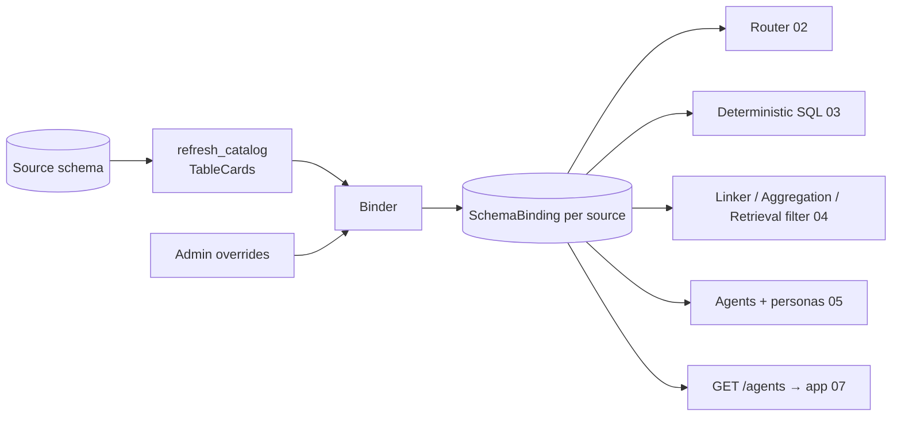

<!-- markdownlint-disable MD013 -->

# 01 — Service-line ontology and schema binding

**Goal:** make the agent roster a fixed *hospital ontology* and bind any relational schema to it
automatically at catalog time, so every downstream stage (router, deterministic SQL, linker,
aggregation, retrieval, agents, UI) reads one `SchemaBinding` instead of hardcoded table names.

**Depends on:** nothing. **Unblocks:** 02, 03, 04, 05, 07.

---

## 1. Problem

Today the system knows the dev seed by name: `nl2sql/routes.rs` matches `patients`, `encounters`,
`diagnoses`…; `aggregation/catalog.rs` hand-maintains field metadata; the proposed agent map in
[hospital-agents-and-data-map.md](../docs/hospital-agents-and-data-map.md) lists 64 physical table
names. A hospital with `tbl_patient`, `PatientMaster`, `enc_visits` or a French/Swahili-labelled
schema gets nothing.

What *is* stable across hospitals is the **function**: every hospital has patients, encounters,
admissions/beds, appointments, orders/results, prescriptions/dispensing, bills/payments, staff,
incidents. That is the ontology. The physical mapping is per deployment.

## 2. Design



Three layers, all in a new module `onprem-rag-server/src/ontology/`:

| Layer | Type | Fixed or per-source | Source of truth |
|---|---|---|---|
| Service lines | `ServiceLine` enum (14) | fixed | `ontology/service_line.rs` |
| Entity concepts | `EntityConcept` enum (~40) | fixed | `ontology/concepts.rs` |
| Column roles | `ColumnRole` enum (~20) | fixed | `ontology/roles.rs` |
| Binding | `SchemaBinding { tables: Vec<TableBinding> }` | per source | `schema_bindings` collection, built by `ontology/binder.rs` |

An `EntityConcept` is what a table *is* (e.g. `Admission`). A `ColumnRole` is what a column *does*
(e.g. `EventTime`, `PatientRef`, `Status`). Service lines own concepts, not tables; tables acquire
a service line through the concept they bind to.

## 3. Types (new files)

### `ontology/service_line.rs`

```rust
#[derive(Debug, Clone, Copy, PartialEq, Eq, Hash, Serialize, Deserialize, EnumIter)]
#[serde(rename_all = "snake_case")]
pub enum ServiceLine {
    PatientChart, FrontDesk, WardBoard, Emergency, Maternity, Theatre, Pharmacy,
    Diagnostics, Revenue, QualitySafety, Workforce, ChronicCare, Facilities,
}

impl ServiceLine {
    pub fn label(self) -> &'static str;           // "Ward Board"
    pub fn slug(self) -> &'static str;            // "ward_board"
    pub fn blurb(self) -> &'static str;           // one sentence, from the data-map doc §2
    pub fn tier(self) -> u8;                      // 1,2,3 per data-map §3
    pub fn concepts(self) -> &'static [EntityConcept];  // owned concepts (§4 below)
    pub fn vocabulary(self) -> &'static [&'static str]; // domain words for router/persona
}

/// Concepts every agent may read (data-map §6 rule 2).
pub const SHARED_CONCEPTS: &[EntityConcept] = &[Patient, Encounter, Provider, Department, DiagnosisCode];
```

### `ontology/concepts.rs`

```rust
#[derive(Debug, Clone, Copy, PartialEq, Eq, Hash, Serialize, Deserialize, EnumIter)]
#[serde(rename_all = "snake_case")]
pub enum EntityConcept {
    // shared
    Patient, Encounter, Provider, Department, DiagnosisCode, Geography,
    // patient chart
    Diagnosis, ClinicalNote, VitalSign, Allergy, MedicalHistory, FamilyHistory, Immunization, Document,
    // front desk
    Appointment, ProviderSchedule, ProviderTimeOff, Referral, InsurancePolicy, Insurer,
    // ward board
    Admission, BedAssignment, Bed, Ward, Transfer, Shift, MedicationAdministration,
    // emergency
    Triage,
    // maternity
    AntenatalVisit, Delivery, Newborn,
    // theatre
    Surgery, Procedure, ProcedureCode, Consent,
    // pharmacy
    Prescription, PrescriptionItem, Medication, StockBatch, StockMovement, DrugInteraction, Allergen, CdsAlert,
    // diagnostics
    LabOrder, LabResult, LabTest, ImagingOrder, BloodUnit, Transfusion,
    // revenue
    Bill, BillItem, Claim, Payment,
    // quality & safety
    Incident, Mortality, Feedback, NotifiableDisease, AccessLog,
    // workforce
    License,
    // chronic care
    CareProgram, ProgramEnrollment, Vaccine,
    // facilities
    Equipment, EquipmentMaintenance,
    // fallback
    Unknown,
}

pub struct ConceptDescriptor {
    pub concept: EntityConcept,
    pub name_tokens: &'static [&'static str],      // "admission", "admit", "inpatient", "ipd"
    pub column_tokens: &'static [&'static str],    // "admission_date", "discharge", "ward", "los"
    pub required_roles: &'static [ColumnRole],     // e.g. Admission: [PatientRef, EventTime]
    pub description: &'static str,                 // embedded with BGE-M3 for similarity
    pub singular: &'static str, pub plural: &'static str, pub synonyms: &'static [&'static str],
}
pub fn descriptor(c: EntityConcept) -> &'static ConceptDescriptor;
```

Descriptors are the *only* place domain vocabulary lives. Include international variants
(`ipd`/`opd`, `casualty`/`a&e`/`er`/`ed`, `theatre`/`or`, `chemist`/`pharmacy`, `mpesa`/`payment`,
`nhif`/`shif`/`insurer`, `ward round`, `sick leave`, etc.).

### `ontology/roles.rs`

```rust
#[derive(Debug, Clone, Copy, PartialEq, Eq, Hash, Serialize, Deserialize)]
#[serde(rename_all = "snake_case")]
pub enum ColumnRole {
    PrimaryKey, PatientRef, EncounterRef, ProviderRef, DepartmentRef, WardRef, BedRef,
    ForeignRef,            // other FK
    BusinessId,            // patient_no, encounter_no, rx_number, claim_no
    PersonGivenName, PersonFamilyName, PersonFullName,
    EventTime,             // primary timestamp for "when did it happen"
    StartTime, EndTime,    // for durations / occupancy
    BirthDate, DeathDate,
    Status, Category, Type, Severity, Priority,   // low-cardinality enums
    Gender,
    Amount,                // money
    Quantity, Measure,     // numeric non-money (weight, count, score, minutes)
    Duration,              // minutes/days/hours
    Flag,                  // boolean
    Code,                  // ICD-10, procedure code, ATC
    Description, FreeText, // narrative
    Location,              // room, store, ward name text
    Contact, Identifier,   // phone/email/national id — PII, never selected by default
    Unknown,
}
```

### `ontology/binding.rs`

```rust
#[derive(Debug, Clone, Serialize, Deserialize)]
pub struct ColumnBinding {
    pub column: String,
    pub role: ColumnRole,
    pub confidence: f32,           // 0..1
    pub enum_values: Vec<String>,  // ≤ 25 distinct values when role is Status/Category/Type/Severity/Priority/Gender
    pub pii: bool,                 // from ingest PII analyzer or role ∈ {Contact, Identifier, PersonFullName…}
}

#[derive(Debug, Clone, Serialize, Deserialize)]
pub struct TableBinding {
    pub table: String,
    pub concept: EntityConcept,
    pub confidence: f32,
    pub service_lines: Vec<ServiceLine>,   // derived: owners of concept (+ shared)
    pub columns: Vec<ColumnBinding>,
    pub patient_path: Option<Vec<JoinHop>>, // shortest FK path to the Patient table (≤ 3 hops)
    pub row_count: i64,
    pub overridden: bool,
}

#[derive(Debug, Clone, Serialize, Deserialize)]
pub struct JoinHop { pub from_table: String, pub from_column: String, pub to_table: String, pub to_column: String }

#[derive(Debug, Clone, Serialize, Deserialize)]
pub struct SchemaBinding {
    pub source_id: String,
    pub catalog_version: String,    // ties to schema_catalog_state.active_version
    pub dialect: SourceKind,
    pub tables: Vec<TableBinding>,
    pub built_at: DateTime,
    pub coverage: BindingCoverage,  // per service line: tables bound, required concepts missing
}

pub struct BindingCoverage { pub lines: HashMap<ServiceLine, LineCoverage> }
pub struct LineCoverage { pub tables: Vec<String>, pub missing_concepts: Vec<EntityConcept>, pub usable: bool }

impl SchemaBinding {
    pub fn tables_for(&self, line: ServiceLine) -> Vec<&TableBinding>;      // owned + SHARED
    pub fn table(&self, name: &str) -> Option<&TableBinding>;
    pub fn by_concept(&self, c: EntityConcept) -> Option<&TableBinding>;    // highest confidence
    pub fn patient_table(&self) -> Option<&TableBinding>;
    pub fn column_with_role(&self, table: &str, role: ColumnRole) -> Option<&ColumnBinding>;
    pub fn fk_path(&self, from: &str, to: &str) -> Option<Vec<JoinHop>>;    // BFS over fk_edges + override relationships, ≤ 3 hops
    pub fn usable_lines(&self) -> Vec<ServiceLine>;
}
```

## 4. Concept ownership (fixed table, replaces physical-table map)

| ServiceLine | Owned concepts |
|---|---|
| PatientChart | Diagnosis, ClinicalNote, VitalSign, Allergy, MedicalHistory, FamilyHistory, Immunization, Document, Geography |
| FrontDesk | Appointment, ProviderSchedule, ProviderTimeOff, Referral, InsurancePolicy, Insurer |
| WardBoard | Admission, BedAssignment, Bed, Ward, Transfer, Shift, MedicationAdministration, VitalSign |
| Emergency | Triage, Encounter, VitalSign, Admission, Referral |
| Maternity | AntenatalVisit, Delivery, Newborn, Admission, ProgramEnrollment |
| Theatre | Surgery, Procedure, ProcedureCode, Consent, Equipment, Admission |
| Pharmacy | Prescription, PrescriptionItem, Medication, MedicationAdministration, StockBatch, StockMovement, DrugInteraction, Allergen, CdsAlert, Allergy |
| Diagnostics | LabOrder, LabResult, LabTest, ImagingOrder, BloodUnit, Transfusion |
| Revenue | Bill, BillItem, Claim, Payment, InsurancePolicy, Insurer |
| QualitySafety | Incident, Mortality, Feedback, NotifiableDisease, AccessLog, CdsAlert, DiagnosisCode |
| Workforce | Provider, License, ProviderSchedule, ProviderTimeOff, Shift, Department |
| ChronicCare | CareProgram, ProgramEnrollment, Vaccine, Immunization |
| Facilities | Equipment, EquipmentMaintenance, Ward, Bed |

Multiple owners per concept are intentional (data-map §1). The `PatientChart` agent additionally
treats *every* table with a `patient_path` as readable when the question names a patient (plan 05).

A `ServiceLine` is **usable** for a source when at least one owned concept is bound with
confidence ≥ 0.55. The UI hides unusable tabs (plan 07); the router never routes to them (02).

## 5. Binder algorithm (`ontology/binder.rs`)

```rust
pub async fn build_binding(db: &DocumentDb, config: &Config, source_id: &str) -> AppResult<SchemaBinding>
```

Inputs: active `TableCard`s (`schema_catalog`), `MetadataOverrides` (`schema_metadata_overrides`),
PII analysis if present (`connectors::routes::analyze_schema` output persisted per source).

Per table, score each `EntityConcept` (0..1) as a weighted sum; keep the argmax:

| Signal | Weight | How |
|---|---|---|
| Name tokens | 0.35 | normalise table name (strip schema, prefixes `tbl_`, `t_`, `dim_`, `fact_`, `hms_`; split `snake`/`camel`; singularise; stem). Jaccard of tokens vs `descriptor.name_tokens ∪ synonyms`. Exact singular/plural match → 1.0 |
| Column tokens | 0.30 | fraction of `descriptor.column_tokens` present as substrings of any column name |
| Required roles | 0.15 | fraction of `descriptor.required_roles` satisfied after column-role pass |
| Embedding | 0.15 | cosine(`card_vector`, BGE-M3(`descriptor.description`)); descriptor vectors computed once at boot and cached in `AppState` |
| FK shape | 0.05 | e.g. has FK to Patient-bound table → +1 for patient-facing concepts; has FK to Medication-bound table → Prescription/StockBatch/… |

Run two passes: pass 1 binds high-confidence anchors (Patient, Provider, Encounter, Department,
Medication, Ward — required for FK-shape scoring); pass 2 binds the rest with FK shape available.
Ties (Δ < 0.05) resolve toward the concept whose owning line is *not* yet covered (spread coverage).

Column roles, per column, in order (first match wins, confidence noted):

1. Override alias hits (`MetadataOverrides.aliases` with a role suffix — see §6) → 1.0.
2. PK/FK metadata → `PrimaryKey`; FK to a table bound as Patient/Encounter/Provider/Department/Ward/Bed → the specific `*Ref`; other FK → `ForeignRef`. 0.95.
3. Name tokens (table-agnostic lists in `roles.rs`, e.g. `EventTime`: `_at`, `_date`, `date`, `time`, `datetime`, `timestamp`, `_on`, `occurred`, `recorded`; `Amount`: `amount`, `price`, `cost`, `fee`, `total`, `kes`, `usd`, `_due`, `paid`; `Status`: `status`, `state`, `outcome`, `disposition`; `Gender`: `gender`, `sex`) combined with type (temporal / numeric / text). 0.8.
4. Profile: text column with `approximate_distinct_count ≤ 25` and `sample_values` non-empty → `Category` (or `Status` if any sample ∈ status lexicon). 0.6. Temporal column with the lowest null ratio and name not `created_at`/`updated_at` → `EventTime` if none yet. 0.6.
5. Otherwise `Unknown`.

Exactly one `EventTime` per table: prefer domain names (`admission_date`, `encounter_date`,
`scheduled_start`, `delivered_at`, `occurred_at`) over audit names (`created_at`, `updated_at`).
`StartTime`/`EndTime` pairs detected by prefix (`scheduled_start`/`scheduled_end`, `actual_*`,
`starts_at`/`ends_at`, `admission_date`/`discharge_date` also yields StartTime/EndTime while keeping
`admission_date` as EventTime).

`enum_values`: for `Status|Category|Type|Severity|Priority|Gender` roles, take `sample_values` when
`approximate_distinct_count ≤ 25`; otherwise run `SELECT DISTINCT col … LIMIT 26` through
`run_select` (validated) at build time — only for non-PII roles.

`patient_path`: BFS from each table over `fk_edges ∪ overrides.relationships` to the Patient-bound
table, max 3 hops; store the hop list.

Persist to `schema_bindings` (`_id = source_id`), and keep last 5 versions in
`schema_binding_history` for the admin diff view. Invalidate/rebuild on every
`refresh_catalog_with_trigger` success and on overrides save. Load into
`AppState.bindings: RwLock<HashMap<String, Arc<SchemaBinding>>>` at boot and on rebuild.

## 6. Admin overrides (extend existing)

Extend `MetadataOverrides` in `nl2sql/routes.rs` (keep the two existing vectors):

```rust
pub struct MetadataOverrides {
    pub aliases: Vec<MetadataAlias>,
    pub relationships: Vec<MetadataRelationship>,
    #[serde(default)] pub table_concepts: Vec<TableConceptOverride>,   // { table, concept: EntityConcept | "ignore" }
    #[serde(default)] pub column_roles: Vec<ColumnRoleOverride>,       // { table, column, role: ColumnRole }
    #[serde(default)] pub service_lines: Vec<ServiceLineOverride>,     // { table, add: Vec<ServiceLine>, remove: Vec<ServiceLine> }
}
```

`validate_overrides` additionally checks enum spellings and that `ignore` tables are not the only
Patient binding. Saving overrides triggers `build_binding` and sets `TableBinding.overridden`.

## 7. Dev-seed expectation (regression fixture)

The binder **must** reproduce the data-map's table→agent table for `docker/dev-postgres` without
any override. Encode it as a test fixture `ontology/tests/dev_seed_binding.json` with the 64 rows
`{ table, concept, service_lines }` (derive from data-map §4, e.g. `deliveries → Delivery →
[Maternity]`, `cds_alerts → CdsAlert → [Pharmacy, QualitySafety]`). Test asserts ≥ 62/64 exact
concept matches and 64/64 service-line superset matches; list any deliberate misses in the test.

A second synthetic schema with different naming (plan 08) guards against overfitting.

## 8. API

| Method & path | Auth | Purpose |
|---|---|---|
| `GET /agents` | user | Roster for the UI: `[{ kind, label, blurb, tier, usable, sources: [{source_id, tables: [..]}], example_questions: [..] }]`. `usable` = any connected source has the line usable **or** ingested `records` contain tables bound to it. `example_questions` from `ServiceLine::examples()` filtered to bound concepts (plan 05). |
| `GET /sources/<id>/binding` | admin | Full `SchemaBinding` + coverage. |
| `POST /sources/<id>/binding/rebuild` | admin | Force `build_binding`. |
| `GET /sources/<id>/binding/history` | admin | Last 5 versions (concept diffs). |
| `PUT /nl2sql/<id>/catalog/overrides` | admin | Extended body (§6). |

## 9. Wiring

- `main.rs`: register routes; call `ontology::load_all_bindings(&state)` after `ensure_nl2sql_indexes`.
- `nl2sql/catalog.rs::refresh_catalog_inner`: on success → `binder::build_binding` (log, non-fatal).
- `state.rs`: `bindings` map + `fn binding(&self, source_id) -> Option<Arc<SchemaBinding>>`; `fn any_binding_for(&self, line) -> Vec<Arc<SchemaBinding>>`.
- `aggregation/catalog.rs::build_from_store`: augment `CollectionMeta` with `concept: Option<EntityConcept>` and `service_lines` by matching the ingested `table` name against bindings for the record's `source_id` (records carry `source_id` and `table`). The hand-maintained layer stays as fallback.
- `config.rs`: `ONPREM_BINDING_MIN_CONFIDENCE` (0.55), `ONPREM_BINDING_ENUM_MAX` (25), `ONPREM_BINDING_MAX_HOPS` (3).

## 10. Tests

- Unit: token normalisation (`tbl_PatientMaster` → `patient master`; `enc_visits` → `encounter visit`); role assignment for representative column sets; exactly-one-EventTime rule; BFS path.
- Fixture: §7 dev-seed expectations.
- Fixture: `ontology/tests/alt_schema_binding.json` — 25-table alternative naming (`PatientMaster`, `Visit`, `IPD_Admission`, `OT_Case`, `Rx`, `RxLine`, `LabReq`, `LabRes`, `Invoice`, `Receipt`, `Staff`, `Roster`, `Incident`) with expected concepts; ≥ 22/25.
- Coverage test: every concept in `ServiceLine::concepts()` unions has a descriptor; every descriptor concept is owned by ≥ 1 line (except `Unknown`, `Geography`).
- Live: `POST /sources/<dev>/binding/rebuild` then `GET /agents` shows all 13 lines usable.

## 11. Acceptance

- `GET /agents` on the dev seed returns 13 usable lines (+ Ask) without overrides.
- Renaming `patients → PatientMaster` and `encounters → Visit` in a copy of the seed (test-only) still binds `Patient`/`Encounter` ≥ 0.55.
- Overrides round-trip; `overridden: true` shown; rebuild < 5 s for 64 tables (embedding descriptors cached).
- No PII column is ever placed in `enum_values`.
