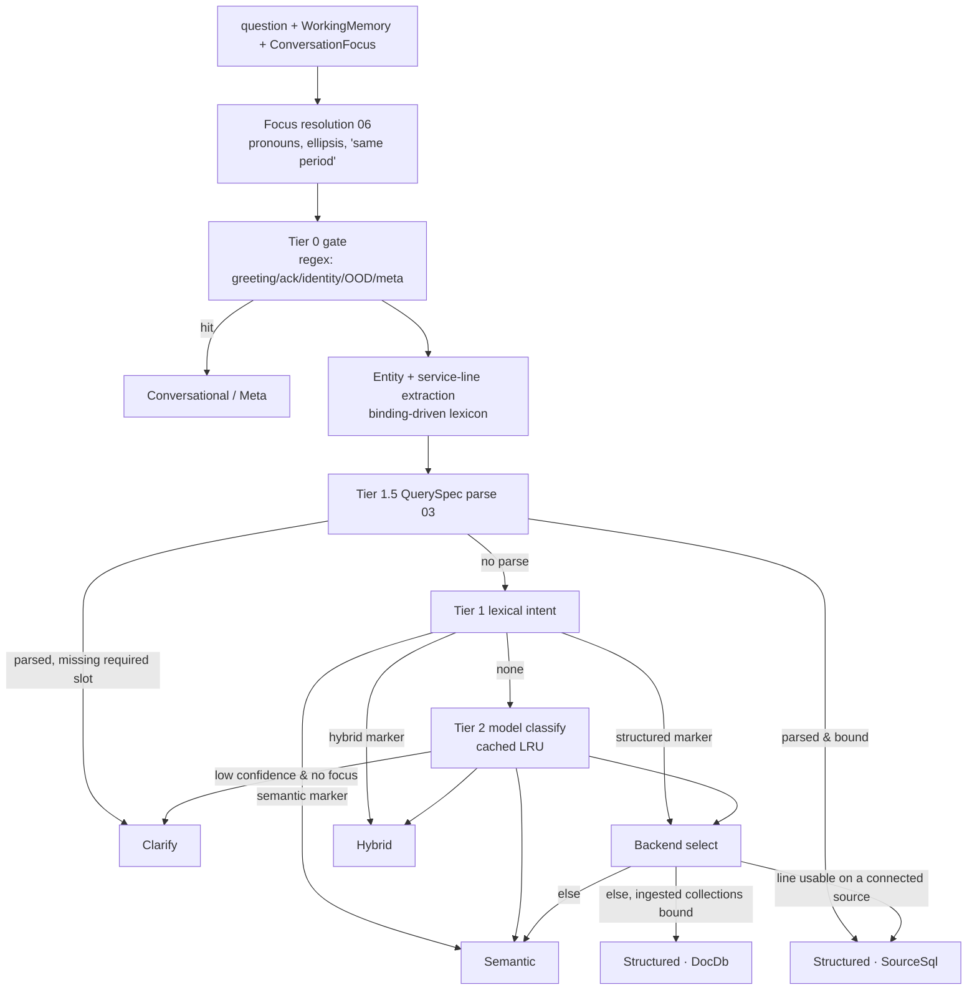

<!-- markdownlint-disable MD013 -->

# 02 — Intent router v3

**Goal:** a tiered, local router that (a) decides *conversation / structured / semantic / hybrid /
clarify*, (b) names the **service line**, **backend** and **entities** the executor needs, (c) uses
conversation focus so follow-ups route like their antecedents, and (d) is cheap by default and
model-backed only when needed.

**Depends on:** 01 (`ServiceLine`, `SchemaBinding`), 03 (the `QuerySpec` matcher is Tier 1.5).
**Unblocks:** 04, 05, 06.

---

## 1. What changes versus router v2

| v2 (today) | v3 |
|---|---|
| Tier 0 regex → Tier 1 lexical markers → Tier 2 phi-4-mini tool call | Tier 0 gate → **Tier 1 focus-aware lexical** → **Tier 1.5 deterministic `QuerySpec` parse** → Tier 2 model classifier → **Tier 3 clarify** |
| `backend` picked by string shape; `RouteEntities` discarded | `backend` chosen from *binding coverage*; entities consumed by 03/04 |
| No notion of which agent/tables | `service_line: Option<ServiceLine>` + `scope: Vec<String>` (allowed tables) in every decision |
| Anaphora handled ad hoc in `resolve_followup_sql` | Focus from `ConversationFocus` (06) resolved *before* routing |
| Hybrid classified, answered semantically | Hybrid produces a cohort `QuerySpec` + retrieval filter (04) |
| No clarification | Bounded single-question clarify branch |

## 2. Decision type (`router/mod.rs`)

```rust
pub enum RouteClass {
    Conversational,
    ConversationMeta,
    Structured { intent: QueryIntent, backend: StructuredBackend },
    Semantic,
    Hybrid { cohort_intent: QueryIntent },
    Clarify { question: String, slot: MissingSlot },   // new
}

#[derive(Debug, Clone, Copy, PartialEq, Eq, Serialize, Deserialize)]
#[serde(rename_all = "snake_case")]
pub enum MissingSlot { Subject, Patient, TimeRange, Metric, Dimension }

pub struct RouteDecision {
    pub class: RouteClass,
    pub tier: u8,                      // 0 gate, 1 lexical, 15 → reported as 1 with `deterministic: true`, 2 model, 3 clarify
    pub cached: bool,
    pub deterministic: bool,           // true when Tier 1.5 produced a QuerySpec
    pub service_line: Option<ServiceLine>,
    pub source_id: Option<String>,     // chosen when backend == SourceSql
    pub scope: Vec<String>,            // allowed tables (bound to service_line, or all if None)
    pub entities: RouteEntities,       // now always present, Default when empty
    pub query_spec: Option<QuerySpec>, // plan 03 IR, when parsed
    pub resolved_question: String,     // after focus substitution (06); what downstream stages see
}

#[derive(Debug, Clone, Default, Serialize, Deserialize)]
pub struct RouteEntities {
    pub concepts: Vec<EntityConcept>,          // "deliveries" → Delivery
    pub tables: Vec<String>,                   // explicit table mentions (kept)
    pub patient_key: Option<String>,           // "PT-00042", "SYN-2024-0001", a resolved name
    pub provider_ref: Option<String>,
    pub time_range: Option<TimeRange>,         // { start, end, grain, source: Explicit|Focus }
    pub metric: Option<MetricHint>,            // Count | Sum(field) | Avg | Min | Max | Rate
    pub dimension: Option<String>,             // "by ward"
    pub enum_filters: Vec<(String, String)>,   // ("status", "cancelled") from binding enum_values
    pub top_n: Option<u32>,
}
```

`to_sse_json()` adds `service_line`, `deterministic`, `scope_size`, `source_id` and (for Clarify)
`question` + `slot`. The `routed` event contract is extended, not changed, so old clients keep
working.

## 3. Pipeline



### 3.1 Focus resolution (input from plan 06)

Before any tier, `focus::resolve(question, &focus) -> Resolved { question, substitutions }`
rewrites cheap, deterministic anaphora **without a model**: "her/his/the patient/that patient" →
focus patient key; "that ward/there" → focus dimension value; "same period/then" → focus time
range; bare follow-ups like "and by gender?" / "what about last month?" → previous `QuerySpec`
with one slot replaced (03 §6). Substitutions are logged in `RouteDecision.entities` with
`source: Focus`. If the question needs a model rewrite (long, ambiguous), that stays in the
existing `QueryRewrite` role *after* routing — routing must be model-free where possible.

### 3.2 Entity and service-line extraction (`router/entities.rs`, new)

Lexicon is **built from the bindings**, not hardcoded:

- concept terms: `descriptor.singular/plural/synonyms` for each *bound* concept in any loaded binding;
- table names and admin aliases (`MetadataOverrides.aliases`);
- enum values from `ColumnBinding.enum_values` → `enum_filters` (e.g. "caesarean" → `(delivery_mode, caesarean)`, "no-show" → `(status, no_show)`; normalise `-`/`_`/space);
- service-line vocabulary `ServiceLine::vocabulary()` ("theatre list", "triage", "rota", "stock", "claims");
- identifiers: reuse `nl2sql::routes::extract_record_identifier` and add patterns for pure-numeric MRNs when the Patient table's `BusinessId` sample values are numeric;
- time expressions: `router/time.rs` (new) — "last month", "this quarter", "yesterday", "past 7 days", "in 2025", "between March and May", "on the night shift" (→ 19:00–07:00 window; grain hour), "Q1", month names; returns `TimeRange { start, end, grain }` relative to server `now()`;
- metrics: "how many/count/number of" → Count; "total/sum of <amount-role col>" → Sum; "average/mean" → Avg; "rate/percentage/proportion of" → Rate (Count with filter ÷ Count); "longest/shortest/highest/lowest" → Max/Min + ordering;
- dimension: "by <term>" / "per <term>" / "across <term>" / "for each <term>" where `<term>` resolves to a column (role or alias) in scope or to a joined concept (e.g. "by ward" → `Ward` concept via `WardRef`).

Service line = argmax over lines of `(concept hits owned by line × 2) + (vocabulary hits) + (focus.line bonus 1.5)`; `None` if zero. When the request came in on a dedicated agent tab (`/agents/<line>`), the line is fixed and extraction only fills entities.

### 3.3 Tier 1.5 — deterministic `QuerySpec` parse

Call `nl2sql::ir::parse(&resolved_question, &entities, &binding, scope) -> ParseOutcome`
(plan 03). Outcomes:

- `Parsed(spec)` where all *required* slots bound → `Structured { intent: spec.intent(), backend: SourceSql }`, `deterministic: true`, tier reported 1.
- `Parsed` but `missing: Vec<MissingSlot>` and no focus fills them → `Clarify` with a templated question (§5).
- `NoParse` → continue to Tier 1.

Deterministic-first is the single biggest latency win: the A-series already resolves 10/10
without a model; this makes that the *routing* path too, skipping Tier 2 (2–4 s).

### 3.4 Tier 1 lexical (keep `aggregation/intent.rs::classify_lexical`, extend)

Add markers: hybrid (`summarise|explain|why … <structured marker>`), enumeration with filters
("which patients…", "who…", "list…"), lookup ("tell me about", "record of", identifier present).
Return `Some(QueryIntent)` or `None`. Existing order Trend > Enumeration > Aggregation > Lookup >
Narrative stays; fix the "by <dimension>" ambiguity: if entities.dimension is Some and the question
starts with a count marker, prefer Aggregation over Enumeration.

### 3.5 Backend selection (`router/backend.rs`, new)

```rust
pub fn select_backend(state: &AppState, line: Option<ServiceLine>, entities: &RouteEntities) -> Backend
pub enum Backend { SourceSql { source_id, scope }, DocDb { scope }, None }
```

1. Candidate sources = connected sources with a binding. For each, `usable = line.map(|l| binding.coverage.lines[l].usable).unwrap_or(true) && entities.concepts.iter().all(|c| binding.by_concept(c).is_some())`.
2. If ≥ 1 usable source: pick the one whose scope contains the most mentioned concepts; ties → most recently refreshed. → `SourceSql`. `scope = binding.tables_for(line)` names (or all tables when `line == None`).
3. Else if `state.catalog().collections` has collections bound to the line's concepts → `DocDb { scope: those collections }`.
4. Else `None` → route becomes `Semantic` (the flowchart's fail-open).

`ONPREM_TEXT2SQL_ENABLED=false` skips step 2.

### 3.6 Tier 2 model classifier (keep, retarget)

Same `classify_route` tool call, extended schema: add `service_line: string?` (enum of slugs) and
`confidence: number` to `RouteToolOutput`. Prompt lists **only usable** lines with one-line blurbs
and the bound concept names — keeps it short and hospital-specific. Cache key includes the
binding version hash so a schema change invalidates. If `confidence < 0.5` and there is no focus
and the question is ≤ 4 tokens → `Clarify { slot: Subject }`; otherwise fail open to Semantic.

### 3.7 Hybrid

`Hybrid { cohort_intent }` is emitted when Tier 1/2 sees a structured cohort *and* a narrative
verb ("summarise the notes of patients admitted over 14 days", "why were theatre cases cancelled
last month?"). v3 attaches the cohort `QuerySpec` (from 1.5 with the narrative verb stripped) in
`query_spec`; plan 04 executes it.

## 4. Where routing is invoked

Both `rag/routes.rs::chat` and `agents/routes.rs::agent` call one function:

```rust
pub async fn route_v3(state: &AppState, req: RouteRequest<'_>) -> RouteDecision
pub struct RouteRequest<'a> {
    pub question: &'a str,
    pub memory: &'a WorkingMemory,
    pub focus: &'a ConversationFocus,      // 06
    pub fixed_line: Option<ServiceLine>,   // Some on dedicated agent tabs
    pub mode: AgentMode,                   // Ask | Trends | Handover (05)
    pub trace: &'a RequestTrace,
}
```

`POST /route` (eval endpoint) gains optional `service_line` and `conversation_id` inputs and
returns the full decision JSON (plan 08 fixtures use `service_line_expected`, `backend_expected`,
`deterministic_expected`).

## 5. Clarify branch

Templates (no model): `Subject`: "Which records do you mean — {top 3 bound concepts in the line,
comma-joined}?"; `Patient`: "Which patient? Give a patient number or full name."; `TimeRange`:
"For which period — e.g. last month, this quarter, or a date range?"; `Metric`: "Do you want a
count, a total, or an average?"; `Dimension`: "Grouped by what — e.g. {two enum/ref columns in
scope}?". Emitted as SSE `clarify` `{ question, slot, options: [..] }` then `done`; the assistant
message is persisted with `structured: null` and `clarify: {slot}` so the next turn's focus
resolver knows the user is answering a slot (06 §4). Rule: never clarify twice in a row — the
second time, fall through to Semantic.

## 6. Config

`ONPREM_ROUTER_DETERMINISTIC_FIRST` (true), `ONPREM_ROUTER_CLARIFY_ENABLED` (true),
`ONPREM_ROUTER_MODEL_MIN_CONFIDENCE` (0.5), existing `ONPREM_ROUTER_MODEL_ENABLED`,
`ONPREM_ROUTER_CACHE_SIZE`.

## 7. Files

- `router/mod.rs` — types, `route_v3`, cache key change; keep `route()` as a thin wrapper for one release.
- `router/entities.rs`, `router/time.rs`, `router/backend.rs`, `router/clarify.rs` — new.
- `router/conversational.rs` — unchanged.
- `aggregation/intent.rs` — marker additions.
- `rag/routes.rs`, `agents/routes.rs` — call `route_v3`, pass decision to `StructuredExecutor` (04).

## 8. Tests

- `router/time.rs`: 30 phrases → ranges (fixed `now` injected).
- `router/entities.rs`: with the dev binding, "how many caesarean deliveries last month by ward" → concepts `[Delivery]`, line `Maternity`, enum_filter `(delivery_mode, caesarean)`, time_range last month, dimension `ward`.
- Backend selection: no sources → DocDb/Semantic; source without Maternity tables → not SourceSql for Maternity.
- Tier ordering: A-series questions never reach Tier 2 (assert `deterministic == true`).
- Clarify: "how many were cancelled?" with empty focus → Clarify(Subject); with focus `Appointment` → Structured.
- Extend `eval/data/router.jsonl` (plan 08) with `service_line_expected`.

## 9. Acceptance

- Router accuracy ≥ 0.95 on the extended fixture; median routing latency < 50 ms when Tier 2 is not invoked; Tier 2 invoked on ≤ 25 % of the fixture.
- `routed` SSE event shows `service_line` for every structured/hybrid decision on the dev seed.
- No question ever yields two consecutive `clarify` events in one conversation.
